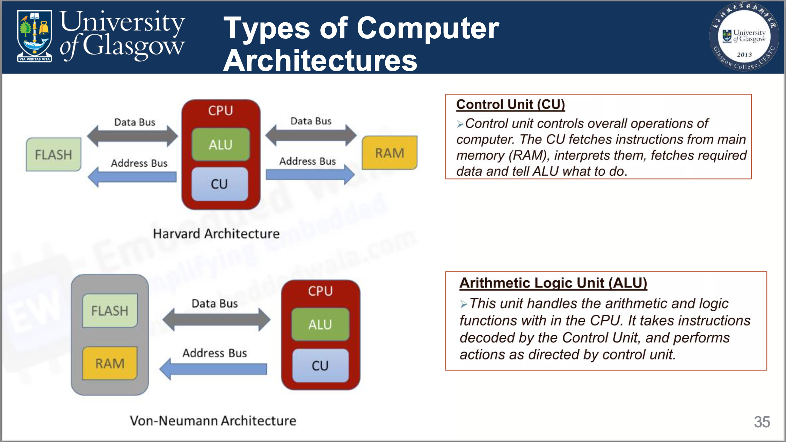

# Lecture 1: Introduction to Embedded Processors

> Lecture @ 2025-2-24

## 分数构成

- Final Examination : 75%
  - 期末考试
- Lab Work : 15%
  - 和之前一样的实验课
- Written Assessment : 10%
  - 小组作业，做出东西后写报告

> 我们还追加了大家都很喜欢的签到 dlc XD

## 嵌入式系统

### 什么是嵌入式系统 (Embedded System) ？

- 是一种应用计算机系统。
- 它的定义不断发展，很难确定，因为技术的进步。一些关键特征：
  - 硬件和/或软件功能有限，比 PC 有限，例如内存、功耗、处理性能、没有或有限的操作系统等。
  - 嵌入式系统是一种具有更高质量和可靠性要求的计算机系统，因为它可以服务于关键应用。
  - 一些被称为嵌入式系统的设备，如 PDA 或 Web Pad，实际上并不是嵌入式系统。

通用系统和嵌入式系统的区别：

| 不同方面           | 通用系统 (General-Purpose Computer)                    | 嵌入式系统 (Embedded System)                                   |
| :----------------- | ------------------------------------------------------ | -------------------------------------------------------------- |
| 内容 (Content)     | 包含通用的硬件，可以运行通用的系统，可以运行通用的软件 | 很多特定用途的部件的组合，运行嵌入式的操作系统以执行特定的任务 |
| 操作系统 (OS)      | 通用的操作系统                                         | 没有操作系统或者嵌入式的操作系统                               |
| 重要因素           | 主要考虑的是性能                                       | 主要考虑的是特定用途的需求                                     |
| 功率消耗           | 相对较大                                               | 相对较小                                                       |
| 响应时间           | 相对较大                                               | 相对较小                                                       |
| 修改 (alterations) | 可以进行改变                                           | 通常不会改变                                                   |

### 常见的嵌入式系统

- Stand-alone Embedded System
  - 一个独立的嵌入式系统，没有网络连接。
- Real-time Embedded System
  - 实时嵌入式系统，对时间要求非常严格。
- Networked Embedded System
  - 有网络连接的嵌入式系统，例如智能家居、智能城市等。
- Mobile Embedded System
  - 移动嵌入式系统，例如智能手机、智能手表等。

### 嵌入式系统的组成

嵌入式系统通常由以下几个部分组成：

- 硬件部分
  - 处理器 (Processor/CPU)
    - 通常是 Microprocessor 或者 Microcontroller
  - 也包含其他部分，比如板子上的供电以及别的接口和外设
    - 如 A/D, D/A, GPIO
  - 可能有用于加速的 FPGA 或者 ASIC
- 软件部分
  - （可选的）嵌入式操作系统
    - 比如 RTOS
  - 嵌入式软件
  - 不同外设的驱动

### 不同的电脑架构

冯诺伊曼架构和哈佛架构是两种计算机的基础架构

| 冯诺伊曼架构 (Von Neumann Architecture)               | 哈佛架构 (Harvard Architecture)                        |
| ----------------------------------------------------- | ------------------------------------------------------ |
| 只有一条总线通向 Flash 和 RAM，程序和数据共享一条总线 | 有两条总线，分别用于程序和数据，可以同时访问程序和数据 |
| 速度慢，因为程序和数据共享一条总线                    | 速度快，因为程序和数据分开存储                         |
| 成本更低，因为只有一条总线，设计相对简单              | 成本更高，设计更加复杂                                 |

而 CPU 等组成如下

- 控制单元 (Control Unit, CU)
  - 控制整个计算机的操作，从 RAM 读取指令并翻译，读取对应的数据并让 ALU 操作
- 算术逻辑单元 (Arithmetic Logic Unit, ALU)
  - 执行算术和逻辑运算，从 RAM 读取的数据经过 ALU 进行运算
  - 运行加减乘除等基本运算及位运算和逻辑运算
- 寄存器 (Registers)
  - 用于存储指令、数据和地址
  - 有时候会有专门的寄存器用于存储特定的数据，比如专门的寄存器用于存储地址
  - 是高速存储器，用于存储 CPU 的工作数据，没有专门的地址

一些专有词汇：

- 接口 (Ports)
  - 输入接口 (Input Port)
    - 用于接收外界的数据输入
  - 输出接口 (Output Port)
    - 用于输出数据到外界
- 设备驱动 (Device Drivers)
  - 用于控制外设的软件
- 接口 (Interfaces)
  - 硬件：用于连接 CPU 和 I/O 设备、外置元件的接口
  - 软件：用于连接 CPU 和操作系统、应用程序的接口，即驱动程序
- 总线 (Bus)
  - 用于连接 CPU 和其他部件的通信线路
  - 有数据总线、地址总线和控制总线

### MCU 和 MPU 的区别

| 参数     | MCU (Microcontroller Unit)   | MPU (Microprocessor Unit) |
| -------- | ---------------------------- | ------------------------- |
| 应用场景 | 用于特定任务的嵌入式系统     | 用于通用计算机系统        |
| 内部结构 | 集成内存、外设等, 封装在一起 | 内存、外设等是独立的      |
| 性能     | 低                           | 高                        |
| 开销     | 低                           | 高                        |
| 内存大小 | 2KB ~ 256KB                  | 512MB ~ 32GB              |
| 存储大小 | Flash Memory 32KB ~ 2MB      | 硬盘 128GB ~ 2TB          |
| 外设     | UART, I2C, SPI               | USB, UART, Ethernet       |

因此，MCU 适合于资源有限的嵌入式系统，而 MPU 适合于通用计算机系统。

## 总线 (Bus)

总线是一些传输信号的线路的集合，联通嵌入式主板上的各个部件。

### 总线的分类

总线可以分为这样几类：

- 地址总线 (Address Bus)
  - 从处理器向外部设备传送地址信息
- 数据总线 (Data Bus)
  - 数据总线是个双向 (bidirectional) 的总线
  - 用于传输数据
- 控制总线 (Control Bus)
  - 用于传输控制信息
  - 例如读写信号、中断信号等

我们把这三者结合起来的总线叫做 系统总线 (System Bus)。

### 数据传输方式

- 并行传输 (Parallel Transmission)
  - 一次传输多个比特
  - 使用多根线，每根线传输一个比特
  - 速度快，但是成本高
- 串行传输 (Serial Transmission)
  - 一次传输一个比特
  - 使用一根线传输一个比特
  - 速度慢，但是成本低

| 比较                | 并行传输 | 串行传输   |
| ------------------- | -------- | ---------- |
| 速度                | 快       | 慢         |
| 传输线数            | 多条     | 单条       |
| 每次时钟传输 bit 数 | 多 bit   | 单 bit     |
| 成本                | 高       | 低         |
| 串扰                | 易受干扰 | 不易受干扰 |

串行总线更适合嵌入式系统，因为嵌入式系统对成本和功耗有要求，同时嵌入式系统传输的数据量不大。

而在有些数据量大并且延迟敏感的系统中，比如视频传输，会使用并行总线。
