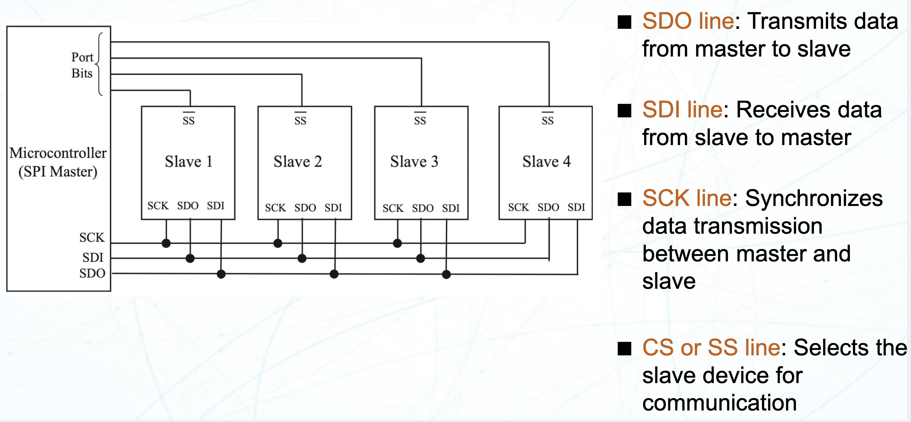

# Lecture 10 : Serial Peripheral Interface (SPI)

> 仍然是 Microelectronic System 里讲过的
>
> 点击这里查看 [Microelectronic System 复习 : SPI](./MS_Review_Notes/B4P1.md)
>
> SPI 的具体传输细节在那里讲的很清晰里，这里简单提及，不再细述

## 概述

SPI 是一种同步通讯协议，在 1980 年代由摩托罗拉（Motorola）开发，主要用于微控制器和各种外设之间的高速数据传输。SPI 的设计目标是实现高速、全双工的通信，适用于嵌入式系统中的各种应用。

SPI 协议遵从主从架构，主设备负责发起通信并控制数据传输，而从设备则响应主设备的请求。一路 SPI 总线上通常有一个主设备和一个或多个从设备，主设备在同一时间内只有一个处于活动状态。



典型的 SPI 实现一共有四根线：

- MOSI（Master Out Slave In）：主设备发送数据到从设备的线
- MISO（Master In Slave Out）：从设备发送数据到主设备的线
- SCLK（Serial Clock）：主设备生成的时钟信号线
- CS/SS（Chip Select/Slave Select）：主设备选择要与之通信的从设备的线

这是典型的全双工 SPI 的四线连接，对于别的场景可能会有所不同。 对于半双工的 SPI 连接，MOSI 和 MISO 可以共用一根线。对于只发送和只接收的 SPI 设备，可以只使用 MOSI 或 MISO 线。对于多主机的 SPI 连接，CS/SS 线可以是多路复用的。

## 传输

SPI 适合高速数据传输，通常在几 Mbps 到几十 Mbps 的范围内。SPI 的速度取决于主设备的时钟频率和从设备的响应能力。SPI 的传输速率通常比 I2C 快得多，因此适用于需要高速数据传输的应用场景。因为不用像 I2C 一样传输地址然后等待 ACK，所以 SPI 的传输延迟也更低。同时，全双工的特性让 SPI 可以同时发送和接收数据，进一步提高了传输效率。


对于 SPI 传输，需要注意 SCLK 时钟的参数，具体而言是指 CPOL（Clock Polarity）和 CPHA（Clock Phase）两个参数。CPOL 决定了时钟线在空闲的情况下的电平高低，CPHA 决定了设备在时钟的上升沿还是下降沿进行数据读取以及发送。你在实际使用中使用什么样的参数，往往由你选择的设备的数据手册决定。


## MBed OS 中的 SPI

### SPI 主机

> API 介绍来自 [MBed OS 的官方文档](https://os.mbed.com/docs/mbed-os/latest/apis/spi.html)

- `SPI(PinName mosi, PinName miso, PinName sclk, PinName cs)`: 构造函数，创建一个 SPI 对象
  - `mosi`: 主设备输出线
  - `miso`: 主设备输入线
  - `sclk`: 主设备时钟线
  - `cs`: 主设备片选线，可选参数，默认为 `NC`（不连接）
- `void format(int bits, int mode)`: 设置 SPI 的数据格式和时钟模式
  - `bits`: 数据位数，通常为 8 或 16 位
  - `mode`: 时钟模式，取值范围为 0 到 3，对应于 CPOL 和 CPHA 的组合
- `void frequency(int hz)`: 设置 SPI 的时钟频率
  - `hz`: 时钟频率，单位为赫兹
  - 默认参数是 1MHz
- `int write(const char *tx_buffer, int tx_length, char *rx_buffer, int rx_length)`: 发送和接收数据
  - `tx_buffer`: 发送缓冲区
  - `tx_length`: 发送数据的长度
  - `rx_buffer`: 接收缓冲区
  - `rx_length`: 接收数据的长度
  - 总共进行交互的字节数量是 `tx_length` 和 `rx_length` 的最大值。超出部分的字节输出补全默认值
- `void set_default_write_value(int value)`: 设置默认的写入值
  - `value`: 默认写入值，通常为 0xFF
  - 有的 SPI 设备在没有数据传输的时候会发送一些数据，这个函数可以设置默认的写入值

样例程序 (来自 [MBed OS 6: SPI](https://os.mbed.com/docs/mbed-os/v6.16/apis/spi.html))

```cpp
/*
 * Copyright (c) 2006-2020 Arm Limited and affiliates.
 * SPDX-License-Identifier: Apache-2.0
 */
#include "mbed.h"

SPI spi(D11, D12, D13); // mosi, miso, sclk
DigitalOut cs(D0);

int main()
{
    // Chip must be deselected
    cs = 1;

    // Setup the spi for 8 bit data, high steady state clock,
    // second edge capture, with a 1MHz clock rate
    spi.format(8, 3);
    spi.frequency(1000000);

    // Select the device by seting chip select low
    cs = 0;

    // Send 0x8f, the command to read the WHOAMI register
    spi.write(0x8F);

    // Send a dummy byte to receive the contents of the WHOAMI register
    int whoami = spi.write(0x00);
    printf("WHOAMI register = 0x%X\n", whoami);

    // Deselect the device
    cs = 1;
}
```

### SPI 从机

- `SPISlave(PinName mosi, PinName miso, PinName sclk, PinName cs)`: 构造函数，创建一个 SPI 从机对象
  - `mosi`: 从设备输入线
  - `miso`: 从设备输出线
  - `sclk`: 从设备时钟线
  - `cs`: 从设备片选线，可选参数，默认为 `NC`（不连接）
- `void format(int bits, int mode)`: 设置 SPI 的数据格式和时钟模式
  - `bits`: 数据位数，通常为 8 或 16 位
  - `mode`: 时钟模式，取值范围为 0 到 3，对应于 CPOL 和 CPHA 的组合
- `void frequency(int hz)`: 设置 SPI 的时钟频率
  - `hz`: 时钟频率，单位为赫兹，默认参数是 1MHz
- `int receive()`: 查看是否有数据可读
  - 返回值
    - `0`: 没有数据可读
    - `1`: 有数据可读
- `int read()`: 读取数据
  - 返回值
    - 读取到的数据
- `void reply(int value)`: 回复数据
  - `value`: 要回复的数据

样例程序 (来自 [MBed OS 6: SPI Slave](https://os.mbed.com/docs/mbed-os/v6.16/apis/spislave.html))

```cpp
/*
 * Copyright (c) 2006-2020 Arm Limited and affiliates.
 * SPDX-License-Identifier: Apache-2.0
 */
#include "mbed.h"

SPISlave device(D12, D11, D13, D10); // mosi, miso, sclk, ssel

int main()
{
    device.reply(0x00);              // Prime SPI with first reply
    while (1) {
        if (device.receive()) {
            int v = device.read();   // Read byte from master
            v = (v + 1) % 0x100;     // Add one to it, modulo 256
            device.reply(v);         // Make this the next reply
        }
    }
}
```


## 使用 SPI 驱动 ADXL345


ADXL345 是一款三轴加速度计，支持 SPI 和 I2C 通讯。我们使用 SPI 来驱动它。

查看 ADXL345 的数据手册，我们了解了它的驱动电压以及软件配置的细节。


根据数据手册，SPI 的最大频率是 5MHz， CPOL 和 CPHA 都是 1，MB 位为 1 来启用单次多字节传输。

这是它的写入和读取的时序：


进而，我们可以得出，在 MBed OS 中，ADXL345 的驱动代码应该是这样的：


> 总的来说，寄存器配置和具体通信内容看 ADXL345 的数据手册，SPI 的具体实现看 MBed OS 的 API 文档。把二者结合起来来实现正常的外设通信。
>
> 这里就不继续抄数据手册的寄存器定义了
