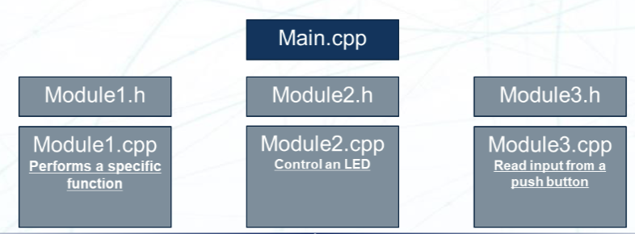
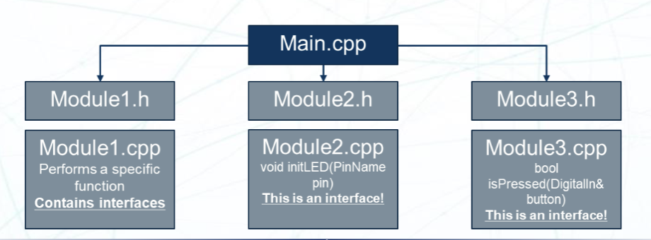
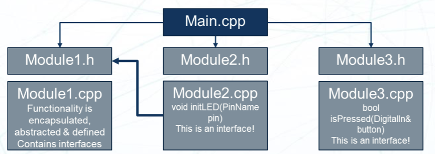
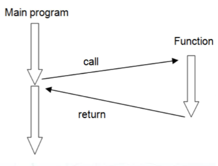
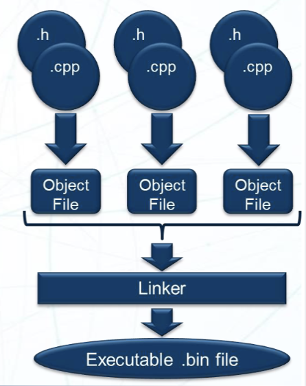
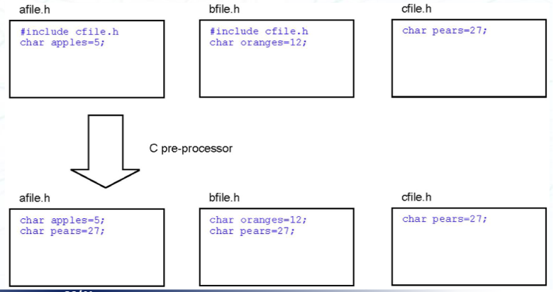
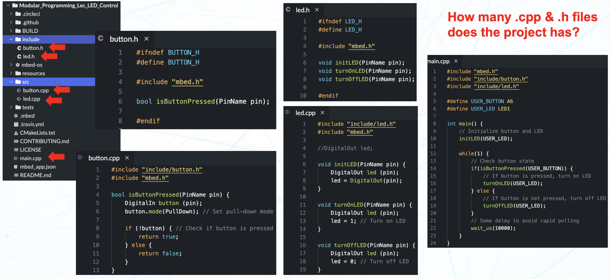

# Lecture 11 : Modular Programming (模块化编程)

## 概述

我们的目标是设计一个满足这样需求的嵌入式系统：

- 代码具有良好可读性，结构化并且文档充分
- 代码可以完全在外部进行性能测试（有标准接口）
- 开发过程可以重用现有的代码来降低开发时间
- 代码设计可以支持多个工程师同时在一个项目上工作
- 为未来升级提供高效的支持

为了完成以上提到的目标，在开始我们的系统实现之前，提前进行设计是很重要的，尤其是在有多个依赖或者多个独立的功能的大型系统项目中。就嵌入式系统而言，一个好的项目不可能把所有的函数逻辑都放在一个无限循环中，合理的代码功能分割可以提高代码的可维护性和可扩展性。

对比一下普通的结构化编程 (Procedural Programming) 和模块化编程 (Modular Programming)：

- 结构化编程 (Procedural Programming)
  - 顺序流 (Sequential Flow)
    - 它是一个线性的指令执行过程
  - 资源效率 (Resource Efficiency)
    - 通常有着更低的资源消耗，如内存占用和运行功耗
  - 有限的重用性 (Limited Reusability)
    - 代码重用性差，不同的函数紧密联系
  - 在复杂的项目中难以维护
- 模块化编程 (Modular Programming)
  - 封装 (Encapsulation)
    - 将代码分解成更小且可以维护的模块，每个模块进行一个特定的功能。
    - 这让整个代码更可读并且更可维护
  - 可重用性 (Reusability)
    - 在封装良好的情况下，代码可以在不同的项目中进行重用
  - 可扩展性 (Scalability)
    - 代码可以很容易的进行扩展，如添加功能、移除功能、或者修改模块的特定功能而不会影响到模块外部的代码

## 概念 (Key Concepts)

在具体的模块化编程之前，我们需要了解这样的一些概念：

- 模块 (Module)

  - 模块是模块化程序的主干
  - 每个模块封装了特定的功能
  - 他们应该有明确定义的边界、接口、以及一定的功能
  - 他们应该有可重用的设计，并且易于替换。



- 接口 (Interface)

  - 接口定义了模块之间的交互
  - 它们制定了模块可以使用的方法、函数、函数原型等
  - 它提供了一个清晰的边界，指明了每个模块的输入、输出和预期行为



- 抽象 (Abstraction)

  - 抽象是模块化编程的核心
  - 它允许我们隐藏复杂性并且只暴露必要的细节
  - 这让我们可以专注于模块的功能而不是实现细节，无需理解其内部的实现就可以使用对应的模块，进而提高了代码的可读性和可维护性

- 封装 (Encapsulation)

  - 封装是将数据和操作数据的函数组合在一起
  - 它允许我们隐藏模块的内部实现细节并且只暴露必要的接口
  - 这让我们可以更改模块的实现而不影响到其他模块，同时避免别的模块的行为影响当前模块。模块之间实现了松耦合 (Loose Coupling)，这让我们可以更容易的进行模块的替换和升级

- 依赖 (Dependency)

  - 依赖指的是模块之间的关系
  - 如一个模块需要依赖另一个模块的功能来运行
  - 管理模块之间的依赖关系是模块化编程中的重要部分，它是确保一个模块的修改不会影响到其他模块的关键



## 函数 (Functions)

函数（或者说是子程序 (subroutine)）是模块化编程的关键构建块。函数是一个独立的代码块，它可以被调用来执行特定的任务，与主函数相互独立。



函数可以用来操作数据，在有大量数据需要处理的场景中这很有用。数据可以输入到函数中，然后把结果返回到主函数中。

用函数来封装一个过程有这样的好处：

- 可以保证在不同时候调用函数时有相同的行为，不会改变。不用考虑重复编写代码时的错误
- 可以让软件的结构更清晰，把一系列行为抽象成一个行为
- 支持模块化编程思想

但是，函数也会带来这样的问题：

- 在调用函数时会有一定的开销（这一点可以通过内联函数来解决）。
- 嵌套函数会让代码层次过多，难以遵循运行过程
- C 语言的函数只能返回一个值，并且不能返回局部变量（当然，这个问题有解决方案，比如函数参数传入指针）

> 连后缀都写成 `.cpp` 了还在说自己是 C 语言程序吗，哈基格，你这家伙

设计函数时，要注意作用域原则 (Scope Rules)。作用域指的是变量的可见性和生命周期。它指明了变量在代码中的可见范围，以及变量对应的内存在何时被分配和释放。

一般的变量有三个类型：

- 局部变量 (Local Variables)
  - 在函数内部定义的变量
  - 只能在函数内部访问
  - 当函数结束时，局部变量的内存会被释放
- 形式参数 (形参，Formal Parameters)
  - 在函数调用时，函数传入的参数对应的值存入这些变量中
  - 这些被称为形式参数
  - 他们的作用域和生命周期和局部变量相同
  - 类型和函数的参数列表相同
- 全局变量 (Global Variables)
  - 在函数外部定义的变量
  - 可见性范围扩展到整个文件
  - 任何代码都可以访问全局变量，在多函数共享相同数据时很有用
  - 当多个函数使用同一个全局变量时，可能会导致意想不到的错误

## 所以，怎么做？

### 在工程中

大型的 cpp 项目需要拆分成不同的文件来提高可读性和可维护性。我们最好把不同的功能的具体实现放在不同的文件中，比如控制外围设备和控制用户输入。这样，如果我们需要修改对应的功能，只需要修改对应的文件即可。这样可以避免在一个文件中修改多个功能导致的错误。

在 C/CPP 项目中，模块化编程使用头文件让多个文件连接在一起。所有的函数在头文件里声明。程序进入点是 `main()` 函数，别的函数会在主函数里被调用，进而执行在别的文件里定义的函数。

头文件的扩展名是 `.h`，通常只包含声明，如编译器指令，函数原型，外部变量声明等。一个典型的例子是 MBed OS 里的 `mbed.h` 文件。

预处理器会将 `#include` 指令替换成对应的头文件。这样，编译器就可以在编译时找到函数的定义。

编译器会给每一个代码文件生成一个目标文件，然后链接器会将所有的目标文件连接在一起。链接器会将所有的函数和变量连接在一起，生成一个完整的可执行文件。



### 头文件带来的问题

之前提到了，我们会用 `#include` 指令来包含头文件。编译器对 `#include` 指令的处理是将头文件的内容直接插入到当前文件中。这样会导致以下问题：

如果我们同时有 `a.h` 和 `b.h` 两个头文件，两个头文件都包含了 `c.h`，那么在编译时，`c.h` 的内容会被插入到 `a.h` 和 `b.h` 中。这样会导致 `c.h` 的内容被插入两次。由于 C/C++ 不允许函数或者变量被定义两次，这会导致编译错误。



为了解决这个问题，我们需要使用预处理指令来避免头文件的多次包含。常见的解决方案是这样的：

```cpp
// my_header.h
#ifndef MY_HEADER_H
#define MY_HEADER_H

... // 头文件的内容

#endif
```

其中，`#ifndef` 是一个预处理指令，表示如果没有定义 `MY_HEADER_H`，就执行后面的代码。`#define` 指令会定义 `MY_HEADER_H`，这样在下次包含这个头文件时，`#ifndef` 指令会判断 `MY_HEADER_H` 是否已经定义，如果已经定义，就跳过头文件的内容，直到 `#endif` 指令。这样，在第一次包含这个文件时，`MY_HEADER_H` 没有被定义，头文件的内容被正常导入，同时 `MY_HEADER_H` 会被定义。在第二次或之后被包含时，`MY_HEADER_H` 已经被定义，头文件的内容会被跳过。这样就避免了头文件的多次包含问题。

在更现代的编译器中，还支持这样的写法：

```cpp
// my_header.h
#pragma once
... // 头文件的内容
```

`#pragma once` 指令会告诉编译器只包含一次这个头文件。这样就避免了多次包含的问题。虽然 `#pragma once` 是一个非标准的指令，但是大多数现代编译器都支持这个指令。但是，`#pragma once` 指令并不是 C/C++ 标准的一部分，所以在一些老旧的编译器中可能不支持这个指令。为了保证代码的可移植性，还是建议使用 `#ifndef` 和 `#define` 的方式来避免头文件的多次包含问题。

综上，在编写头文件时最好以 `#ifndef` 和 `#define` 的模板来编写，以确保头文件的内容只被包含一次。

### 实际工程

如果做到了上述内容，实现了模块化编程，那么我们就可以在一个大型的项目中使用模块化编程的思想来进行设计。我们可以将不同的功能拆分成不同的模块，每个模块都有自己的接口和实现。这样可以提高代码的可读性和可维护性，同时也可以提高代码的可重用性。

这是一个 PPT 给出的模块化编程的例子：


