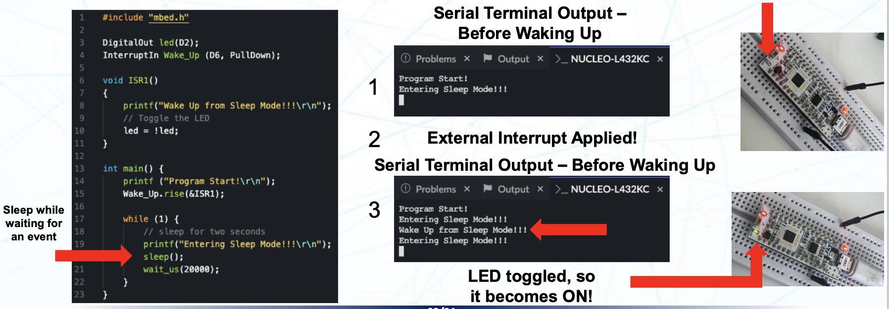

# Lecture 12 ; Energy Efficient Embedded System (节能嵌入式系统)

## 节能的嵌入式系统

ICT (信息与通信技术) 在过去的七十年里迅速发展，对应的碳足迹也随之增加。如果不采取一定行动，随着别的行业的碳排放减少，ICT 的碳排放将占比超过三分之一。因此，ICT 行业需要采取行动来减少其碳排放。

嵌入式系统的能效贯穿他的整个生命周期，从设计到废弃，包括：

- 软件设计
- 硬件设计
- 制造相关因素
- 包装
- 配送
- 操作和使用
- 废弃物处理/回收

对于嵌入式工程师，关心的是在运行期间，嵌入式系统的硬件和软件的功耗。这同时包括设计和实施方面的考虑。需要考虑的方面有：

- 硬件方面
  - 微控制器单元 (MCU)
  - 外围设备/组件的类型和数量 (包括内部和外部)
  - 系统供电
- 软件方面
  - 运行时间
  - 算法和数据结构
  - 软件开销（延迟，变量，迭代）

功耗更低的嵌入式系统有着更高效的运行效率，同时可以延长电池寿命，达到更长时间的运行效果。影响功耗的因素一般有：

- 应用类型
  - 不同类型的设备一般有着不同的功耗期望
  - 比如，便携式的媒体播放器需要长时间以满载运行，显示视频和音频
    - 电源消耗设置侧重于算法和数据流的功耗优化，而不是低功耗模式
  - 而蜂窝电话则需要格局其执行的功能实现不同的重负载和轻负载模式
    - 以最大化睡眠时间的方式尽可能节省电力为重点进行电源优化，之后才是数据流和算法的功耗优化
- 工艺技术
  - 不同的工艺技术有着不同的功耗特性，比如更小的晶体管提供了更高的集成度和更低的功耗
- 电压和频率
  - 管理电压和频率可以显著降低功耗

通常，功耗由这个公式计算

$$
P_{total} = P_{dynamic} + P_{static}
$$

- $P_{dynamic}$ 是动态功耗。
  - 它是指设备在主动使用核心、核心子系统、外围设备时消耗的功耗
- $P_{static}$ 是静态功耗。
  - 静态功耗指的是在设备不进行任何活动或任务时消耗的功耗
  - 因为即使在稳态下也存在电流的泄露路径，这个时候会产生静态功耗

## Mbed OS 上的功耗优化

### 概述

现有的物联网设备可以使用一块电池运行十年时间。在这个前提下，设计具有高能效、低功耗的系统是一项挑战。

复杂的嵌入式系统通常使用多个线程（程序指令序列）、活动计时器、并且通常有一个处理网络连接的第二个核心（当然，`NUCLEO-L432KC` 开发板没有这个特性）。这些特性都会增加使用功耗，我们电源管理和优化技术来降低功耗。

MBed OS 提供了多种低功耗特性，例如睡眠管理器。Mbed OS 一共提供了三种电源模式：

- 活动模式（Active Mode）
  - 设备处于活动状态，所有的时钟都在运行
  - 功耗最高
    
- 睡眠模式（Sleep Mode）
  - 核心系统时钟被禁用
  - 消除了处理器、内存系统、总线使用的动态功耗
    
- 深度睡眠模式（Deep Sleep Mode）
  - 所有高频时钟都被禁用，SysTick 计时器被禁用
  - 只有低频时钟（如 LSE 或 LSI）仍然在运行
  - 功耗最低
    

> 在 Mbed OS 中实现 RTOS 功能，需要一个计时和调度任务的机制（一个周期性产生中断的定时器），这被称为 System Ticker，或者简称 SysTick。

### Mbed OS 上的实现

Mbes OS 中，低功耗模式是使用这几个 API 来实现的：

- `void sleep_manager_sleep_auto(void)`
  - 进入自动选择的睡眠模式
  - 它选择睡眠和深度睡眠模式之间的最佳模式
  - 选择的依据是 deepsleep locking counter (DSLC) 计数器的值
- `void sleep_manager_lock_deep_sleep_internal(void)`
  - 这个函数锁定了深度睡眠模式
  - 如果这个函数被调用了，`sleep_manager_sleep_auto()` 函数会忽略深度睡眠模式
- `void sleep_manager_unlock_deep_sleep_internal(void)`
  - 这个函数解锁了深度睡眠模式
  - 如果这个函数被调用了，`sleep_manager_sleep_auto()` 函数会允许进入深度睡眠模式
- `static void sleep(void)`
  - 这个函数会让 MCU 进入睡眠模式

使用 `void sleep_manager_sleep_auto(void)` 后，当目前系统中的所有线程都是空闲状态时，Mbed OS 会将控制权交给空闲线程（后台系统线程），该线程会在没有其他线程执行的时候执行。空闲线程调用睡眠管理器，该管理器启动睡眠模式或者深度睡眠模式。空闲线程还设置一个定时器以再次唤醒系统，但也可以通过外部中断或者低功耗计时器（LPTIM）来唤醒系统

当已知代码无事可做的时候，可以手动调用睡眠模式（使用 `sleep()` 函数）。这会将 MCU 置于睡眠模式，直到有外部中断或者低功耗计时器（LPTIM）唤醒它。

### 在 NUCLEO-L432KC 上测量系统电流

在 NUCLEO-L432KC 上测量系统电流可以使用 ST-Link/V2-1 的 IDD 功能。这个功能可以测量 MCU 的电流消耗。只需要把 IDD 引脚上的跳线帽移除，然后将 IDD 引脚的两个针脚与电流表串联，即可测量 MCU 的电流消耗。

使用电流表测量睡眠时的电流消耗并不现实，因为它的大小可能只有几毫安甚至几百微安。此外，控制器可能只处于唤醒状态很短的时间。因此，手动测量并不是很实用的方法。并且，几乎所有的 NUCLEO 开发板都有一个板载的 ST-Link/V2-1 调试器用于调试。它也有相当的耗电量。因此，为了精准测量功耗，我们可能需要一个电流测量探针或者电源分析器。比如图中提到的 SiLabs Giant Gecko

## Mbed OS 上的系统统计

除了睡眠管理相关的 API，Mbed OS 还提供了一些系统统计相关的 API。这些 API 可以帮助我们了解系统的运行状态和性能。

- `us_timestamp_t mbed_time_sleep(void)`
  - 这个函数返回从 boot 开始到当前系统进入睡眠模式的时间（以微秒为单位）
- `us_timestamp_t mbed_time_deepsleep(void)`
  - 这个函数返回从 boot 开始到当前系统进入深度睡眠模式的时间（以微秒为单位）
- `us_timestamp_t mbed_time_idle(void)`
  - 这个函数返回从 boot 开始到当前系统进入空闲模式的时间（以微秒为单位）
- `us_timestamp_t mbed_uptime(void)`
  - 这个函数返回从 boot 开始到当前系统运行的时间（以微秒为单位）

要打印出来 us_timestamp_t 类型（实际上是 uint64_t 类型）的时间，如果使用的是 Keil Studio Cloud IDE，需要修改项目的 mbed_app.json 配置文件，添加内容 `%llu: Unsigned long long`。

