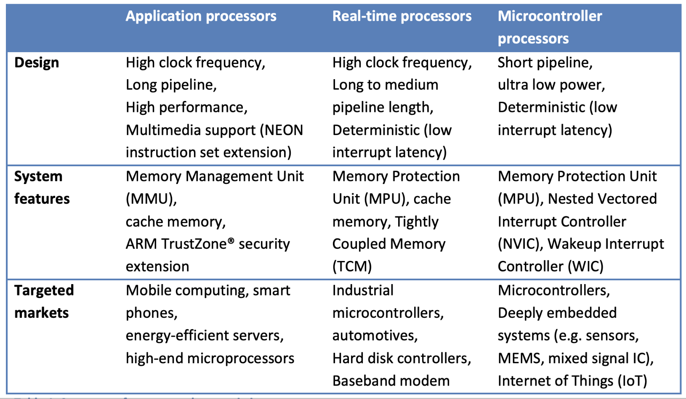

# Lecture 2 : ARM Processors & Intro to Interfacing (ARM 处理器 & 接口)

> Lecture @ 2025-3-3

## ARM 处理器

### 什么是 ARM 处理器

ARM 的全称是 Advanced RISC Machine，是一种基于 RISC 架构的处理器，由 ARM 公司设计。其中 RISC 是 Reduced Instruction Set Computing 的缩写，即精简指令集计算机。类似的，有 CISC (Complex Instruction Set Computing, 复杂指令集计算机)。

RISC 和 CISC 的区别在于指令集的复杂度，RISC 的指令集更加简单，执行速度更快，但是需要更多的指令来完成同样的任务。也正因此，RISC 的硬件实现更加简单，更容易设计和优化。

CISC 和 RISC 都是一种 ISA，即 Instruction Set Architecture，指令集架构。ISA 定义了处理器的指令集，包括指令的格式、操作数的个数、寻址方式等。ISA 定义了软件和硬件之间的接口，使得软件可以在不同的硬件上运行。

ISA 是一种低级的抽象，它定义了处理器的指令集，但是不关心具体的实现。处理器的实现可以有很多种，只要它们遵循了 ISA 的规范，就可以运行相同的软件。而我们之前学过的编程语言，比如 C 语言，是一种高级的抽象，它定义了程序的结构和语法，但是不关心底层的硬件。

| 区别           | RISC                           | CISC                           |
| -------------- | ------------------------------ | ------------------------------ |
| 指令集         | 一个周期执行一个的简单指令     | 复杂指令，可能需要多个周期     |
| 更通用的寄存器 | 芯片里有更多的空间给寄存器     | 相对更少的寄存器               |
| 内存模型       | 简单的内存模型，更少的数据类型 | 复杂的内存模型，更多的数据类型 |
| 重点           | 重点在软件上                   | 重点在硬件上                   |

总结一下:

- CISC
  - 优点
    - 代码的体积更小，因为一个指令可以完成更多的工作
    - 内存效率更高
  - 缺点
    - 运行更慢
    - 硬件设计更复杂
    - 通常有更高的功耗
- RISC
  - 优点
    - 运行更快
    - 功耗更低
  - 缺点
    - 更多的指令，因此代码更大
    - 需要更多的内存
    - 制造成本更高

> 并不只有 ARM 是 RISC 架构，还有 MIPS，RISC-V 等等。

### ARM 处理器的类型

ARM 处理器广泛用于移动设备、嵌入式系统、智能手机、平板电脑、智能手表、智能家居等等。不同的 ARM 处理器有不同的性能和功耗，适用于不同的场景。

- ARM Cortex-M
  - 定位是 Microcontroller Processors, 适用于嵌入式系统
  - 低功耗，低成本
  - 时钟频率通常小于 200MHz
  - 适用于实时系统
- ARM Cortex-A
  - 定位是 Application Processors, 适用于智能手机、平板电脑等
  - 支持手机操作系统，比如 Android。同时支持 Linux
  - 高性能，时钟频率通常大于 1GHz
- ARM Cortex-R
  - 定位是 Real-time Processors, 适用于实时系统
  - 通常用于汽车、工业控制等
  - 时钟频率通常为 200MHz 到 1GHz

PPT 上给了一个更加详细的表格，可以参考。

对于嵌入式，常用的是 ARM Cortex-M 系列的处理器。比如 STM32 系列的处理器。

- Cortex-M1
  - 适用于 FPGA, 用于定制的处理器
- Cortex-M0 & Cortex-M0+ (ARMv6-M)
  - 适用于低成本、低功耗的应用
  - 适用于简单的嵌入式系统
- Cortex-M3 & Cortex-M4 (ARMv7-M)
  - 适用于中等成本、中等功耗的应用
  - 适用于复杂的嵌入式系统
- Cortex-M4 adds DSP & FPU
  - 适用于需要 DSP 和 FPU 的应用
- Cortex-M7 (ARMv7E-M)
  - 高性能系列，支持 DSP 和更先进的浮点运算指令

### 与 x86 和 MIPS 处理器的比较

| 区别 | 硅片面积 | 功耗 | 性能 | 指令集 | 使用场景 | 设计目标   |
| ---- | -------- | ---- | ---- | ------ | -------- | ---------- |
| ARM  | 更小     | 更低 | 更低 | RISC   | 最佳能效 | 嵌入式系统 |
| x86  | 更大     | 更高 | 更高 | CISC   | 最高性能 | 通用系统   |

| 区别 | 指令集 | 寄存器数量 | 特点                               |
| ---- | ------ | ---------- | ---------------------------------- |
| ARM  | RISC   | 16         | 支持 64 位，数据吞吐量高，更受欢迎 |
| MIPS | RISC   | 32         | 适用于嵌入式系统                   |

## STM32 : 典型的 ARM Cortex-M 处理器

### NUCLEO-L432KC

在这个课程中，我们将使用 STM32 系列的处理器，具体是 NUCLEO-L432KC 开发板。这个开发板集成了 STM32L432KC 处理器，是一款 ARM Cortex-M4 处理器。

STM32L432KC 是 STM32L4 系列的处理器，属于低功耗的 L 系列。它的定位是 L4 系列，适用于低功耗、低成本的应用。它的特点是低功耗、高性能、高集成度。

STM32L432KC 的命名方式是 `STM32` + `L` + `4` + `32` + `K` + `C`，其中：

- `STM32` 是 STM32 系列的处理器
- `L` 是 L 系列，低功耗系列
- `4` 是 L4 系列，属于低功耗系列中较高性能的系列
- `32` 指具体是 L4 系列中的 L432 系列，决定了对应的外设数量等
- `K` 32pin 封装
- `C` 指的是 256KB Flash

> 用的时候再查具体的含义。

NUCLEO-L432KC 则是使用了 STM32L432KC 的具体的型号字母来命名的。NUCLEO 是 STMicroelectronics 推出的一款开发板系列，用于快速原型开发。NUCLEO-L432KC 是其中的一款，使用了 STM32L432KC 处理器，同时版载了一些常用的外设，比如 LED、按键、USB、UART，以及一个 STLINK 调试器。

### Cortex-M4 的内存映射

> 回顾一下 Microelectronic System 讲过的嵌入式系统的存储类型。

内存映射是指将处理器的地址空间映射到外设的地址空间，使得处理器可以通过读写内存的方式来访问外设。不同的处理器会有不同的内存映射，具体的内存映射可以查看处理器的数据手册。

s
这个图是 Cortex-M4 的内存映射，可以看到，Cortex-M4 的地址空间被分为了几个部分

| 内存部分          | 内存大小 | 内存地址                | 功能                                  |
| ----------------- | -------- | ----------------------- | ------------------------------------- |
| 代码              | 0.5 GB   | 0x00000000 ~ 0x20000000 | 片上的 flash，用于存储用户编写的程序  |
| SRAM (Static RAM) | 0.5 GB   | 0x20000000 ~ 0x40000000 | 片上的 SRAM，来快速存取需要的数据     |
| 外设              | 0.5 GB   | 0x40000000 ~ 0x60000000 | 外设的寄存器，通过内存地址来访问外设  |
| 外置 RAM          | 1 GB     | 0x60000000 ~ 0xA0000000 | 外部的 RAM                            |
| 外置设备          | 1 GB     | 0xA0000000 ~ 0xE0000000 | 外部设备的寄存器，比如 SRAM、Flash 等 |
| 系统              | 0.5 GB   | 0xE0000000 ~ 0xFFFFFFFF | 给系统中断以及一些系统组件使用        |

> 这个也不用背，不同的处理器是不同的，需要的时候查阅数据手册

## GPIO (General Purpose Input Output, 通用输入输出)

### 什么是 GPIO

GPIO，全称是 General Purpose Input Output，通用输入输出。它是一种通用的接口，可以用来连接处理器和外设。通过 GPIO，处理器可以读取外设的状态，或者控制外设的状态。

在硬件上，GPIO 是一些引脚，可以通过软件来配置这些引脚的功能。比如，可以将一个引脚配置为输入模式，用来读取外设的状态；也可以将一个引脚配置为输出模式，用来控制外设的状态。

同时它也可以自定义为一些特殊的功能，比如连接 ADC、DAC 或者串行总线等。

### GPIO 的硬件结构

可以看到，GPIO 的硬件结构包括了输入输出缓冲器、控制寄存器、数据寄存器、上拉下拉电阻等。

输入部分包括了输入缓冲器和控制寄存器，用于读取外设的状态。输出部分包括了输出缓冲器、控制寄存器和数据寄存器，用于控制外设的状态。

内部的上下拉 MOSFET 电阻可以用来拉高或拉低电平，使得引脚的电平可以保持在一个确定的状态。

最右侧的上下拉电阻是可选的，可以通过软件来控制是否启用。二极管是用来保护引脚的，防止反向电压，让引脚的电压保持在一个安全的范围。

### GPIO 的八种模式

- 输入模式
  - Floating Input (浮空输入)
    - 引脚电平默认浮空，不上拉不下拉
  - Pull-up Input (上拉输入)
    - 引脚电平默认上拉，默认为高电平
  - Pull-down Input (下拉输入)
    - 引脚电平默认下拉，默认为低电平
  - Analog Input (模拟输入)
    - 用于连接 ADC，读取模拟信号
- 输出模式
  - Push-pull Output (推挽输出)
    - 引脚可以输出高电平或低电平
      - 可以通过内置的接地 pull-down 电阻来拉低电平
      - 可以通过内置的电源 pull-up 电阻来拉高电平
  - Open-drain Output (开漏输出)
    - 引脚可以输出低电平，但是不能输出高电平
      - 具体原理是通过控制接地开关来控制输出
    - 需要外部上拉电阻来拉高电平
  - Alternate Function (复用功能) output
    - 也分为 push-pull 和 open-drain 两种
    - 用于连接外设，比如串口、SPI、I2C 等

---

> 最后附加了一些关于硬件 debug 的方法
>
> - 数字万用表，作为电压表测量电压，作为电流表测量电流，以及一些基础的使用方法
> - 示波器，用来观测信号的波形，可以观测电压信号、电流信号、数字信号等
