# Lecture 3 : Assembly and Machine Language

> Lecture @ 2025-3-10
>
> 感觉不如进[图灵完备](https://store.steampowered.com/app/1444480/Turing_Complete/)里自己搓一遍

## 嵌入式 C 源代码的编译过程

1. C 源代码，包括 C 函数文件，头文件，相关的库文件等
2. 经过编译器后，生成汇编代码（此时仍然具有可读性），常见的文件后缀是 `.s`
3. 经过汇编器后，生成机器码（此时无法阅读），常见的文件后缀是 `.o`
4. 经过链接器后，生成可执行文件（同样是机器码，无法阅读）
5. 将可执行文件通过下载器下载到 Arm 处理器中

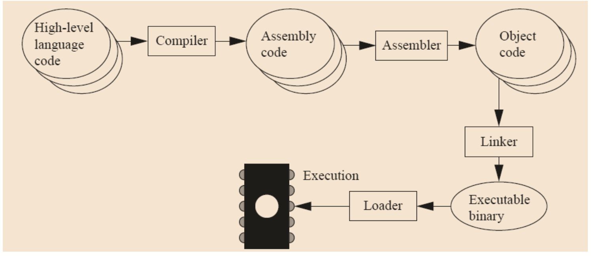

## 汇编语言 (Assembly Language)

### 什么是汇编语言

- 汇编语言
  - 汇编语言是一种低级的编程语言，和机器语言类似，但是比机器语言更容易阅读和理解
  - 汇编语言使用助记符来表示机器指令。
  - 汇编语言通常是与特定的处理器架构相关的，因此不同的处理器架构有不同的汇编语言。
- 机器语言
  - 机器语言是计算机能够直接理解和执行的语言，通常是二进制代码
  - 机器语言是最底层的编程语言，通常是与特定的处理器架构相关的。
  - 通常并不具有可读性

### 汇编语言的结构

一个典型的汇编语言语句有以下几个部分

```asm
<Label> <Mnemonic> <Operands> ; <Comment>
```

- `<Label>`: 标签，通常是一个标识符，用于标识程序中的某个位置
- `<Mnemonic>`: 助记符，表示要执行的操作，比如 `MOV`, `ADD`, `SUB` 等
- `<Operands>`: 操作数，表示要操作的数据，可以是寄存器、内存地址、立即数等
- `; <Comment>`: 注释，用于解释代码的含义，通常以 `;` 开头

对于机器码，通常结构是这样的

```asm
<Opcode> <Operands> ; <Comment>
```

- `<Opcode>`: 操作码，表示要执行的操作，比如 `0xE0800002`, `0xE0800003` 等
- `<Operands>`: 操作数，表示要操作的数据，可以是寄存器、内存地址、立即数等
- `; <Comment>`: 注释，用于解释代码的含义，通常以 `;` 开头
- `0xE0800002` 是一个 32 位的机器码，表示要执行的操作

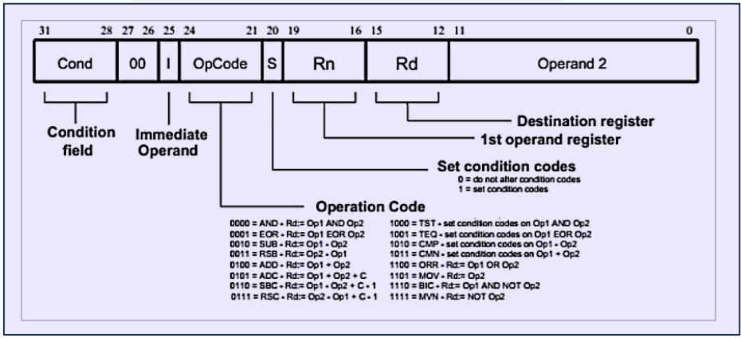

汇编会被转换成机器码，机器码是计算机能够直接理解和执行的语言，通常是二进制代码。汇编语言和机器语言之间的转换是通过汇编器完成的。

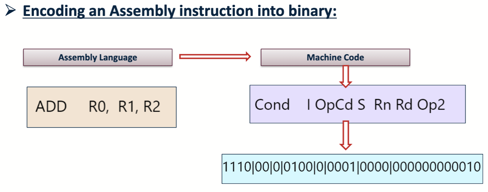

## 字节存储顺序 (Endian)

计算机如果要把一个数据存储在内存中，需要按照一定的格式。

数据存储在内存中。内存的基础单元是一个字节 (8 bits)，一个字节可以存储一个字符。内存是由很多个字节组成的，每个字节都有一个地址。这个地址是一个无符号整数，表示这个字节在内存中的位置。地址具有一定的长度，比如 32 位的地址可以表示 2^32 个字节的内存空间 (也就是 4GiB )，64 位的地址可以表示 2^64 个字节的内存空间。ARM (arm64 之前的架构) 处理器使用的是 32 位的地址。

对于需要占据多个字节的数据，数据的存储也有两种方式

- 大端存储 (Big Endian)

  - 大端存储是指数据的高位字节存储在低地址中，低位字节存储在高地址中
  - 例如，0x12345678 在内存中的存储方式是

    ```asm
    Address   Value
    0x00      0x12  <- MSB
    0x01      0x34
    0x02      0x56
    0x03      0x78  <- LSB
    ```

  - 在传输过程中，大端存储的传输顺序是从高位到低位，低位在后，也就是 MSB -> LSB

- 小端存储 (Little Endian)

  - 小端存储是指数据的低位字节存储在低地址中，高位字节存储在高地址中
  - 例如，0x12345678 在内存中的存储方式是

    ```asm
    Address   Value
    0x00      0x78  <- LSB
    0x01      0x56
    0x02      0x34
    0x03      0x12  <- MSB
    ```

  - 在传输过程中，小端存储的传输顺序是从低位到高位，高位在后，也就是 LSB -> MSB

大端模式和小端模式不只在内存中存储数据时有区别，在网络传输数据时也有区别。网络传输数据时，通常使用大端模式来存储数据。这是因为大端模式更符合人类的阅读习惯。

对于 ARM 处理器，默认的模式是小端模式 (现在的处理器基本都是小端模式，因为更方便计算)。而如果需要的话，可以通过编程的方式实现大端模式的效果。

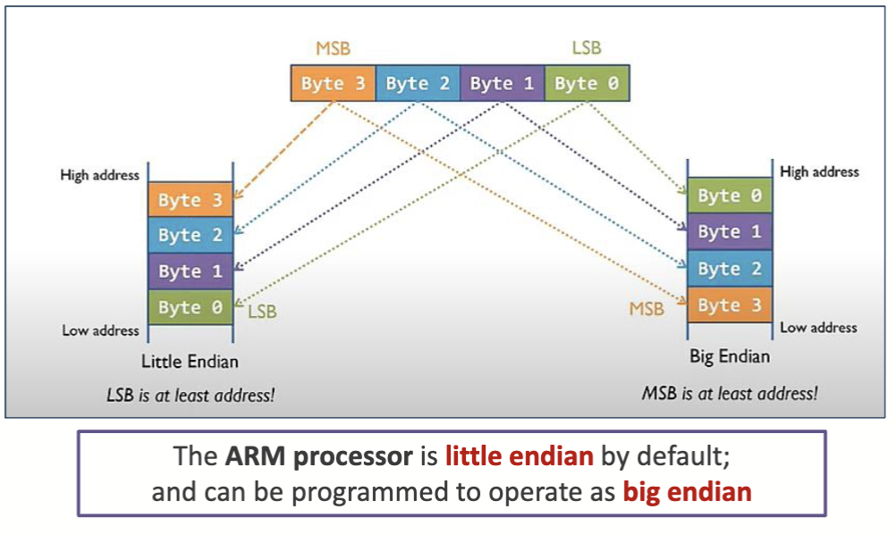

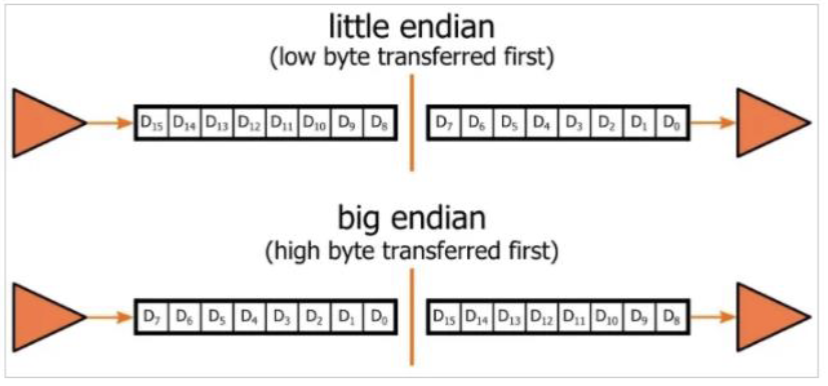

> 值得一提的是，大端存储和小端存储的名字来源于《格列佛游记》中的一个故事。故事中有两个国家，一个国家的人认为大端是正确的，另一个国家的人认为小端是正确的。
>
> 故事里的大端和小端指的是鸡蛋的两端。一个国家的人认为应该从大端开始吃鸡蛋，另一个国家的人认为应该从小端开始吃鸡蛋。这个故事用来形容两种不同的观点。

## 关于 ARM 处理器

### 指令集 (ISA)

如果需要编写特定处理器上运行的汇编语言，第一件事是确定对应的处理器的指令集 (ISA, Instruction Set Architecture)。指令集是处理器能够执行的所有指令的集合。不同的处理器有不同的指令集。

对于一个指令集，它有以下几个部分：

- 处理器在哪里存储和读取数据
  - 寄存器 (registers)
  - 内存 (memory)
  - I/O 设备 (Input/Output devices)
- 处理器如何操作 (manipulate) 数据
  - 汇编语言命令 (Assembly-language instruction)
  - 处理器硬件活动 (processor hardware actions)

对于 RISC 指令集的处理器，它是加载/存储机器 (load/store machine)，也就是说，它只能通过加载指令从内存中读取数据到寄存器，或者通过存储指令将寄存器中的数据写入内存。所有的操作都必须在寄存器中进行。

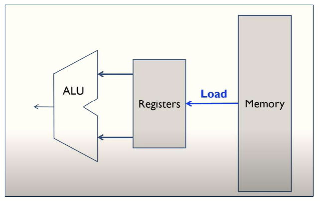
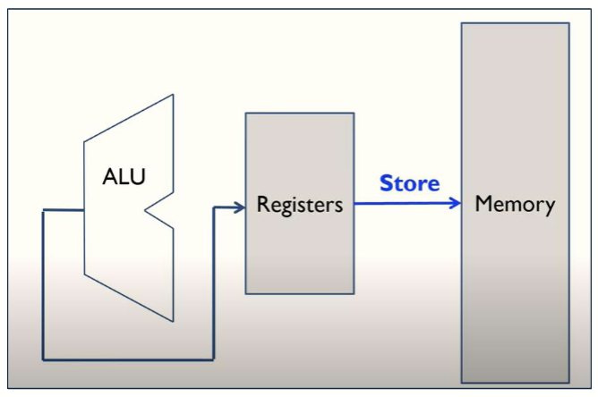

### 寄存器 (Registers)

对于 ARM 处理器，它有 16 个寄存器，分别是 `R0` 到 `R15`。不同的寄存器有着不同的用途

- `R0` 到 `R12`: 通用寄存器 (general-purpose registers)
  - 位宽为 32 位
  - 可以用于存储数据或者地址，数据可以是 32 位、16 位、8 位等
- `R13`: 栈指针寄存器 (SP, stack pointer register)
  - 位宽为 32 位
  - 用于存储栈的地址
  - 其中有
    - 主栈指针 (MSP, Main Stack Pointer)
      - 用于存储主栈的地址
      - 主栈用于存储函数调用时的参数和返回值
    - 进程栈指针 (PSP, Process Stack Pointer)
      - 用于存储进程栈的地址
      - 进程栈用于存储进程的局部变量和函数调用时的参数
- `R14`: 链接寄存器 (LR, link register)
  - 位宽为 32 位
  - 用于存储函数返回地址
  - 当调用一个函数时，链接寄存器会存储返回地址
  - 当函数执行完毕后，链接寄存器会被用来返回到调用函数的地方
- `R15`: 程序计数器 (PC, program counter)
  - 位宽为 32 位
  - 用于存储下一条要执行的指令的地址
  - 也可以用于存储当前正在执行的指令的地址

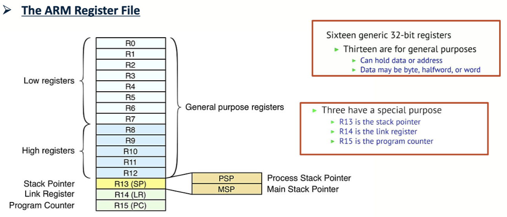

### 内存映射 (Memory Map)

内存映射是指将内存地址映射到处理器的寄存器和 I/O 设备上。内存映射可以让处理器通过访问内存地址来访问寄存器和 I/O 设备。

回顾 [Lecture 2](Lecture2.md#cortex-m4-的内存映射) 中的 ARM 处理器的内存映射

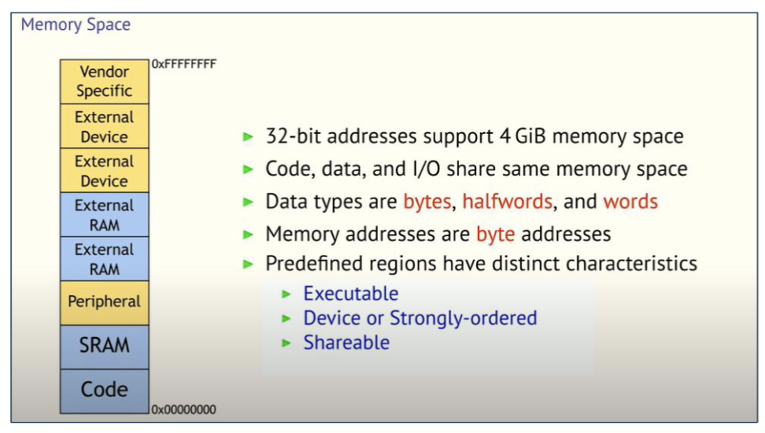

### CPU 结构

> 这一部分可以回顾大一下的 Microelectronics Systems 课程

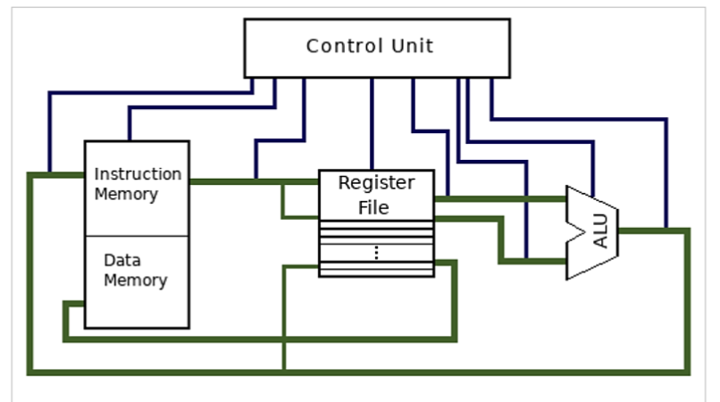

在图中有以下几个部分

- 控制单元 (CU, Control Unit)
  - 控制单元是 CPU 的核心部分，负责控制 CPU 的工作
  - 控制单元通过控制信号来控制 ALU 和寄存器的工作
- 算术逻辑单元 (ALU, Arithmetic Logic Unit)
  - 算术逻辑单元是 CPU 的计算部分，负责执行算术和逻辑运算
  - 算术运算包括加法、减法、乘法、除法等
  - 逻辑运算包括与、或、非、异或等
- 寄存器 (Registers)
  - 寄存器是 CPU 的存储部分，负责存储数据和地址
  - 寄存器的速度比内存快很多，但是容量比内存小很多
  - 寄存器的数量和大小决定了 CPU 的性能
- 内存 (Memory)
  - 内存是 CPU 的存储部分，负责存储数据和指令
  - 内存的速度比寄存器慢很多，但是容量比寄存器大很多
  - 内存的大小决定了 CPU 的性能
  - ARM 的内存又分为了两个部分
    - 指令存储器 (Instruction Memory)
      - 存储 CPU 要执行的指令
    - 数据存储器 (Data Memory)
      - 存储 CPU 要处理的数据

可以从图中看到，ARM 处理器的指令存储器和数据存储器是分开的，这种结构叫做哈佛架构，在 [Lecture.1](./Lecture1.md#不同的电脑架构) 中有提到。实际上，对于 ARM 指令集的处理器，两种架构都是存在的。

### 流水线 (Pipeline)

流水线指的是将指令的执行过程分成多个阶段，每个阶段可以同时执行不同的指令。流水线的目的是提高 CPU 的性能。

- 指令的执行过程分为以下几个阶段
  - 取指 (Fetch)
    - 从内存中读取指令
  - 解码 (Decode)
    - 将指令解码成机器码
  - 执行 (Execute)
    - 执行指令
  - 写回 (Write Back)
    - 将结果写回寄存器
- 流水线的优点是可以提高 CPU 的性能，因为多个指令可以同时执行

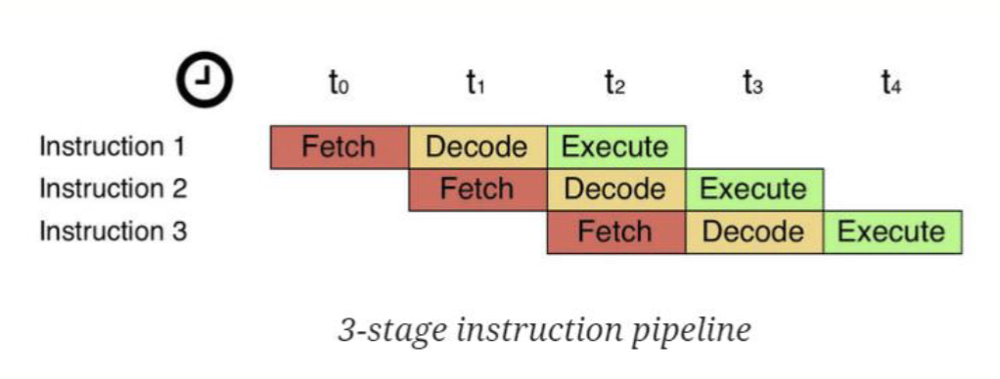

### 函数调用

对一个过程 (或者说函数) 的调用被称为一个帧 (frame)，它包含了函数的参数、局部变量、返回地址等信息。

帧的大小由函数的参数和局部变量的大小决定。帧的大小通常是 4 的倍数，因为 ARM 处理器是 32 位的。

帧被存储在一个栈 (Stack) 中，栈是一个后进先出 (LIFO) 的数据结构。这里存储的内容是这个帧被调用的地方

> 那么，[什么是栈呢](https://baike.baidu.com/item/%E6%A0%88/12808149)？

过程栈 (Procedure Stack) 的顺序是从栈顶到栈底，从高地址到低地址。这符合 LIFO 的设计。

栈指针 (SP, Stack Pointer) 定义了当前帧的结尾。栈指针指向当前的栈的顶部，也就是目前最低的地址。它标志着栈内存储数据的边界。

帧指针 (FP, Frame Pointer) 定义了当前帧的起始位置，或者说上一个帧的末尾位置。它在函数调用过程中保持不变。

这些部分相互作用，可以实现高级语言编程中的函数调用和函数返回的效果。对于汇编语言里的具体实现，见[后面关于分支跳转的部分](#bl--bx-分支链接分支交换)。

## 那么，该怎么写汇编？

之前我们提到了[汇编语言的结构](#汇编语言的结构):

```asm
<Label> <Mnemonic> <Operands> ; <Comment>
```

用一个简单的例子来讲解一下汇编语言的基础结构

```asm
ADD R0, R1, R2 ; R0 = R1 + R2
```

- `<Label>`: 没有标签
- `<Mnemonic>`: `ADD`
  - 表示要执行加法操作
- `<Operands>`: `R0, R1, R2`
  - 表示要将 `R1` 和 `R2` 中的值相加，并将结果存储到 `R0` 中
  - 具体的顺序由 ISA 定义
- `<Comment>`: `R0 = R1 + R2`
  - 注释并不会对程序的逻辑产生影响
  - 注释通常用于表示这条指令的作用
  - 注释是可选的，但是建议添加注释，以便于理解代码的含义

接下来，我们来详细讲解一下汇编语言的各个部分

### `<Operands>`: 操作数

操作数是汇编语言中第二重要的部分，它表示要操作的数据。操作数可以是寄存器、内存地址、立即数等。
操作数的类型和数量由助记符决定。对于 ARM 处理器，操作数通常是寄存器或者立即数。

#### 寄存器

如果要使用寄存器里的值，写法是 `R` 加上对应的寄存器编号，例如 `R0`, `R1`, `R2` 等等

常见的做法是将 `R4 - R11` 用作保存变量的值，使用 `R0 - R3` 和 `R12` 用于存储中间值

`LSL` 是 `Logical Shift Left` 的缩写，表示逻辑左移。还有其他的移位操作，比如 `LSR` 表示逻辑右移。

#### 立即数 (Immediate) / 常量 (Constant)

立即数指的是一个常量，直接用于指令中作为操作数，而不需要额外的存储。立即数可以用来表示固定的值，如数值常量，简化计算和操作。

对于 ARM 处理器来说，立即数的位宽不能超过 8 位 (至少 PPT 不认为可以)。

立即数的写法是以 `#` 开头，后面跟随对应的数值。数值可以是十进制、十六进制、二进制等。

例如 `#42` 表示十进制的 42, `#0x2A` 表示十六进制的 2A, `#0b101010` 表示二进制的 101010。

例如，这个程序的效果是将 `R1` 中的值加上 42，并将结果存储到 `R0` 中：

```asm
ADD R0, R1, #42
```

#### 带位移量的寄存器

有的时候，寄存器的位置写的并不单纯是寄存器的值，可能还带有一定的移位操作，比如这种代码

```asm
ADD R0, R1, R2, LSL #2
```

这条指令后面的 `LSL #2` 表示将 `R2` 中的值左移 2 位，然后再和 `R1` 中的值相加，最后将结果存储到 `R0` 中。等效于这样的 C 代码

```c
R0 = R1 + (R2 << 2);
```

类似的，还有 `LSR` 表示右移。

#### 内存地址

在程序中，有的时候要处理大量的数据，但是寄存器只有 16 个不够用。所以我们需要内存来存储存不下的数据。内存的速度较慢，但是容量较大。

为了加快运行速度，通常把经常读取的变量值放在寄存器里，而把不常用的变量存储在内存中。每个字节在内存中都有一个地址。

因为寄存器是 32 位的，从内存中读取的数据也是 32 位的，所以内存地址通常以 4 为间隔步进。

可以从[内存中读取数据到寄存器中](#ldr-从内存中读取数据)，或者[从寄存器中写入到内存里](#str-将寄存器写入内存)。

### `<Mnemonic>`: 助记符，要执行的操作

助记符是汇编语言中最重要的部分，它表示要执行的操作。助记符通常是一个单词或者一个缩写，表示要执行的操作，比如 `ADD`, `SUB`, `MUL`, `DIV` 等。

#### 数据操作 (Arithmetic Operations)

##### `MOV`: 数据移动

`MOV` 指令用于将一个寄存器的值移动到另一个寄存器中，或者将立即数移动到寄存器中。`MOV` 指令的格式如下：

```asm
MOV <destination>, <source>
```

- `<destination>`: 目标寄存器，表示要将值移动到哪个寄存器中
- `<source>`: 表示要将哪个寄存器的值移动到目标寄存器中
  - 可以是寄存器，也可以是立即数

在 c 语言中等效为

```c
destination = source;
```

##### 算术指令 (Arithmetic Operations)

算术指令用于对寄存器中的数据进行加法、减法、乘法、除法等操作。

###### `ADD`: 加法

`ADD` 指令用于将两个寄存器的值相加，并将结果存储到目标寄存器中。它的格式如下：

```asm
ADD <destination>, <source1>, <source2>
```

- `<destination>`: 目标寄存器，表示要将值移动到哪个寄存器中
- `<source1>`: 第一个源寄存器
  - 必须是寄存器
- `<source2>`: 第二个源寄存器
  - 可以是寄存器，也可以是立即数
  - 也可以是带位移量的寄存器

比如，这样的汇编代码

```asm
ADD R0, R1, R2
ADD R3, R4, #42
```

等价于这样的 C 代码

```c
R0 = R1 + R2;
R3 = R4 + 42;
```

###### `ADDS`: 加法，设置符号位

`ADDS` 指令用于将两个寄存器的值相加，并将结果存储到目标寄存器中。在最终，它会根据计算的结果[设置符号位 (N, Z, C, V)](#条件执行-conditional-execution)

```asm
ADDS <destination>, <source1>, <source2>
```

用法和 `ADD` 保持一致

###### `ADC`: 带进位的加法

`ADC` 指令用于将两个寄存器的值相加，并将结果存储到目标寄存器中。因为使用了进位，它可以处理大于 32bit 的数据。
它的格式如下：

```asm
ADC <destination>, <source1>, <source2>
```

- `<destination>`: 目标寄存器，表示要将值移动到哪个寄存器中
- `<source1>`: 第一个源寄存器
  - 必须是寄存器
- `<source2>`: 第二个源寄存器
  - 可以是寄存器，也可以是立即数
  - 也可以是带位移量的寄存器
- `C` 标志位: 进位标志位，表示是否有进位
  - 如果有进位，则将进位加到结果中
  - 如果没有进位，则不加进位

对于 `ADC R0, R1, R2`，它的等价 C 代码是

```c
R0 = R1 + R2 + C;
```

###### `SUB`: 减法

`SUB` 指令用于将两个寄存器的值相减，并将结果存储到目标寄存器中。它的格式如下：

```asm
SUB <destination>, <source1>, <source2>
```

- `<destination>`: 目标寄存器，表示要将值移动到哪个寄存器中
- `<source1>`: 第一个源寄存器
  - 必须是寄存器
- `<source2>`: 第二个源寄存器
  - 可以是寄存器，也可以是立即数
  - 也可以是带位移量的寄存器

对于 `SUB R0, R1, R2`，它的等价 C 代码是

```c
R0 = R1 - R2;
```

###### `SUBS`: 减法，设置符号位

`SUBS` 指令用于将两个寄存器的值相减，并将结果存储到目标寄存器中。在最终，它会根据计算的结果[设置符号位 (N, Z, C, V)](#条件执行-conditional-execution)

```asm
SUBS <destination>, <source1>, <source2>
```

用法和 `SUB` 保持一致

###### `SBC`: 带借位的减法

`SBC` 指令用于将两个寄存器的值相减，并将结果存储到目标寄存器中。因为使用了借位，它可以处理大于 32bit 的数据。

```asm
SBC <destination>, <source1>, <source2>
```

- `<destination>`: 目标寄存器，表示要将值移动到哪个寄存器中
- `<source1>`: 第一个源寄存器
  - 必须是寄存器
- `<source2>`: 第二个源寄存器
  - 可以是寄存器，也可以是立即数
  - 也可以是带位移量的寄存器
- `C` 标志位: 进位寄存器，表示是否有借位
  - 没有借位时为默认值 1，发生借位时为 0
  - 如果有借位，则将借位减去结果中
  - 如果没有借位，则不减去借位

对于 `SBC R0, R1, R2`，它的等价 C 代码是

```c
R0 = R1 - R2 - C; // 标志位被设立时 C 取 0
```

###### `MUL`: 乘法

`MUL` 指令用于将两个寄存器的值相乘，并将结果存储到目标寄存器中。它的格式如下：

乘法指令将会执行 32bit 与 32bit 的数据的乘法运算，并存储低 32bit 的结果。因此结果对于有符号数和无符号数是一样的。

```asm
MUL <destination>, <source1>, <source2>
```

- `<destination>`: 目标寄存器，表示要将值移动到哪个寄存器中
- `<source1>`: 第一个源寄存器
- `<source2>`: 第二个源寄存器

##### 逻辑指令 (Logical Operations)

逻辑指令用于对寄存器中的数据进行与、或、非、异或、移位等操作。

###### `AND`: 按位与

`AND` 指令用于将两个寄存器的值进行按位与操作，并将结果存储到目标寄存器中。它的格式如下：

```asm
AND <destination>, <source1>, <source2>
```

- `<destination>`: 目标寄存器，表示要将值移动到哪个寄存器中
- `<source1>`: 第一个源寄存器
- `<source2>`: 第二个源寄存器

等效于 C 语言的 `&` 运算符

> `AND` 指令通常用于对数据进行掩码操作，如 0b10101010 为原数据，若只想保留其第七位，则可以与 0b01000000 进行 `AND` 操作。
>
> 也可以用来清除一些不需要的位

###### `ORR`: 按位或

`ORR` 指令用于将两个寄存器的值进行按位或操作，并将结果存储到目标寄存器中。它的格式如下：

```asm
ORR <destination>, <source1>, <source2>
```

- `<destination>`: 目标寄存器，表示要将值移动到哪个寄存器中
- `<source1>`: 第一个源寄存器
- `<source2>`: 第二个源寄存器

等效于 C 语言的 `|` 运算符

> `ORR` 指令通常用于组合多个不同部分的数据。比如我有数据 0xFA00 以及数据 0x00D8，可以通过 `ORR` 指令将它们组合成 0xFAD8。
>
> 也可以用来设置一些需要的位

###### `EOR`: 按位异或

`EOR` 指令用于将两个寄存器的值进行按位异或操作，并将结果存储到目标寄存器中。它的格式如下：

```asm
EOR <destination>, <source1>, <source2>
```

- `<destination>`: 目标寄存器，表示要将值移动到哪个寄存器中
- `<source1>`: 第一个源寄存器
- `<source2>`: 第二个源寄存器

等效于 C 语言的 `^` 运算符

###### `BIC`: 清除 (取反后按位与)

`BIC` 指令用于将第二个寄存器的值取否后与第一个寄存器的值进行按位与操作，并将结果存储到目标寄存器中。它的格式如下：

```asm
BIC <destination>, <source1>, <source2>
```

- `<destination>`: 目标寄存器，表示要将值移动到哪个寄存器中
- `<source1>`: 第一个源寄存器
- `<source2>`: 第二个源寄存器

对于 `BIC R0, R1, R2`，它的等价 C 代码是

```c
R0 = R1 & ~R2;
```

> `BIC` 与 `AND` 类似，也可以用来进行掩码操作

###### `MVN`: 按位取反

`MVN` 指令用于将第一个寄存器的值取反，并将结果存储到目标寄存器中。它的格式如下：

```asm
MVN <destination>, <source>
```

- `<destination>`: 目标寄存器，表示要将值移动到哪个寄存器中
- `<source>`: 第一个源寄存器

对于 `MVN R0, R1`，它的等价 C 代码是

```c
R0 = ~R1;
```

###### `LSL`: 按位左移

`LSL` 指令用于将第一个寄存器的值左移指定的位数，并将结果存储到目标寄存器中。它的格式如下：

```asm
LSL <destination>, <source>, <shift>
```

- `<destination>`: 目标寄存器，表示要将值移动到哪个寄存器中
- `<source>`: 源寄存器
- `<shift>`: 左移的位数
  - 值的范围是 0 到 31

对于 `LSL R0, R1, #2`，它的等价 C 代码是

```c
R0 = R1 << 2;
```

###### `LSR`: 按位右移

`LSR` 指令用于将第一个寄存器的值右移指定的位数，并将结果存储到目标寄存器中。它的格式如下：

```asm
LSR <destination>, <source>, <shift>
```

- `<destination>`: 目标寄存器，表示要将值移动到哪个寄存器中
- `<source>`: 源寄存器
- `<shift>`: 右移的位数
  - 值的范围是 0 到 31

对于 `LSR R0, R1, #2`，它的等价 C 代码是

```c
R0 = R1 >> 2;
```

#### 条件执行 (Conditional Execution)

对于 ARM 处理器，它的 ALU 是这样的结构

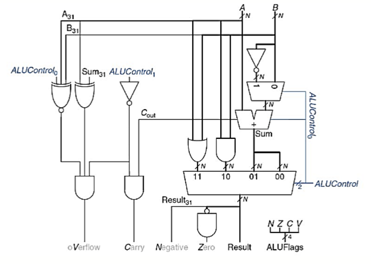

可以看到，ALU 在进行完一次运算后，可能会产生很多种的标志位，

- `N`: Negative
  - 负数标志位，表示结果是否为负数
- `Z`: Zero
  - 零标志位，表示结果是否为零
- `C`: Carry
  - 进位标志位，表示是否有进位
  - 如果是减法就是是否没有借位
- `V`: Overflow
  - 溢出标志位，表示是否发生了溢出

有些算术运算也会设置这些符号位，比如 [`ADDS`](#adds-加法设置符号位), [`SUBS`](#subs-减法设置符号位) 等。

##### `CMP`: 比较

`CMP` 指令用于将两个寄存器的值进行比较，并设置标志位。它的格式如下：

```asm
CMP <source1>, <source2>
```

- `<source1>`: 第一个源寄存器
- `<source2>`: 第二个源寄存器

具体的做法是将两者作差，得到结果 `source1 - source2`，然后设置对应的标志位

- 如果结果为负数，则设置 `N` 标志位为 1，否则为 0
- 如果结果为零，则设置 `Z` 标志位为 1，否则为 0
- 如果结果有进位，则设置 `C` 标志位为 1，否则为 0
- 如果结果发生了溢出，则设置 `V` 标志位为 1，否则为 0

最后丢弃计算出的结果

##### 条件执行后缀

ARM 处理器的指令集支持条件执行，也就是可以根据标志位的值来决定是否执行某条指令。条件执行一个样例如下：

```asm
CMP R5, R9        ; 比较 R5 和 R9
                  ; 设置标志位
SUBEQ R1, R2, R3  ; 如果相等(EQ)，执行 SUB
ORRMI R4, R0, R9  ; 如果小于等于(MI)，执行 ORR
```

这里的 `SUBEQ` 和 `ORRMI` 就是条件执行的指令，它们是基础的命令 (如 `SUB`) 加上条件判断的后缀 (如 `EQ`) 组成的。

在 ARM 的条件判断中有这些后缀可用：

| Cond | 助记符      | 名字                                | 条件表达式                             |
| ---- | ----------- | ----------------------------------- | -------------------------------------- |
| 0000 | `EQ`        | Equal                               | $Z$                                    |
| 0001 | `NE`        | Not Equal                           | $\overline{Z}$                         |
| 0010 | `CS` / `HS` | Carry Set / Unsigned higher or same | $C$                                    |
| 0011 | `CC` / `LO` | Carry Clear / Unsigned lower        | $\overline{C}$                         |
| 0100 | `MI`        | Minus /Negative                     | $N$                                    |
| 0101 | `PL`        | Plus / Positive or Zero             | $\overline{N}$                         |
| 0110 | `VS`        | Overflow (Set)                      | $V$                                    |
| 0111 | `VC`        | Overflow Clear / No Overflow        | $\overline{V}$                         |
| 1000 | `HI`        | Unsigned Higher                     | $C \overline{Z}$                       |
| 1001 | `LS`        | Unsigned Lower or Same              | $\overline{C} + Z$                     |
| 1010 | `GE`        | Signed Greater or Equal             | $\overline{N \oplus V}$                |
| 1011 | `LT`        | Signed Less Than                    | $N \oplus V$                           |
| 1100 | `GT`        | Signed Greater Than                 | $\overline{Z} (\overline{N \oplus V})$ |
| 1101 | `LE`        | Signed Less Than or Equal           | $Z + (N \oplus V)$                     |
| 1110 | `AL` / none | Always / unconditional              | 1                                      |

#### 分支执行 (Branching)

分支执行指令用于改变程序的执行顺序。它们可以是无条件跳转，也可以是有条件跳转。

分支执行分为几类：

##### `B`: 分支指令

分支执行跟标签息息相关，得先了解[标签的写法](#label-标签)。

- Branch (`B`)
  - 无条件跳转
  - 跳转到指定的地址
- Branch and Link (`BL`)
  - 用于函数调用
  - 跳转到指定的地址，并将返回地址存储到链接寄存器中
  - 执行后能通过 `BX LR` 返回到调用点

在 `B` 或者 `BL` 后添加标签名，则会跳转到标签名对应的地址处执行，类似于 C 语言中的 `goto` 语句。

比如使用无条件跳转的用法：

```asm
B TARGET        ; 跳转到 TARGET
ADD R0, R1, R2  ; 这条指令不会被执行

TARGET:         ; 跳转到这一行往下执行
ADD R3, R4, R5  ; 这条指令会被执行
```

对于 `B` 和 `BL` 指令，他们也适用于条件执行后缀, 比如这样

```asm
CMP R0, R1      ; 比较 R0 和 R1
BEQ THERE       ; 如果相等，跳转到THERE
ADD R0, R1, R2  ; 如果跳转，则这条指令被跳过

THERE:          ; BEQ 指令跳转到这里
ADD R1, R1, #1  ; 这条指令会被执行
```

因此，这样的一段 C 语言程序

```c
if (i==j)
  f = g + h;
f = f - i;
```

可以同时用这两种汇编代码来实现

```asm
CMP R3, R4
BNE L1
ADD R0, R1, R2
L1:
SUB R0, R0, R3
```

```asm
CMP R3, R4
ADDEQ R0, R1, R2
SUB R0, R0, R3
```

`ADDEQ` 这种带后缀的操作可以显著减少代码行数，让代码更简洁。如果是更加复杂的代码，`B` 则具有更好的可读性。

##### `BL` / `BX`: 分支链接/分支交换

`BL` 指令用于函数调用，它会将返回地址存储到链接寄存器中。它的格式如下：

```asm
BL <label>  ; 调用处的地址存储到 LR 中
```

- `<label>`: 标签名，表示要跳转到哪个地址
- `LR`: 链接寄存器，存储返回地址
  - `LR` 是 ARM 处理器中的一个特殊寄存器，用于存储函数调用的返回地址
  - 在函数调用时，`BL` 指令会将当前指令的地址存储到 `LR` 中，以便在函数执行完毕后返回

在跳转之后，可以使用 `BX LR` 指令返回到调用点。它的格式如下：

```asm
BX LR  ; 返回到调用点
```

- `BX`: Branch and Exchange
  - 用于返回到调用点
  - `LR` 寄存器中存储的是函数调用的返回地址
  - `BX` 指令会将 `LR` 中的地址加载到程序计数器 (PC) 中，从而实现返回

具体的用法如下：

```asm
BL FUNCTION       ; 调用 FUNCTION 函数
ADD R0, R1, R2    ; 这条指令将在调用后执行
...
FUNCTION:
  SUB R0, R0, R1  ; 函数体
  BX LR           ; 返回到调用点
```

这里的程序与这样的 C 语言程序类似

```c
int main() {
  ...
  function();
  ...
}

void function() {
  ...
}
```

> 因为 C 语言存在变量作用域的概念，其实这个并不完全等价于函数调用，更类似于 `goto` 的组合
>
> C 语言是在这个基础上实现的函数调用，但是在汇编语言中，函数调用和 `goto` 是没有区别的

#### 内存读取

##### `LDR`: 从内存中读取数据

`LDR` 指令用于从特定的内存地址中读取数据并保存到寄存器中。它的格式如下：

```asm
LDR <destination>, [<address>] ; Method 1
LDR <destination>, [<address>, <offset>] ; Method 2
```

- `<destination>`: 目标寄存器，表示要将值移动到哪个寄存器中
- `<address>`: 表示要从哪个内存地址中读取数据
  - 必须是寄存器
- `<offset>`: (可选) 内存地址偏移量
  - 表示要从哪个内存地址中读取数据
  - 可以是寄存器，也可以是立即数
  - 最终的地址是 `<address> + <offset>`，也就是从 `<address>` 开始偏移 `<offset>` 个字节

> 有一种伪命令可以用 `LDR` 来读取立即数
>
> ```asm
> LDR R0, =#0x11
> ```
>
> 这条指令的效果是将 0x11 这个立即数存储到 `R0` 中，和这个指令效果是一致的
>
> ```asm
> MOV R0, #0x11
> ```
>
> 之所以在这里说这个，是因为 PPT 里的汇编程序用了一些非常令人困惑的语法，我觉得他说的其实是这种用法

##### `STR`: 将寄存器写入内存

`STR` 指令用于将寄存器中的数据写入到特定的内存地址中。它的格式如下：

```asm
STR <source>, [<address>] ; Method 1
STR <source>, [<address>, <offset>] ; Method 2
```

- `<source>`: 源寄存器，表示要将值移动到哪个寄存器中
- `<address>`: 表示要将哪个内存地址中写入数据
  - 必须是寄存器
- `<offset>`: (可选) 内存地址偏移量
  - 表示要将哪个内存地址中写入数据
  - 可以是寄存器，也可以是立即数
  - 最终的地址是 `<address> + <offset>`，也就是从 `<address>` 开始偏移 `<offset>` 个字节

##### `ADR`: 地址寄存器

`ADR` 指令用于将一个地址存储到寄存器中。它的格式如下：

```asm
ADR <destination>, <address>
```

- `<destination>`: 目标寄存器，表示要将值移动到哪个寄存器中
- `<address>`: 表示要将哪个内存地址中写入数据

`ADR` 指令用来声明一个存储地址的寄存器，用法如下：

```asm
ADR R1, TABLE1  ; 让 R1 指向 TABLE1 的地址
...
TABLE1:         ; TABLE1 的地址
```

### `<Label>`: 标签

标签用于标识程序中的位置，通常用于分支跳转。标签的格式如下：

```asm
TARGET:
  ADD R0, R1, R2
```

- `TARGET`: 标签名
  - 标签名可以是任意合法的标识符，但是不能是 ARM 处理器的保留字
  - 标签名只能由字母、数字和下划线组成
  - 标签名后面必须有冒号 `:`

> 令人疑惑的是，PPT 上的所有汇编代码都没有在 label 后添加冒号

标签经常和[分支跳转命令](#分支执行-branching)一起使用，实现各种复杂的逻辑。

## 是时候该上手写汇编了

### 数据流图 / 控制流图

数据流图 (Data Flow Graph) 是一个不包含条件块的图，表示数据的流动和处理过程。它通常用于表示数据的输入、输出和处理过程。它是一种高级的编程语言，

一个具有一个入口 (entry) 和一个出口的部分被称为基本块 (Basic Block)

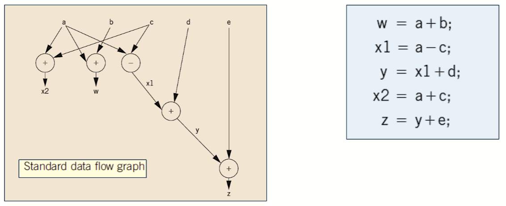

控制流图 (Control Flow Graph) 是一个包含条件块的图，表示程序的控制流。它通常用于表示程序的执行顺序和分支跳转。

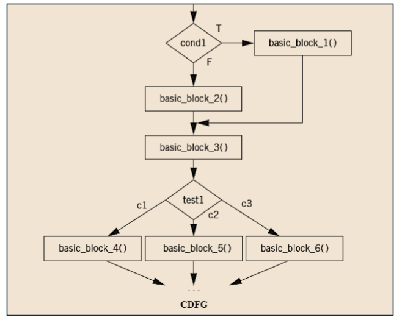

数据流图和控制流图表示的都是一个逻辑过程，这个过程可以由多种方式实现，比如 C 语言，以及我们这里提到的汇编语言。

### 将对应的逻辑用汇编表示

PPT 上的例子里的表达式：$z=e+((a+b)-(c+d))$，数据流图如下

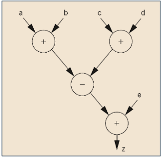

将这个程序用汇编语言表示出来，则是这样

```asm
.data             ; 指出这里是数据段
  a:  .word 0x0A  ; 这里用标签是给 ADR 指令寻址用的
  b:  .word 0x0B  ; 算是它PPT里没提到的数据表示方法
  c:  .word 0x0C  ; 如果是作为函数的话，其实输入可以替换成寄存器
  d:  .word 0x0D
  e:  .word 0x0E
  z:  .word 0

.text             ; 指出这里是代码段
  ADR R0, a       ; R0 指向 a 的地址
  ; 实际上，ADR 取地址有一定的局限性
  ; LDR 伪指令一般会更灵活，写法是：
  ; LDR R0, =a
  ; 这条指令会将 a 的地址存储到 R0 中
  LDR R1, [R0]    ; R1 = a
  ADR R0, b       ; R0 指向 b 的地址
  LDR R2, [R0]    ; R2 = b
  ADD R2, R1, R2  ; R2 = a + b

  ADR R0, c       ; R0 指向 c 的地址
  LDR R1, [R0]    ; R1 = c
  ADR R0, d       ; R0 指向 d 的地址
  LDR R0, [R0]    ; R0 = d
  ADD R1, R1, R0  ; R1 = c + d

  SUB R1, R2, R1  ; R1 = (a + b) - (c + d)

  ADR R0, e       ; R0 指向 e 的地址
  LDR R2, [R0]    ; R2 = e
  ADD R2, R2, R1  ; R2 = e + ((a + b) - (c + d))

  ADR R0, z       ; R0 指向 z 的地址
  STR R2, [R0]    ; z = e + ((a + b) - (c + d))
```

> 没错，他完全没讲数据段这个概念，写起来一头雾水是很正常的
>
> 不能指望 C 语言学了一学期而汇编能一个半小时速通
>
> 估计考试也不会考的很难

### 寄存器分配优化

众所周知，寄存器的数量是有限的，通常只有 16 个寄存器可用。在较大的程序中，变量的数量往往会远大于这个数量。这意味着我们需要在某些数据不再需要被使用的时候重用对应的寄存器，同时将需要多次访问的变量存在寄存器中以提高程序的效率。

### 将 C 编译成汇编

在[最开头的部分](#嵌入式-c-源代码的编译过程)，我们提到了 C 语言的编译过程是将源代码编译成汇编，然后通过汇编器把汇编语言编译成机器码的过程。如果我们使用一定的方法，可以让编译器保留中间产物，输出我们对应平台的汇编代码。

> 此处的所有结果都是基于 `arm64` 架构的 M2 芯片以及 `MacOS 15.3.1` 版本得出的，使用的是 `19.1.7` 版本的 `Homebrew` 源的 `clang` 编译器。

比如说，对于这样一段 C 语言代码:

```c
// test_asm.c
int main(void) {
    int a = 1;
    int b = 2;
    int c;
    c = a + b;
    c = a - b;
}
```

我们可以通过这样的指令让编译器输出汇编代码

```bash
clang ./test_asm.c -S -o test_asm.s -O0
```

- `clang`: clang 编译器，也可以使用 gcc
- `./test_asm.c`: C 语言源代码的路径
- `-S`: 输出汇编代码
- `-o test_asm.s`: 输出的汇编代码的路径
- `-O0`: 不进行任何优化
  - 编译器默认会对代码进行优化，以达到更好的运行效率
  - 因为我们这个代码本质什么都没做，会被全部优化掉，所以得关闭优化

最后，得到的结果是这样的：

```asm
  .section  __TEXT,__text,regular,pure_instructions
  .build_version macos, 15, 0  sdk_version 15, 2
  .globl  _main                           ; -- Begin function main
  .p2align  2
_main:                                  ; @main
  .cfi_startproc
; %bb.0:
  sub  sp, sp, #16
  .cfi_def_cfa_offset 16
  mov  w8, #1                          ; =0x1
  str  w8, [sp, #12]
  mov  w8, #2                          ; =0x2
  str  w8, [sp, #8]
  ldr  w8, [sp, #12]
  ldr  w9, [sp, #8]
  add  w8, w8, w9
  str  w8, [sp, #4]
  ldr  w8, [sp, #12]
  ldr  w9, [sp, #8]
  subs  w8, w8, w9
  str  w8, [sp, #4]
  mov  w0, #0                          ; =0x0
  add  sp, sp, #16
  ret
  .cfi_endproc
                                        ; -- End function
.subsections_via_symbols
```

这样我们就得到了对应的汇编代码
