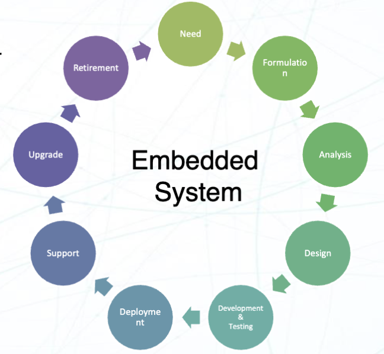
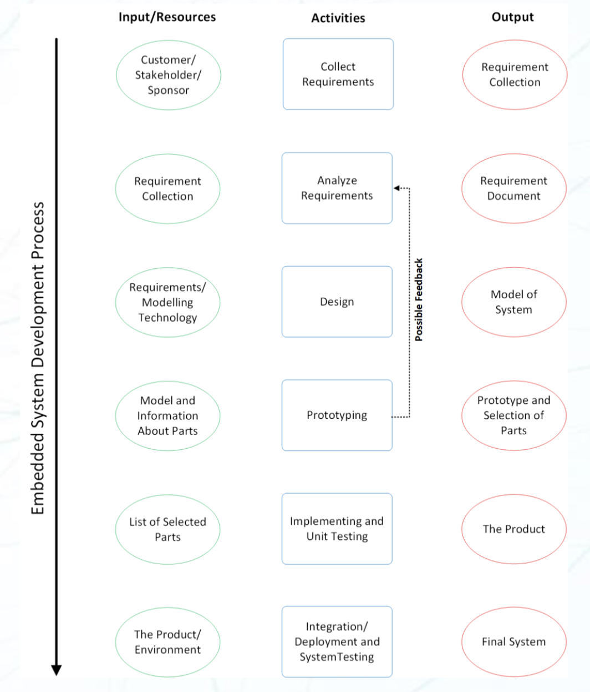
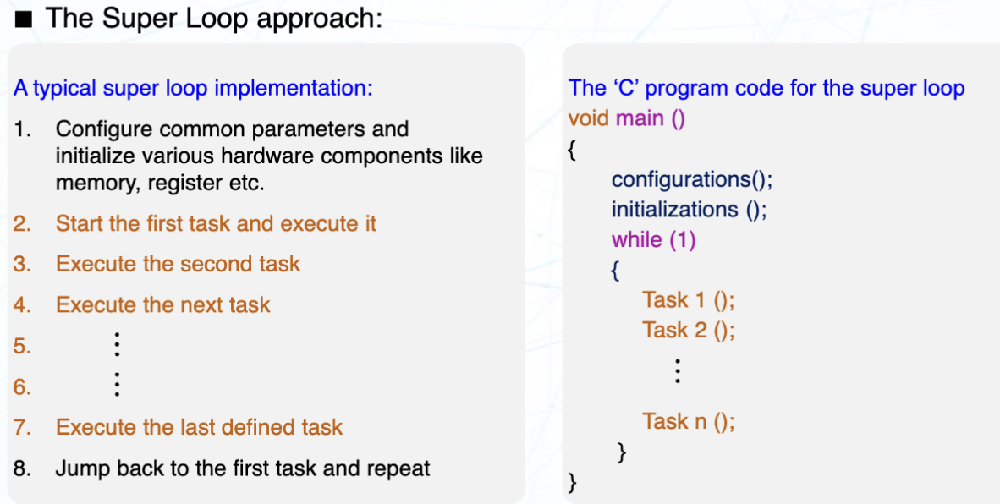

# Lecture 4 : Embedded System & Project Developent Cycle (嵌入式系统与项目开发周期)

## 嵌入式系统的开发周期

对于开发一个嵌入式系统，有这样的过程

嵌入式系统的开发周期一般分为三个大的部分:

- Analysis (分析)
  - 确定需要开发什么样的产品（来解决什么问题）
- Design (设计)
  - 确定达到对应效果的方案（如何达到目标）
- Development (开发)
  - 实际开发，实现对应的设计

具体细分来讲，嵌入式系统的开发周期可以分为以下几个阶段：

1. 需求分析 & 规范 (Requirement Analysis & Specification)
   - 确定产品的功能需求
   - 收集相关人员的意见
     - 性能需求
     - 功能需求
     - 约束
   - 确定产品规格
     - 硬件需求
     - 软件需求
     - 接口需求
   - 需要考虑的因素
     - 功耗
     - 大小限制
     - 环境条件等
2. 系统设计 (System Design)
   - 架构设计 (Architecture Design)
     - MPU & MCU 选择
     - 传感器选择
     - 执行器选择
     - 通信接口选择
   - 细节设计 (Detailed Design)
     - 模块
     - 接口
     - 算法和数据结构
   - 权衡设计 (Design Trade-offs)
     - 性能 vs 功耗
     - 性能 vs 实时性
     - 性能 vs 成本
3. 原型设计 (Prototyping)
   - 开发硬件原型
     - 设计 PCB
     - 元件选型
     - 焊接
   - 开发软件原型
     - 编写固件/软件
     - 实现对应算法
     - 实现对应硬件的驱动
     - 实现对应接口
   - 结合软件和硬件两部分
4. 测试与验证 (Testing & Verification)
   - 功能测试 (Functional Testing)
     - 测试系统的功能是否正常工作
     - 单元测试 (Unit Testing)
       - 测试单个模块是否正常工作
     - 集成测试 (Integration Testing)
       - 测试各个模块之间的接口是否正常工作
     - 验证测试 (Validation Testing)
       - 测试系统是否能够达到对应的需求，按照需求工作
   - 非功能测试 (Non-functional Testing)
     - 如性能测试，可靠性测试，安全性测试等
5. 验证与确认 (Validation & Verification)
   - 确认系统是否符合需求
   - 确定系统满足用户的使用禅境
   - 确认系统是否符合相关的标准
6. 部署与维护 (Deployment & Maintenance)
   - 将系统部署到实际环境中
   - 提供用户文档和用户培训
   - 提供系统维护
     - 软件更新
     - 漏洞修复
     - 硬件升级
   - 监控系统性能
   - 解决出现的问题
7. 反馈与迭代 (Feedback & Iteration)
   - 收集用户和相关人员反馈
   - 确定升级需求和新功能
   - 基于反馈进行迭代

## 嵌入式固件 (Embedded Firmware)

### 什么是嵌入式固件

嵌入式固件，指的是嵌入式硬件里的控制算法 (control algorithm) （或者说是 程序指令 (program instructions)），以及一些关于系统的设置 (configuration settings)。开发者将这些程序烧录到嵌入式硬件的存储器中。这是一个嵌入式系统里必要的部分。

嵌入式固件可以用很多种方式开发：

- 使用高级语言编写 (HLL, High-level Language) 程序
  - 通常使用的是嵌入式的 C/C++ 语言编写程序
  - > 实际上现在也有别的开发语言的选项，如果 Rust 发展的好的话也许也能进军嵌入式领域。不过现在最多的还是 C
  - 通常在集成开发环境 (IDE) 中编写
    - IDE 里包含了编辑器，编译器，连接器，调试器，仿真器等
    - 不同的 IDE 通常对应着不同的硬件平台
    - 如 Keil, IAR, Arduino IDE, 甚至 VSCode（使用插件）
- 使用汇编语言编写 (Assembly Language) 程序
  - 直接使用对应硬件平台的指令来编写程序，实现对应的功能

> 如果把 FPGA 算上的话，还有：
>
> - 使用硬件描述语言 (HDL, Hardware Description Language) 编写程序
>   - 如 VHDL, Verilog 等
>   - 直接描述需要实现的硬件电路
>
> 当然在这里并不考虑这个

### 嵌入式固件的开发

- 嵌入式固件负责控制嵌入式硬件的多个外设的工作，同时根据需要的功能做出相应的控制。可以说它是嵌入式系统的主脑，让嵌入式系统实现智能
- 将程序下载进硬件后，产品具有智能，开始按照功能运行
- 产品持续运行直到硬件损坏或者固件出现问题
- 如果硬件出现问题，则需要修护或者更换硬件；对于软件问题，需要重新载入固件。

> 这说法给人一种其实是机魂不悦的感觉

#### 开发前的确认

对于固件，通常存储在嵌入式系统的存储器 (ROM, Read-Only Memory) 中。固件通常是不可由终端用户修改的，或者说是只读的。固件通常是由开发者在开发阶段烧录到嵌入式系统中的。

设计嵌入式的固件前，需要考虑这些要求

- 对于硬件
  - 硬件的软件接口
  - 硬件的内存映射
  - IO 接口的具体定义
  - 对应芯片设置和寄存器的配置
- 对于软件，编程语言上
  - 理解更底层的汇编语言
  - 理解高级语言，如 C/C++
  - 或者两者同时掌握

#### 算法的实现

在确定完之后，接下来需要在固件里实现对应的算法。一般有两种主要的方法来实现：

##### 死循环 (Super Loop)

死循环指的是在主函数里写出一个条件恒为真的循环，通常是一个 while(1) 的死循环。然后在这个死循环里实现对应的功能。

它适用于响应时间并不重要的场景。每个任务并没有规定的 deadline，并不能保证操作的实时性。它类似于传统的面向过程编程，重要的是将每个任务一个一个的完成。

具体来说，在死循环里，越上面的任务越先执行，越下面的任务越后执行。每个任务之间是串行的，互不影响。当执行完一次后，就会重新回到死循环的开头，重新开始执行。

- 优点
  - 不需要部署操作系统，配置简单
  - 设计简单，程序结构单一
  - 因为没有系统，内存要求更低
- 缺点
  - 不能保证实时性
  - 当一个任务出问题时，可能会导致整个系统崩溃，耦合性高
- 可以提升的部分
  - 使用中断 (Interrupt) 来提升实时性
  - 将需要实时性的程序用中断服务程序 (ISR) 来实现

##### 嵌入式操作系统 (Embedded Operating System)

###### RTOS 和 GPOS

我们提到的嵌入式操作系统一般指的是

- Real Time Operating System (RTOS, 实时操作系统)
  - 比如 FreeRTOS, ChibiOS, mbedOS, Zephyr 等
  - 内核是小型的，通常是微内核 (Microkernel)
  - 响应能力高，实时性好
  - 通常适用于对实时性要求高的场景
    - 比如飞控，汽车电子，工业控制等
- Customized General-Purpose Operating System (GPOS, 定制通用操作系统)
  - 比如嵌入式的 Linux，Android 等
  - 内核是大型的，通常是宏内核 (Monolithic Kernel)
  - 响应能力低，实时性差，但是功能强大
  - 通常适用于对实时性要求不高的场景
    - 比如智能家居，智能音箱，智能手机等

在嵌入式系统里使用嵌入式操作系统，就可以管理多个不同的任务，进行任务调度以及在不同的任务之间分配不同的资源。

通常部署嵌入式操作系统需要更高的性能，因为操作系统的内存管理和任务调度功能占用了更多的系统资源。

对于 RTOS 和 GPOS，有这样的区别

| RTOS                                 | GPOS                               |
| ------------------------------------ | ---------------------------------- |
| 不公平调度，不同的任务具有不同优先级 | 公平调度，所有的任务具有相同优先级 |
| 内核完全抢占或者极大部分抢占         | 内核非抢占或者极大部分代码段非抢占 |
| 优先级倒置是一个很主要的问题         | 优先级倒置通常不是问题             |
| 可预测性的行为                       | 可预测性难以保证                   |

###### 任务调度

任务调度程序 (Task Scheduler) 是嵌入式操作系统的核心部分。它负责管理和调度不同的任务，响应中断，将处理器的控制交给对应的任务。决定哪个任务能使用 CPU 的算法即为调度算法 (Scheduling Algorithm)。

对于实时系统每个实时任务都有一个截止时间 (Deadline)，即任务必须在这个时间之前完成。因为这个原因，每个任务都具有了可预测性和及时的结果。

任务调度 (Task Scheduling) 指的是管理和调度不同的任务的方法。它可以是周期性或者非周期性的。实时调度算法可以统计、动态或者混合两种方法来决定程序的优先级，分别称为固定/动态/混合调度算法 (Fixed/Dynamic/Mixed Scheduling Algorithm)。这些算法可以是抢占的 (Preemptive) 或者非抢占的 (Non-preemptive)

任务调度程序决定优先级的一些依据是：

- CPU 的利用率
- 数据吞吐量
- 周转时间
- 等待时间
- 响应时间

###### 抢占式/非抢占式调度

- 抢占式进程 (Preemptive Process)
  - 可以在运行过程中直接被操作系统中断
  - 可以缩短响应时间，对于交互式系统来说是必要的
  - 被抢占时，进程的状态会被保存，在下次运行时可以继续执行
- 非抢占式进程 (Non-preemptive Process)
  - 一直运行，直到进程结束或者主动放弃 CPU
  - 不重要的进程可以永远阻塞 CPU，妨碍其他进程的运行

对于看中实时性的系统来说，抢占式进程是必要的。因为它可以保证高优先级的任务可以在低优先级的任务运行时被中断。

但是对于一些不需要实时性的系统来说，非抢占式进程可以减少上下文切换的开销，提高 CPU 的利用率

###### 不同的 RTOS 变体

RTOS 根据它对时间限制的容忍性可以分为三种类型：

- 硬实时系统 (Hard Real-Time System)
  - 系统必须在严格的时间限制内完成任务，任何延迟都可能导致系统失败。
  - 比如飞控，汽车电子，导弹等
- 软实时系统 (Soft Real-Time System)
  - 系统在一定时间限制内完成任务更为重要，但偶尔的延迟可以接受。
  - 比如显示器，音频处理等
- 坚定实时系统(?) (Firm Real-Time System)
  - 任务需有严格的时间限制，但是错过了截止时间并不会导致系统失败。
  - 比硬实时系统更宽松，但是比软实时系统更严格
  - 比如工业控制，机器人等
