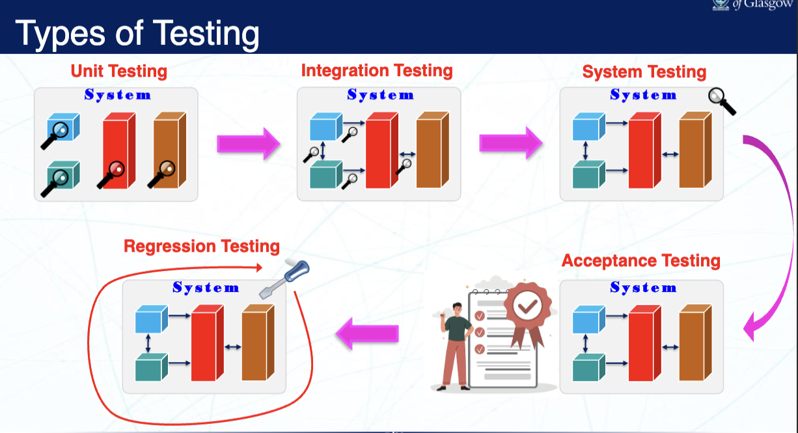
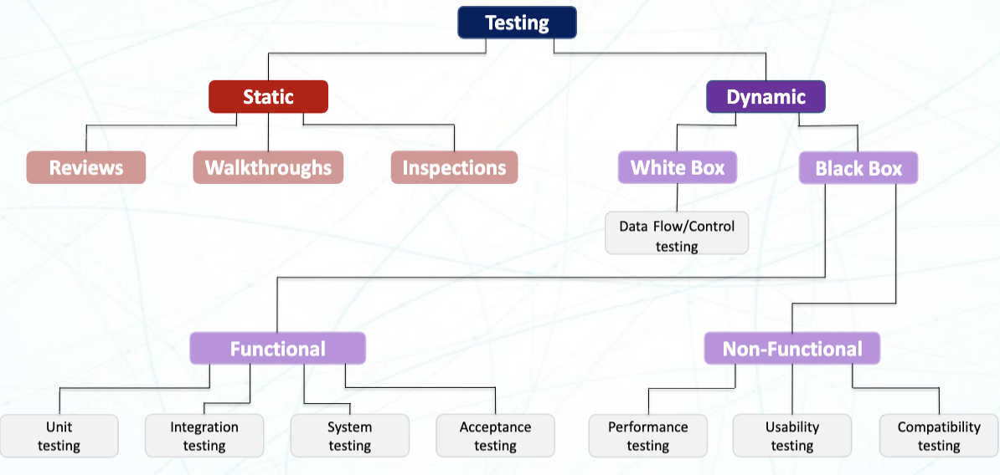
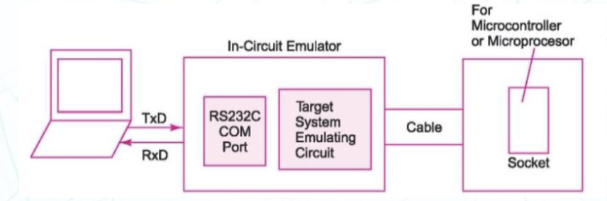
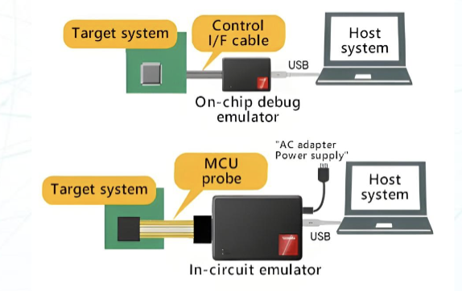

# Lecture 5 : Testing and Debugging - I

> Lecture @ 2025-3-24

## Software Testing (软件测试)

### 什么是软件测试

测试 (Testing) 是一个确定系统可以按照需求的功能运行的过程。当一个系统越复杂，那么它就越容易出错，需要更详细的测试。

对于嵌入式系统，因为它涉及了硬件和软件之间的接口，它更容易出现错误和问题。

有很多方法可以生成全面的测试集，来确保系统的功能正常工作。

### 测试的类型

在一个开发过程中，测试有很多种类型：

- Unit Testing (单元测试)
  - 测试单个模块的功能
  - 确保每个模块都能正常工作
- Integration Testing (集成测试)
  - 测试各个模块之间的接口
  - 确保各个模块之间能够正常工作
- System Testing (系统测试)
  - 测试整个系统的功能
  - 确保整个系统能够正常工作
- Acceptance Testing (验收测试)
  - 测试系统是否符合需求
  - 确保系统能够满足用户的使用需求
- Regression Testing (回归测试)
  - 测试系统在修改后是否仍然能够正常工作
  - 确保系统在修改后不会出现新的错误

### 白盒测试 (White-box Testing)

白盒测试，指的是测试人员知道一个系统的内部结构、内部设计和接口等。白盒测试用来改进系统的设计、可用性和性能，同时确定系统的功能是否正常工作，精确确定失败和错误发生的位置和原因。

白盒测试适用的场景：

- 单独测试每个语句、对象和函数
- 代码中的破损和错误结构
- 特定输入数据的流向
- 条件循环的功能
- 内部安全漏洞
- 预期输出

白盒测试的优点：

- 通过寻找隐藏的错误来提高代码质量
- 完全彻底的测试
- 可以自动化执行测试
- 可以在系统开发的早期阶段进行测试

白盒测试的缺点：

- 需要对系统的内部结构有深入的了解
- 高复杂度和高成本
- 需要大量的时间和精力
- 需要对编程语言有深入的了解

### 黑盒测试 (Black-box Testing)

黑盒测试，指的是测试人员并不了解一个系统的内部结构、设计和接口。在黑盒设计中，主要关注系统在输入可能情况下的输入时，输出是否符合预期。它的目的是通过确定输入输出之间的关系来验证系统的功能。

黑盒测试适用的场景：

- 安全性和漏洞评估
- 错误处理和异常处理
- 兼容性和互操作性
- 性能和负载测试
- 用户界面和可用性测试
- 功能和需求测试
- 输入验证

黑盒测试的优点：

- 高效，适合大量代码
- 不需要获得源代码
- 将开发人员和测试人员身份分离
- 大量的中等水平的测试人员可以进行测试，基于自己的经验

黑盒测试的缺点：

- 在有限的测试场景内进行测试
- 难以设计测试用例
- 测试人员的水平参差不齐，影响效率
- 无法定位到具体的错误和问题，覆盖率低 (Blind Coverage)

### 灰盒测试 (Gray-box Testing)

灰盒测试，同时包含了黑盒测试和白盒测试的特点。测试人员知道一部分系统的结构和内部实现的细节。它的目的是确定系统的功能是否正常工作，是否有正确的输入和输出。

灰盒测试的优点：

- 增加了测试的覆盖率，同时测试外部行为和内部代码
- 更易于定位到错误和问题，更加准确
- 优化资源占用，提高测试效率

灰盒测试的缺点：

- 对代码的有限可见性会导致一些没有被发现的错误
- 在无法知道系统内部的信息时可能会很困难
- 很依赖于测试人员的系统知识和个人能力

### 静态 & 动态测试 (Static & Dynamic Testing)

**静态测试**，指的是在不执行程序的情况下进行测试。它的目的是通过分析代码来发现错误和问题。静态测试可以在开发的早期阶段进行，帮助开发人员发现错误和问题。

在静态测试中，工具分析固件代码、硬件规格、设备驱动程序、系统要求和相关文档等进行分析，而不用实际运行程序。它的目的是确定代码的缺陷、质量问题并进行改进。

静态测试通常使用人力或者静态分析工具来进行。静态分析工具可以检查代码的语法、风格、复杂度等问题，帮助开发人员发现潜在的错误和问题。比如使用 `clang-tidy`来检查代码的风格和语法错误，使用 `cppcheck`来检查代码的复杂度和潜在的错误。

**动态测试**，指的是在执行程序的情况下进行测试。它的目的是通过运行程序来发现错误和问题。动态测试可以在开发的后期阶段进行，帮助开发人员发现错误和问题。

在嵌入式系统中，动态测试指的是将程序在目标硬件上执行来评估其行为和性能。它包含系统对不同输出的响应，通过不同的测试样例来评估系统的功能和性能。动态测试可以使用测试工具、调试器和仿真器等来进行。在动态测试中，往往也关注系统的功能、响应时间、实时行为、在各种负载下的功耗等等。

- **静态测试优点：**
  - 在早期识别缺陷
  - 确定合法性和安全性
  - 进行优化和资源管理
  - 互作性和兼容性
  - 文档质量
- **静态测试缺点：**
  - 有限的视角
  - 人为错误
- **动态测试优点：**
  - 功能验证
  - 真实世界的模拟
  - 实时性行为的评估
  - 性能分析
  - 硬件软件协同
- **动态测试缺点：**
  - 依赖硬件环境
  - 有限的覆盖率
  - 复杂性和高耗时
  - 开销和资源密集

## Embedded System Debugging (嵌入式系统调试)

### 什么是调试

测试并不是调试，它的目的是发现系统存在问题。

调试 (Debugging) 是一个确定系统的错误和问题的过程。它的目的是通过分析代码、运行程序和测试来发现错误和问题，并进行修复。调试的过程是在测试之后进行的，测试是为了验证系统的功能是否正常工作，而调试是为了发现和修复系统的错误和问题。

调试一个嵌入式系统有很多方法，而确定用什么方法调试，主要受开销、易用性和对应方案的能力影响。

- 烧录然后运行 (Burn & Learn)
  - 过程
    - 编写代码
    - 烧录到硬件
    - 测试，获得对应的结果
    - 抹掉烧录的程序，回到第一步
- 软件仿真 (Software Simulation)
  - 在软件里模拟对应 CPU 和对应的指令集
  - 在软件里模拟对应的外设
  - 模拟器有模拟的 IO
    - 波形图
    - 寄存器的日志
    - 人工输入
    - 数字信号
- 示波器 (Oscilloscope)
  - 确定交流信号
  - 在执行了对应的代码后，输出不同的信号，信号代表着不同的状态
  - 好处
    - 在大部分情况下可行
    - 易于使用
    - 相对便宜
  - 缺点
    - 只能看到引脚输出的少量信号
- 逻辑分析仪 (Logic Analyzer)
  - 逻辑分析仪是一个可以监测数字信号的硬件
  - 它可以监测地址、指令、数据
  - 适合调试在中断里的问题
  - 好处
    - 适用于高速信号
    - 在外部内存总线中很有效
    - 可以使用反汇编器
  - 缺点
    - 没有断点调试
    - 需要额外学习使用方法
    - 在单芯片的 MCU 里只能监测 IO 信号，无法读取内部信号
- 在线仿真 (In-Circuit Emulation)
  - > 仿真器，指的是一种可以模拟目标系统的硬件和软件的设备。它可以在目标系统上运行程序，并提供调试和测试的功能。仿真器通常用于嵌入式系统的开发和调试中，可以帮助开发人员发现和修复系统的错误和问题。它和调试器的区别在于，仿真器可以模拟整个系统的硬件和软件，而调试器只能调试已经编译好的程序。
  - > 现在已经很少见了，因为它们通常很贵，且需要更换目标 MCU，每个仿真器只能支持一个特定的 MCU。它们通常用于一些特殊的场景，比如需要对系统进行深入的调试和测试，或者需要对系统进行性能分析和优化。
  - 需要在线仿真器硬件，通常很贵
  - 需要更换目标 MCU
  - 仿真程序存储器替代了目标 MCU
  - 提供了内存、寄存器、CPU 的完全可见性
- 在线调试 (In-Circuit Debug)
  - > 在线调试器，指的是一种可以在目标系统上进行调试的设备。它可以在目标系统上运行程序，并提供调试和测试的功能。比如 ST-LINK/V2, CMSIS-DAP 等。
  - 可以在实际的硬件上调试对应的程序
  - 使用特殊的连接方式 (比如 SWD, JTAG 等) 将 ICD (In-Circuit Debugger, 在线调试器) 连接到目标 MCU
  - 可以监控软件如何控制硬件行为，同时实时的改变软件中变量的值

> 后接 [Testing & Debugging - II](Lecture6.md)
