# Lecture 6 : Testing & Debugging - II

## Task Scheduling (任务调度)

Task Scheduler (任务调度程序) 是嵌入式操作系统的核心部分。它负责管理和调度不同的任务，响应中断，将处理器的控制交给对应的任务。决定哪个任务能使用 CPU 的算法即为调度算法 (Scheduling Algorithm)。

任务调度算法的类型：

- None-preemptive Scheduling (非抢占式调度)
  - 任务在运行时不会被中断
  - 任务会一直运行，直到它完成或者主动放弃 CPU
  - 非抢占式调度的优点是简单和高效，但是缺点是可能导致低优先级的任务永远无法获得 CPU 的使用权
- Preemptive Scheduling (抢占式调度)
  - 特点
    - 任务在运行时可以被中断
    - 任务可以被抢占，以便高优先级的任务能够获得 CPU 的使用权
    - 抢占式调度的优点是提高了系统的响应性，但缺点是可能导致上下文切换的开销

Terminology (术语):

- Process/Task (进程/任务)
  - 指的是一组需要 CPU 运行的指令的集合
- Ready Queue (就绪队列)
  - 指的是所有准备好运行的任务的集合
- Execution Time/Completion Time (执行时间/完成时间)
  - 指的是任务开始运行到完成的时间
- Wait Time (等待时间)
  - 指的是任务在就绪队列中等待的时间
- Turn Around Time (TAT, 周转时间)
  - 指的是任务从开始到完成的总时间
  - TAT = Wait Time + Execution Time

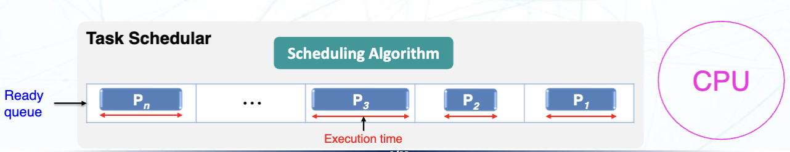

## Scheduling Algorithms (调度算法)

### Non-preemptive Scheduling (非抢占式调度)

#### First Come First Serve (FCFS) Scheduling (先来先服务调度)

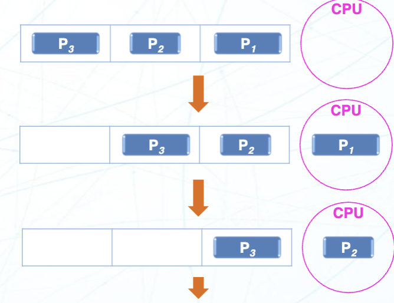

先来先服务调度指的是根据任务到达的顺序来调度任务。第一个到达的任务会被第一个调度执行，后续的任务会在前面的任务完成后依次执行。它的数据结构和队列是一致的，也被称作 FIFO (First In First Out) 调度。

缺点：

- 倾向于让 CPU 密集型任务垄断 CPU，导致其他任务得不到公平的处理
- IO 密集型任务必须等待 CPU 密集型任务完成后才能执行
- 平均的等待时间较长

#### Last Come First Serve (LCFS) Scheduling (后进先出调度)

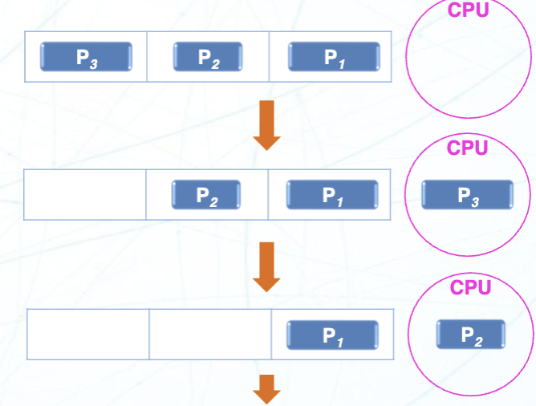

后进先出调度指的是根据任务到达的顺序来调度任务。第一个到达的任务会被最后调度执行，后续的任务会在前面的任务完成后依次执行。它的数据结构和栈是一致的，也被称作 LIFO (Last In First Out) 调度。

缺点：

- 更倾向于让 CPU 密集型任务垄断 CPU，导致其他任务得不到公平的处理
- IO 密集型任务必须等待 CPU 密集型任务完成后才能执行
- 平均的等待时间较长

#### Shortest Job First (SJF) Scheduling (最短作业优先调度)

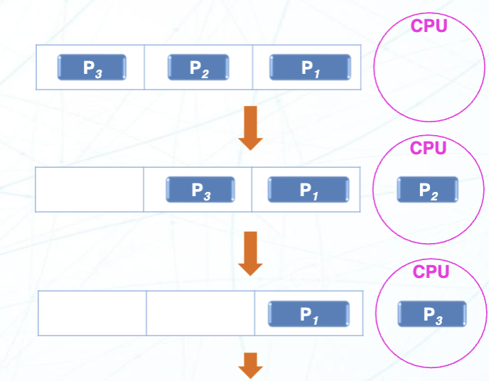

最短作业优先调度会让 CPU 根据任务的执行时间来调度任务，越短的任务越早被调度执行。它的平均等待时间是最短的，和其他的调度算法相比这是最优的算法。

缺点：

- 执行时间较长的任务可能会一直得不到调度执行，而执行时间较短的任务会一直被调度执行。(**Starvation**，进程饥饿)
- 很难知道下一个执行的任务是哪个任务，因为执行时间较短的任务会不断被加入到就绪队列中

#### Highest Priority First (HPF) Scheduling (最高优先级优先调度)

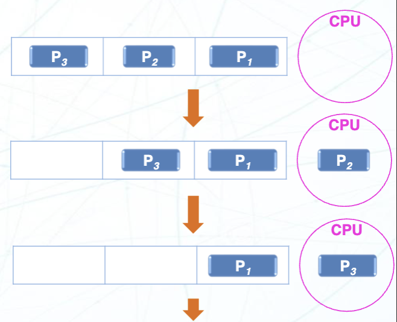

每个任务都有自己的优先级 (Priority)，调度算法根据每个程序的优先级来调度 CPU 的使用

每个程序的优先级由他们的大小、类型、不同的截止时间等进行决定。一般优先级由 0 开始，最高到 N (操作系统中的最大优先级数量)，优先级越高的任务越早被调度执行。

比如 Ubuntu 支持的优先级等级是 1-99 ，其中 1 是最高优先级，99 是最低优先级。

缺点：高优先级的任务会一直被调度执行，而低优先级的任务会缺乏被执行的机会。(**Starvation**，进程饥饿)

### Preemptive Scheduling (抢占式调度)

#### Shortest Remaining Time (SRT) Scheduling (最短剩余时间调度)

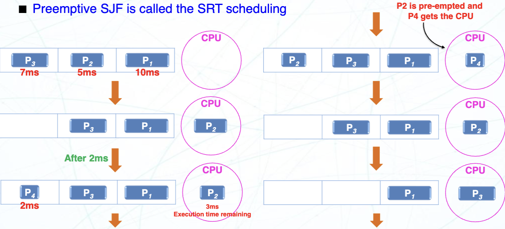

之前非抢占式的 SJF 调度只会在当前的任务执行完毕的时候检查最短的运行时间的任务作为下一个处理的任务。

在 SRT 调度里，每当一个新的任务到达时，都会检查当前正在执行的任务和新到达的任务的剩余时间。剩余时间更短的任务会被调度执行，执行当前的任务会被挂起，直到剩余时间更短的任务完成后才会继续执行。

#### Round Robin (RR) Scheduling (轮转调度)

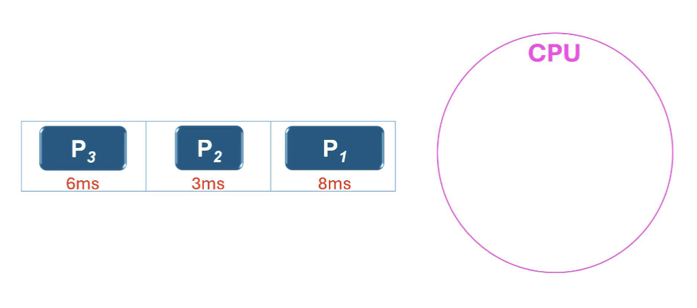

轮转调度是最常用的抢占式调度算法。它会将 CPU 的时间分成一个个的时间片 (Time Slice)，每个任务会被分配一个时间片来执行。每个任务在执行完自己的时间片后，会被挂起，回到队列的末尾，CPU 会被分配给下一个任务。

当有新进程加入时，新进程会被加入到就绪队列的末尾。当某个进程被执行完时，它会被从就绪队列中删除。每个进程会被分配一个时间片来执行，时间片的大小可以根据系统的需求进行调整。

循环调度类似于 FCFS 调度，唯一的区别是添加了时间片的抢占，这样可以让 CPU 在就绪队列中循环运行每个任务。

#### Preemptive Highest Priority First (PHPF) Scheduling (抢占式最高优先级优先调度)

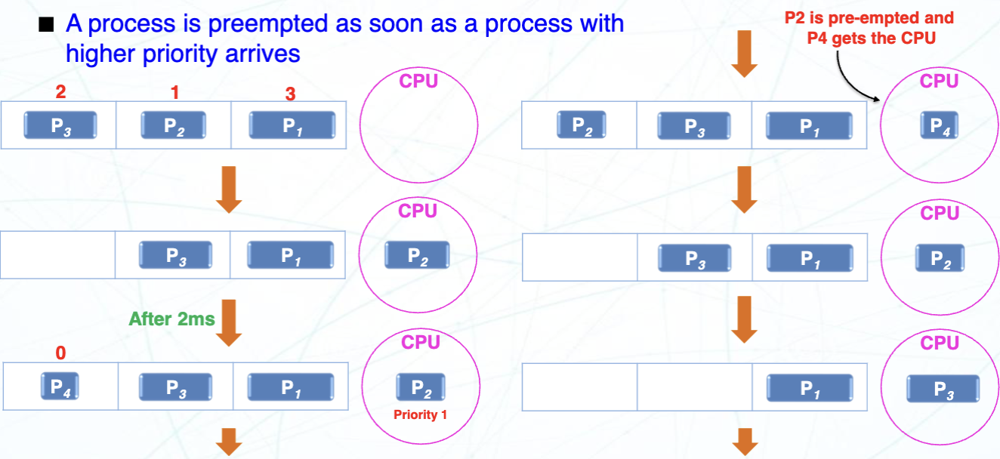

抢占式最高优先级优先调度是最高优先级优先调度的抢占式版本。它会根据每个任务的优先级来调度 CPU 的使用。每个任务都有自己的优先级 (Priority)，调度算法根据每个程序的优先级来调度 CPU 的使用。

当一个任务正在运行时，如果有一个新的任务到达，并且它的优先级比当前正在运行的任务高，那么当前的任务会被挂起，新的任务会被调度执行。

### Interrupts (中断)

当 CPU 正在处理别的任务时，如果有设备发出的事件，CPU 也要对其进行响应。通常有两种常见的实现方式：

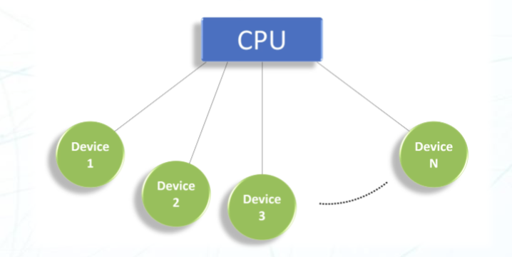

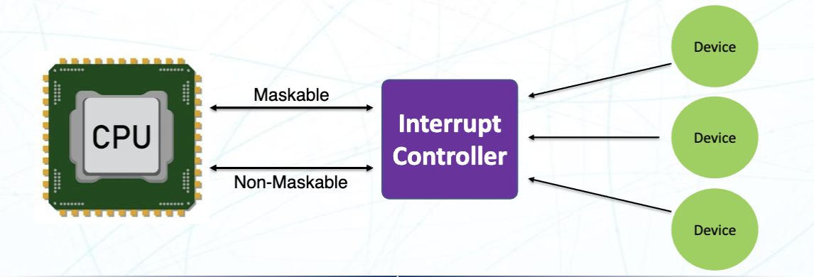

- Polling (轮询)
  - CPU 会定期重复的检查设备的状态，判断是否有事件发生，是否需要处理
  - 优点：实现简单，适用于对实时性要求不高的场景
  - 缺点：CPU 会浪费时间去检查设备的状态，降低了系统的效率
- Interrupt (中断)
  - 中断是 CPU 处理异步 (Asynchronous) 事件的机制。
  - 优点：CPU 可以在处理其他任务时，及时响应设备的事件，提高了系统的效率
  - 缺点：实现复杂，需要对中断进行管理和调度
  - 具体过程
    1. 外部中断发生
    2. 当前运行的指令被停止
    3. 保存当前的指令状态，将值压入栈中
    4. 将 LR 设置到地址 `0xFFFFFFF9`
    5. 中断程序状态寄存器 (IPSR) 被设置为中断数字
    6. 执行中断指令 (ISR，中断服务程序)
    7. 执行完成后，获得返回指令
    8. 恢复之前的指令状态，返回主函数

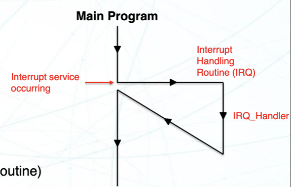

> 关于中断的前置知识，可以参考 Microelectronic System 的最后一章
