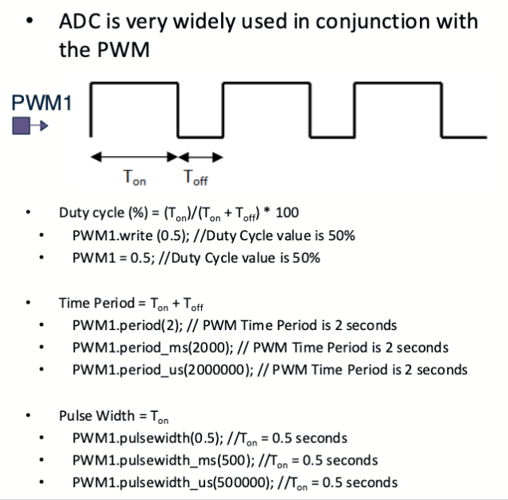
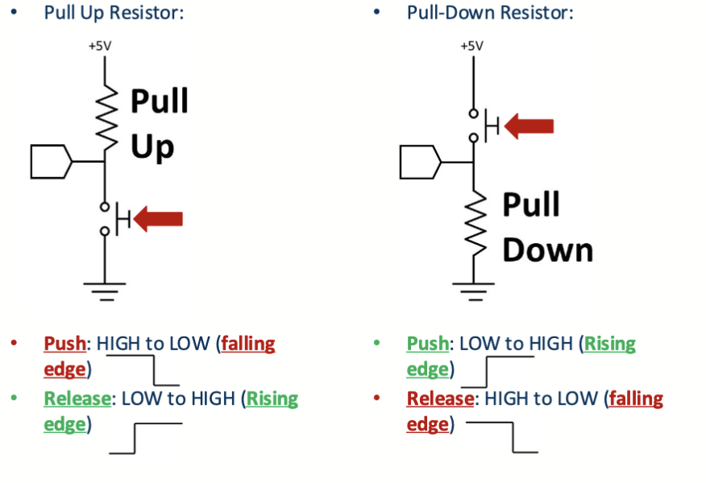
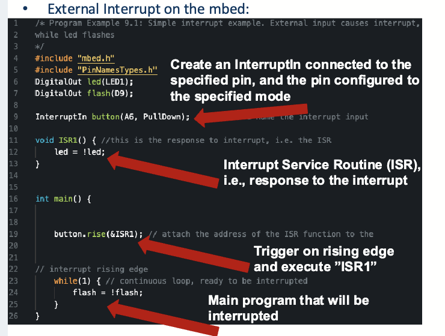
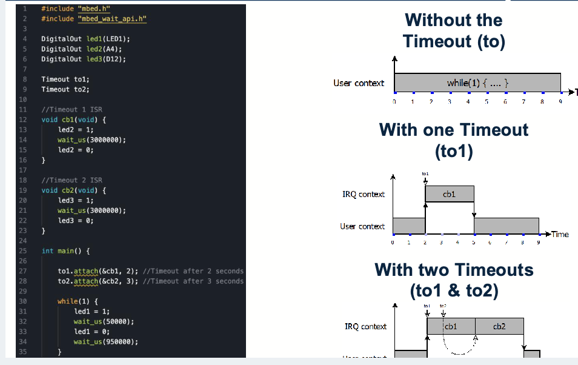
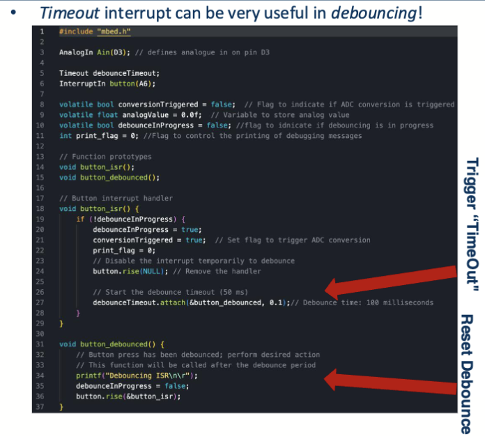

# Lecture 7 : ADC & Interrupts

## ADC (Analog to Digital Converter, 模数转换器)

### ADC 基础部分

ADC 的作用是将模拟信号转换为数字信号。在一些情况下，我们需要对模拟信号进行测量，比如温度、湿度、光照等。ADC 可以将这些模拟信号转换为数字信号，以便进行处理和分析。

对于一个典型的片上 ADC，它的计算公式是这样的

$$
ADC_{value} = \frac{V_{in}}{V_{ref}} \times 2^{N}
$$

- $V_{in}$ 是输入电压
- $V_{ref}$ 是参考电压
- $N$ 是 ADC 的分辨率
- $ADC_{value}$ 是 ADC 的输出值

### MBed OS 中的 ADC

对于我们使用的 `NUCLEO-L432KC` 开发板来说，他有 10 路的 ADC 输入，参考电压和输入电压相同是 `3.3V` ，在我们的实验中的 `MBed OS` 环境下，应该这个样子使用 ADC

```cpp
// 定义了一个 ADC 输入对象 adc_in，连接到 A0 引脚
AnalogIn adc_in(A0);
// 读取 ADC 输入的值，范围是 0.0 到 1.0
float adc_val = adc_in.read();
```

可以发现这里读取的 adc 的数值是浮点数，而我们之前提到的 ADC 读取的值是一个`0`到`1 << N`的整数。这里其实是`Mbed OS`的`AnalogIn` 类对于 ADC 输入值的封装，浮点数的值其实是 $\frac{ADC_{value}}{2^N}$，也就是将 ADC 的值归一化到 $[0, 1)$ 的范围内。

下面是具体的`AnalogIn`类的类方法:

- `AnalogIn(PinName pin)`
  - 构造函数，创建一个 ADC 输入对象，连接在 `pin` 引脚上
- `float read()`
  - 读取 ADC 输入的值作为返回值，范围是 $[0.0, 1.0)$
- `unsigned short read_u16()`
  - 读取 ADC 输入的值作为返回值，不归一化成浮点数，范围是 $[0, 2^{16})$
- `float read_voltage()`
  - 读取 ADC 输入的值作为返回值，范围是 $[0.0, V_{ref})$
  - 这个函数的返回值是一个浮点数，表示输入电压的值
  - 值的单位直接就是伏特，不用二次处理。
- `void set_reference_voltage(float voltage)`
  - 设置参考电压的值，单位是伏特
  - `read_voltage`以这个值为参考来计算实际的输入电压
- `float get_reference_voltage()`
  - 获取参考电压的值，单位是伏特
  - 这个值是 `set_reference_voltage` 设置的值

## PWM (Pulse Width Modulation, 脉冲宽度调制)

### PWM 基础部分



关于 PWM 信号，有三个概念

- 占空比 (Duty Cycle)
  - 占空比是指 PWM 信号中高电平的时间占整个周期的比例
  - 占空比的范围是 $[0, 1]$
  - 占空比为 $0$ 时，PWM 信号始终为低电平
- 周期 (Period)
  - 周期是指 PWM 信号的一个完整周期的时间
  - 周期的单位是秒
- 脉宽 (Pulse Width)
  - 脉宽是指 PWM 信号中高电平的时间
  - 脉宽的单位是秒
  - 脉宽和占空比的关系是 $Pulse Width = Duty Cycle \times Period$

### Mbed 中的 PWM

在 Mbed OS 中，PWM相关操作被包装成了 `PwmOut` 类。这个类的实现是通过对一个引脚进行快速的开关操作来实现 PWM 信号的输出。PWM 信号的占空比可以通过设置引脚的高电平和低电平的时间比例来控制。

下面是一些在 MS 里就提到过的 PWM 相关的类方法：

- `PwmOut(PinName pin)`
  - 构造函数，创建一个 PWM 输出对象，连接在 `pin` 引脚上
- `void write(float cycle)`
  - 设置 PWM 输出的占空比，范围是 $[0.0, 1.0]$
- `void operator=(float cycle)`
  - 设置 PWM 输出的占空比，范围是 $[0.0, 1.0]$
  - 这个函数和上面的 `write` 函数是等价的，但是复用了等号运算符来实现简单的调用
- `void period(float seconds)`
  - 设置 PWM 输出的周期，单位是秒
  - 这个函数可以设置 PWM 输出的频率
- `void period_ms(int ms)`
  - 设置 PWM 输出的周期，单位是毫秒
  - 这个函数可以设置 PWM 输出的频率，适用于更精细的时间控制
- `void period_us(int us)`
  - 设置 PWM 输出的周期，单位是微秒
  - 这个函数可以设置 PWM 输出的频率，适用于更精细的时间控制
- `void pulsewidth(float seconds)`
  - 设置 PWM 输出的脉冲宽度，单位是秒
  - 这个函数可以设置 PWM 输出的脉冲宽度
- `void pulsewidth_ms(int ms)`
  - 设置 PWM 输出的脉冲宽度，单位是毫秒
  - 这个函数可以设置 PWM 输出的脉冲宽度，适用于更精细的时间控制
- `void pulsewidth_us(int us)`
  - 设置 PWM 输出的脉冲宽度，单位是微秒
  - 这个函数可以设置 PWM 输出的脉冲宽度，适用于更精细的时间控制

> 可以发现 ADC 读出来的值可以直接灌进`PwmOut`类的 `write` 函数中，这样就可以实现一个简单的 PWM 输出了。这样获得的 PWM 信号的占空比和 ADC 输入的电压与参考电压的比值是相同的。如果 ADC 参考电压和 VCC 连接，那么输出的 PWM 信号的平均值和输入的电压是相同的。

## Interrupts (中断)

> 真的要再介绍一次中断吗？

中断允许微控制器立即响应事件，而不会浪费处理周期。中断非常适合在处理关键事件（例如，监测患者的体温变化）时需要实时响应和最小延迟的任务。

> 注意： **_不要_** 在中断服务函数中使用阻塞性的延时函数

### 外部中断 (External Interrupt)

在 MBed OS 中，引脚电平变化引起的外部中断被打包成了`InterruptIn` 类。这个类可以用于检测引脚电平的变化，并在变化时触发中断处理函数。之前提到过，GPIO 的引脚输入有上拉和下拉两种情况，如图所示：



上拉/下拉指的是在按钮没有触发时的默认电平状态。在对应的上升沿/下降沿时，InterruptIn 类绑定的中断回调函数会被触发。



### 超时中断 (Timeout Interrupt)

超时中断指的是定时器到达设定的时间后触发的中断。这个中断可以用于实现定时任务，比如定时读取传感器数据、定时发送数据等。

在 MBed OS 中，超时中断被打包成了`Timeout` 类。这个类可以用于设置定时器，并在定时器到达设定的时间后触发中断处理函数。如果在一个 `TimeOut` 中断中发生了另一个 `TimeOut` 中断，那么一个新的中断将被挂起，直到第一个中断处理完成后才会执行。这个特性可以用于实现定时器的嵌套调用。

> 再强调一次， **_不要_** 在中断服务函数中使用阻塞性的延时函数



### 按键消抖 (Debounce)

按键消抖是指在按键被按下或释放时，由于机械接触的原因，可能会产生多个电平变化的现象。这个现象会导致中断被触发多次，从而导致错误的操作。

为了避免这个现象，我们可以在中断处理函数中添加一个延时，等待按键的状态稳定后再进行处理。这个延时的时间一般在 10ms 到 50ms 之间。也可以使用软件定时器来实现按键消抖。

在这里，我们可以用 `InterruptIn` 来实现按键中断，并在按键中断的中断回调函数中使用 `TimeOut` 来延时触发另一个中断，结合两个中断的结果来实现按键消抖的效果。

> 还有通过硬件来实现按键消抖，用计时器来实现状态机的按键消抖等方法，这里只是一种典型的实现方式



需要注意的是，这里为了避免多次触发按键中断，可以发现在按键中断的回调函数中禁用了按键中断，而在超时中断的回调函数中重新使能了按键中断。这样可以避免在按键中断的回调函数中再次触发按键中断。

### 定时器中断 (Ticker Interrupt)

定时器中断是指定时器到达设定的时间后触发的中断。这个中断可以用于实现定时任务，比如定时读取传感器数据、定时发送数据等。

在 MBed OS 中，定时器中断被打包成了`Ticker` 类。这个类可以用于设置定时器，并在定时器到达设定的时间后触发中断处理函数。和 `Timeout` 类似，`Ticker` 类也可以用于实现定时器的嵌套调用。

> 这里的定时器中断和超时中断的区别在于，`Timeout` 类是单次触发的，而 `Ticker` 类是周期性触发的。也就是说，`Ticker` 类可以用于实现定时器的循环调用，而 `Timeout` 类只能用于实现定时器的单次调用。


