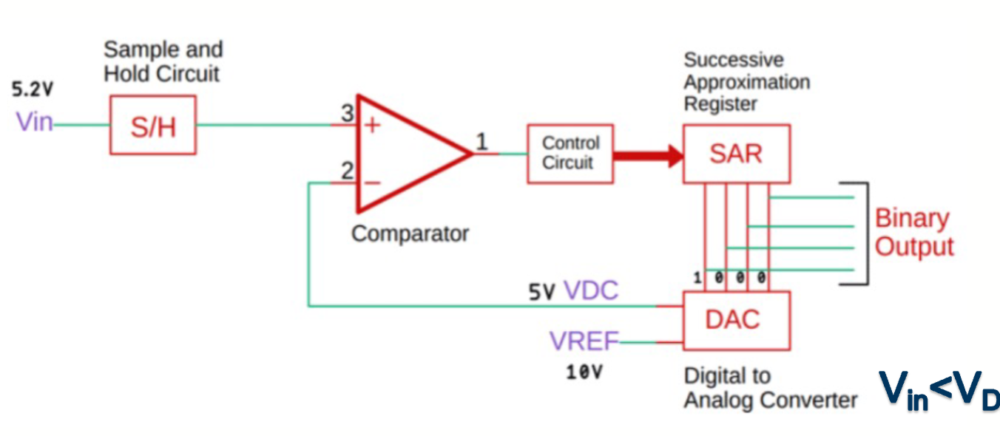

# Lecture 7 Fix : Working Principle of ADC (模数转换器工作原理)

> Embedded Processor 是一门神奇的科目。他可以让你在每一节课都去上了的同时还能在 Moodle 上找到全新并且没有讲过的 PPT。

## 什么是 ADC？

一个典型的 ADC（模数转换器）的框图如图所示。图上有一些相关的控制信号：

- SC (Start Conversion)：开始转换信号
  - 一个数字信号，用于触发 ADC 开始转换过程。
- EOC (End of Conversion)：转换结束信号
  - 一个数字信号，用于指示 ADC 转换过程已完成。

对于一个 ADC 部件，它花费有限的时间来转换一个模拟信号到一个数字信号，具体的转换时间是和提供的时钟信号有关。数字信号包括多个位数，位的多少和 ADC 的位宽一致。

$V_{ref}$ 是给 ADC 的参考电压大小，它通常决定了 ADC 的输入量程。$V_{in}$ 是 ADC 的输入模拟信号，在开始转换时这个信号会被采样并被转换。

## 相关参数

### 输出 (D)

对于一个典型的 ADC，它的输出的数字信号和输入的模拟信号符合这样的一个等式

$$
D = \frac{V_i}{V_{ref}} 2^n
$$

其中，有

- $D$ 是 ADC 的输出数字信号
- $V_i$ 是 ADC 的输入模拟信号
- $V_{ref}$ 是 ADC 的参考电压
- $n$ 是 ADC 的位宽（即输出数字信号的位数）

当然，ADC 的输入信号的可能性是无限的，但是我们这里的 ADC 只能有有限种类的输出。如果 D 最后算出来并不是一个整数，ADC 要怎么得出数据呢？一般有两种方法

- **向下取整 (Truncates)**
  - 直接舍去小数部分，保留整数部分。
- **四舍五入 (Rounds)**
  - 如果小数部分大于等于 0.5，则向上取整，否则向下取整。

图中展示的是四舍五入的情况。

同样的，对于一个 ADC，有允许的最大输入值和最小输入值，这两者之间的就是这个 ADC 的量程(range)。超出量程的输入值可能会导致 ADC 输入上限/下限的数字输出，这个现象被称为 **削波 (clipping)**

### 分辨率 (Resolution)

如果在一定的量程里，ADC 可以输出更多不同的状态，那么我们可以根据 ADC 的输出得到更加准确的测量结果。

我们把状态之间对应的电压变化大小称作 **分辨率 (resolution)** ，用这样的公式进行计算。

$$
\mathrm{resolution} = \frac{V_{ref}}{2^n}
$$

### 量化误差 (Quantisation Error)

**LSB (Least Significant Bit)** 在 ADC 中表示最小的电压步长，即：

$$
\text{LSB} = \frac{V_{ref}}{2^n}
$$

LSB 等于 ADC 的分辨率，代表连续两个数字输出码之间对应的模拟电压差值。

**量化误差 (Quantisation Error)** 是指实际输入电压与其对应的量化电压之间的差值，这是一个**模拟电压差值**。

#### 量化误差的产生

当输入电压 $V_{in}$ 介于两个量化级别之间时，ADC 必须选择一个数字输出码，这就产生了量化误差：

- **截断方式 (Truncation)**：

  - 量化误差范围：$0$ 到 $+1 \text{ LSB}$
  - 最大量化误差：$1 \text{ LSB}$

- **四舍五入方式 (Rounding)**：
  - 量化误差范围：$-0.5 \text{ LSB}$ 到 $+0.5 \text{ LSB}$
  - 最大量化误差：$0.5 \text{ LSB}$

#### 实例说明

假设一个 3 位 ADC，$V_{ref} = 8V$：

- LSB = $\frac{8V}{2^3} = 1V$
- 如果 $V_{in} = 2.7V$，理论数字值 = $\frac{2.7}{8} \times 8 = 2.7$
- 使用截断：输出码 = 2，对应电压 = 2V，量化误差 = 2.7V - 2V = 0.7V = 0.7 LSB
- 使用四舍五入：输出码 = 3，对应电压 = 3V，量化误差 = 2.7V - 3V = -0.3V = -0.3 LSB

> **注意**：量化误差是以模拟电压为单位的误差，通常用 LSB 作为单位来表示其大小。四舍五入方式可以将最大量化误差从 1 LSB 减少到 0.5 LSB。

## ADC 中断

ADC 作为一个外设，会在特定状态下产生中断信号。常见的 ADC 中断类型包括：

### 转换相关中断

- **ADC Ready**
  - ADC 就绪中断
  - 当 ADC 初始化完成并准备开始转换时触发
- **End of Conversion (EOC)**
  - 单次转换结束中断
  - 当 ADC 完成单个通道的一次转换时触发
- **End of Sequence (EOS)**
  - 转换序列结束中断
  - 当 ADC 完成预设的多通道转换序列时触发
- **End of Sampling**
  - 采样结束中断
  - 当 ADC 完成模拟信号的采样阶段（转换开始前）时触发

### 注入转换相关中断

- **End of Injected Conversion (JEOC)**
  - 注入转换结束中断
  - 当 ADC 完成一次注入转换时触发
  - 注入转换是高优先级转换，可以打断正在进行的常规转换序列
- **End of Injected Sequence (JEOS)**
  - 注入序列结束中断
  - 当 ADC 完成预设的注入转换序列时触发
- **Overflow of Injected Sequence Context Queue**
  - 注入序列上下文队列溢出中断
  - 当注入序列的上下文队列溢出时触发，表示注入转换请求过于频繁

### 监控和错误中断

- **Analog Watchdog (AWD)**
  - 模拟看门狗中断
  - 当被监控通道的转换结果超出预设的数字阈值范围时触发
  - 用于实时监测信号是否在安全范围内
- **Data Overrun (OVR)**
  - 数据溢出中断
  - 当 ADC 数据寄存器中的转换结果被新数据覆盖而未被及时读取时触发
  - 表示软件处理速度跟不上 ADC 转换速度

> **注意**：具体的中断类型和命名可能因不同的微控制器厂商和型号而有所差异。以上列举的是基于 STM32 等常见微控制器的 ADC 中断类型。

## ADC 类型

根据不同的转换原理和架构，ADC 有多种类型，每种都有其特定的应用场景和性能特点：

### 主要 ADC 架构类型

- **逐次逼近型 ADC (Successive Approximation Register, SAR ADC)**
  - 使用二分搜索算法逐步逼近输入电压值
  - 转换速度中等，功耗较低
  - 广泛应用于嵌入式系统中
- **Delta-Sigma ADC (ΔΣ ADC)**
  - 使用过采样和噪声整形技术
  - 高精度，低噪声
  - 适用于音频和精密测量应用
- **流水线型 ADC (Pipelined ADC)**
  - 将转换过程分为多个流水线级
  - 高速转换，高吞吐量
  - 常用于高速数据采集系统
- **闪速型 ADC (Flash ADC)**
  - 使用并行比较器阵列同时进行所有比较
  - 转换速度最快
  - 功耗高，成本高，通常用于高速应用
- **Dual Slope ADC**
  - 通过积分和比较实现转换
  - 精度高，但速度较慢
  - 常用于数字万用表等精密测量设备

### 逐次逼近 ADC

逐次逼近 ADC 的原理是比较输入的电压大小和通过 SAR 寄存器生成的参考电压大小，进而通过二分法得到最终的输出。具体的步骤是：

- SAR 寄存器初始化为 0，将最高位设置成 1
- DAC 根据 SAR 寄存器的输出值生成 ADC 的参考电压
- 比较器比较输入电压和生成的参考电压大小
- 控制单元根据比较器的输出调整 SAR 寄存器的值
- 重复上述步骤，直到得到的结果达到所需的精度

这个图里展示出了 SAR ADC 的多次迭代、树状的二分搜索的过程
