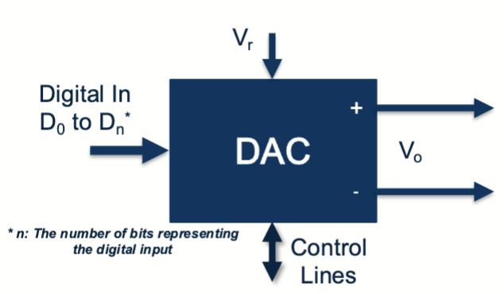

# Lecture 8 : DAC

## DAC (Digital to Analog Converter, 数模转换器)

### DAC 基础部分

DAC 的作用是将数字信号转换为模拟信号。DAC 的工作原理和 ADC 是相反的。DAC 可以将数字信号转换为模拟信号，以便进行输出和控制。

DAC 在生活中有着广泛的应用，比如数字信号处理，手机，MCU 的电源，音频放大器等。

---

一个典型的 DAC 模块如图所示：



其包括的引脚有数字信号输入线，一些控制线，外置的基准电压输入和最终的电压值输出。

对于一个典型的 DAC，它的输出电压的公式是这样的：

$$
V_o = \frac{D}{2^n} V_r
$$

- $V_o$ 输出电压
- $D$ 数字输入值
- $n$ DAC 的位数
- $V_r$ 参考电压

由此可得，DAC 的输出范围是 $[0, (1-\frac{1}{2^n})V_r]$，它的分辨率是 $\frac{V_r}{2^n}$

### MBed OS 中的 DAC

对于我们使用的 `NUCLEO-L432KC` 开发板来说，他有 2 路的 DAC 输出，参考电压和输入电压相同是 `3.3V` ，在我们的实验中的 `MBed OS` 环境下，应该这个样子使用 DAC

```cpp
// 定义了一个 DAC 输出对象，连接在 A6 引脚
AnalogOut dac_out(A6);
// 设置 DAC 输出为 0.5 * Vmax
dac_out = 0.5;
```

和 ADC 类似，这里 DAC 写入的值也是一个浮点数，范围是 0~1 。下面是具体的 `AnalogOut` 类的类方法。

- `AnalogOut(PinName pin)`
  - 构造函数，初始化 DAC 输出对象并连接到指定的引脚。
- `void write(float val)`
  - 将浮点值写入 DAC 输出，范围是 0~1。
- `void write_u16(uint16_t val)`
  - 将 16 位无符号整数值写入 DAC 输出，范围是 0~65535。
- `void operator=(float val)`
  - 等效于 `write` 方法，范围是 0~1。
