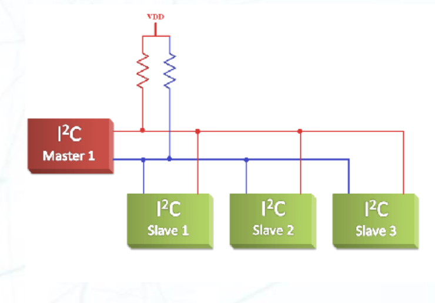
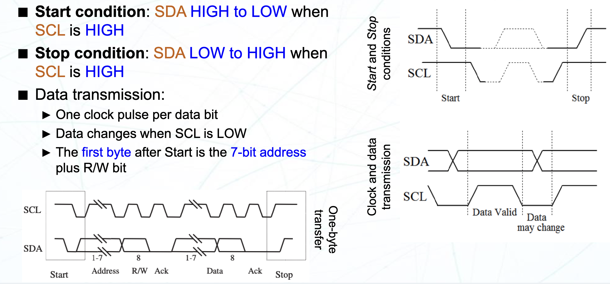
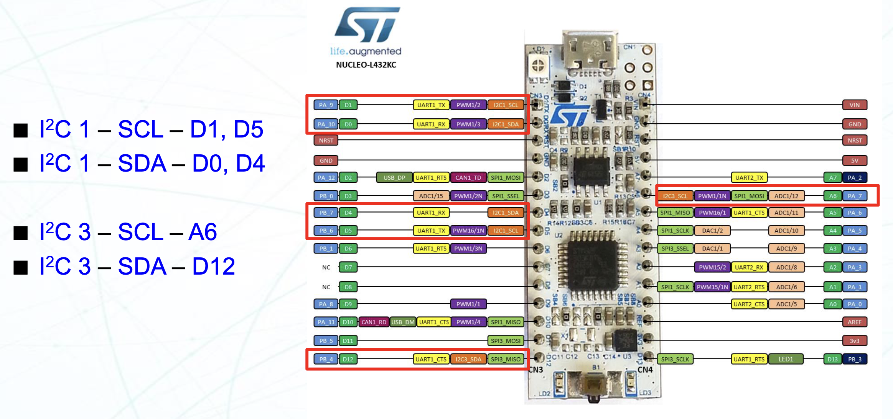
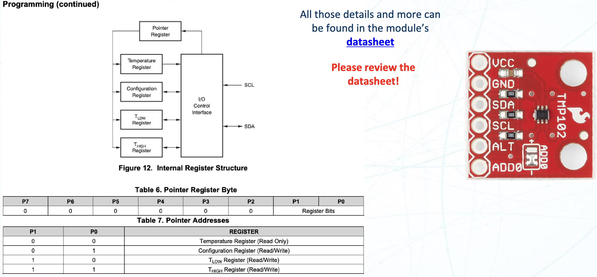
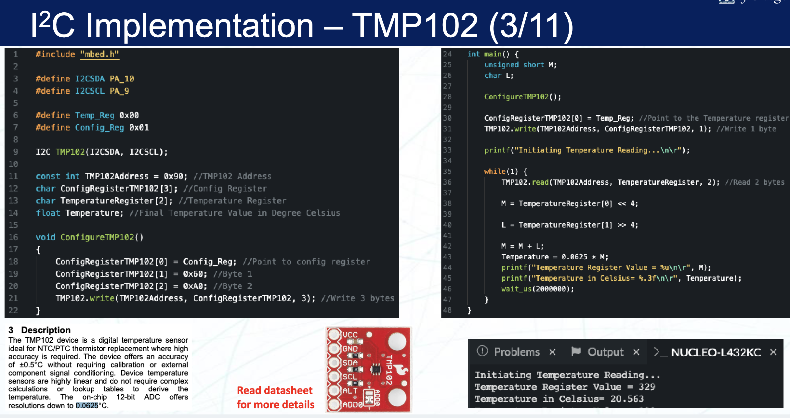
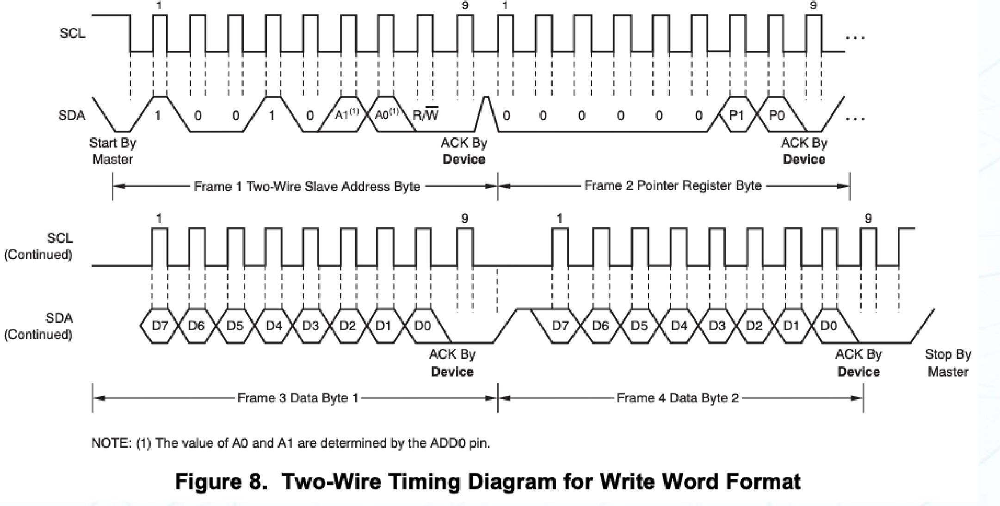
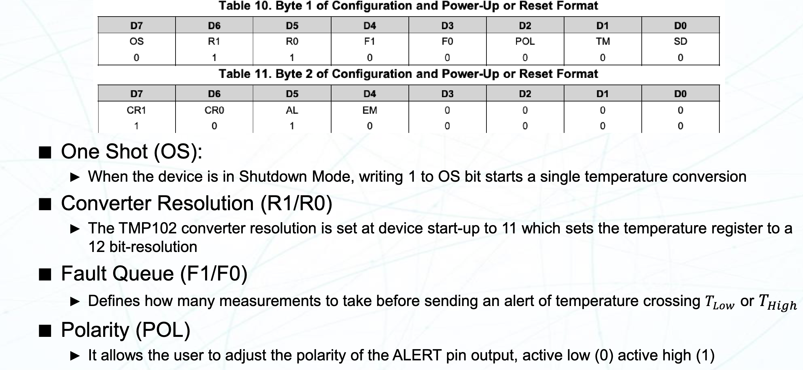
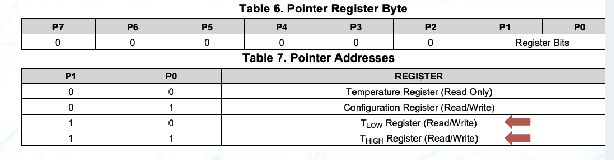
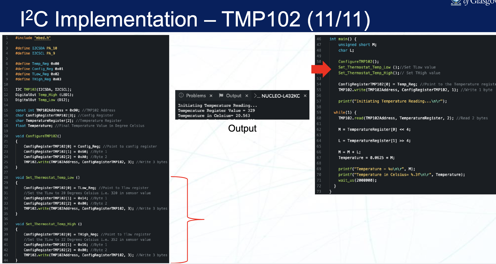

# Lecture 9 : Inter Integrated Circuit (I2C)

> 是的，没错，I2C 在 Microelectronic System 里也讲过了
>
> 点击这里查看 [Microelectronic System 复习 : I2C](./MS_Review_Notes/B4P2.md)

## 背景知识

并行传输和串行传输

- 并行传输
  - 一次传输多个 bit，通常使用多个数据线同时传输。
- 串行传输
  - 一次传输一个 bit，通常使用单个数据线按顺序传输。

异步传输和同步传输

- 异步传输
  - 发送和接收设备不需要共享时钟信号，数据传输的时序由起始位和停止位来控制
  - 比如 USB， UART
- 同步传输
  - 发送和接收设备共享时钟信号，数据传输的时序由时钟信号来控制
  - 比如 I2C， SPI

## Inter Integrated Circuit (I2C)

### 概述



I2C 是一种同步的串行通讯协议，由飞利浦（Philips）在 1980 年代初期开发，主要用于连接微控制器和各种外设。I2C 的设计目标是实现低速、短距离的通信，适用于嵌入式系统中的各种应用。

I2C 遵从主从架构，主设备负责发起通信并控制数据传输，而从设备则响应主设备的请求。一路 I2C 总线上通常有一个或多个子设备和一个或多个从设备，主设备在同一时间内只有一个处于活动状态。

每个从设备都有一个唯一的地址，主设备通过该地址来选择要与之通信的从设备。从设备通过监听总线上的数据来判断是否是自己的地址，如果是，则响应主设备的请求。这种寻址方式限定了从设备的数量，通常在 7 位地址模式下，最多可以连接 127 个从设备（0x00 地址保留给总线控制器）。在 10 位地址模式下，可以连接更多的从设备，但实际应用中较少使用。

I2C 协议使用两根线进行通信：SDA（Serial Data Line）和 SCL（Serial Clock Line）。SDA 用于传输数据，SCL 用于提供时钟信号。SDA 和 SCL 线都是开漏输出（open-drain），这意味着它们通过上拉电阻连接到高电平（Vcc），并且在传输数据时，设备可以将线拉低到低电平（GND）。这种设计允许多个设备共享同一条总线，并且在总线上只有一个设备可以在同一时间内发送数据，从而避免了冲突。

由于输入和输出都是通过 SDA 线，所以 I2C 是一个半双工的协议。

### 传输



- 传输起始条件
  - SCL 维持在高电平
  - SDA 由高电平变为低电平
- 传输停止条件
  - SCL 维持在高电平
  - SDA 由低电平变为高电平
- 传输数据
  - SDA 线在 SCL 低电平时变化，高电平时保持不变
  - SCL 线在高电平时，SDA 线上的数据被采样

所有的 I2C 数据传输都是以一个字节为单位的，一个消息中的字节数量没有限制。每个字节结束后都需要接收方发送一个 ACK 信号确认。

第一个字节由 7 位地址和 1 位读/写位组成。读/写位为 0 表示写操作，为 1 表示读操作。接收方在接收到地址字节后会发送一个 ACK 信号，表示准备好接收数据。

## MBed OS 中的 I2C



我们使用的开发板 `NUCLEO L432KC` 也支持 I2C 通讯。它有 `I2C1` 和 `I2C3` 两个 I2C 控制器，对应的引脚如图所示。

在 `MBed OS 6` 中，有 I2C 主机和从机的 API

### I2C 主机 API

- `I2C(PinName sda, PinName scl)`
  - 创建一个 I2C 对象，指定 SDA 和 SCL 引脚
- `int read(int address, char *data, int length, bool repeated = false)`
  - 从指定地址读取数据
- `int write(int address, const char *data, int length, bool repeated = false)`
  - 向指定地址写入数据
- `int write(int data)`
  - 向 I2C 总线写入一个字节的数据
- `int read(int ack)`
  - 从 I2C 总线读取一个字节的数据
- `void frequency(int hz)`
  - 设置 I2C 的频率
- `void start()`
  - 启动 I2C 通讯 (发送起始条件)
- `void stop()`
  - 停止 I2C 通讯 (发送停止条件)

样例程序 (来自 [MBed OS 6: I2C](https://os.mbed.com/docs/mbed-os/v6.16/apis/i2c.html))

```cpp
/*
 * Copyright (c) 2014-2020 Arm Limited and affiliates.
 * SPDX-License-Identifier: Apache-2.0
 */

#include "mbed.h"

// Read temperature from LM75BD

I2C i2c(I2C_SDA, I2C_SCL);

const int addr7bit = 0x48;      // 7 bit I2C address
const int addr8bit = 0x48 << 1; // 8bit I2C address, 0x90

int main()
{
    char cmd[2];
    while (1) {
        cmd[0] = 0x01;
        cmd[1] = 0x00;
        i2c.write(addr8bit, cmd, 2);

        ThisThread::sleep_for(500);

        cmd[0] = 0x00;
        i2c.write(addr8bit, cmd, 1);
        i2c.read(addr8bit, cmd, 2);

        float tmp = (float((cmd[0] << 8) | cmd[1]) / 256.0);
        printf("Temp = %.2f\n", tmp);
    }
}
```

### I2C 从机 API

- `I2CSlave(PinName sda, PinName scl)`
  - 创建一个 I2C 从机对象，指定 SDA 和 SCL 引脚
- `void frequency(int hz)`
  - 设置 I2C 的频率
- `int receive()`
  - 确认总线上的地址是否匹配
  - 返回值的情况
    - `0` : 地址不匹配
    - `1` : 地址匹配，主机在写数据
    - `2` : 地址匹配，主机在读数据
- `int read(char *data, int length)`
  - 从 I2C 总线读取数据
- `int write(const char *data, int length)`
  - 向 I2C 总线写入数据
- `void address(int address)`
  - 设置 I2C 从机的地址
- `void stop(void)`
  - 停止 I2C 通讯，重置到待选中状态

样例程序 (来自 [MBed OS 6: I2C Slave](https://os.mbed.com/docs/mbed-os/v6.16/apis/i2cslave.html))

```cpp
/*
 * Copyright (c) 2006-2020 Arm Limited and affiliates.
 * SPDX-License-Identifier: Apache-2.0
 */
#include <mbed.h>

#if !DEVICE_I2CSLAVE
#error [NOT_SUPPORTED] I2C Slave is not supported
#endif

I2CSlave slave(D14, D15);

int main()
{
    char buf[10];
    char msg[] = "Slave!";

    slave.address(0xA0);
    while (1) {
        int i = slave.receive();
        switch (i) {
            case I2CSlave::ReadAddressed:
                slave.write(msg, strlen(msg) + 1); // Includes null char
                break;
            case I2CSlave::WriteGeneral:
                slave.read(buf, 10);
                printf("Read G: %s\n", buf);
                break;
            case I2CSlave::WriteAddressed:
                slave.read(buf, 10);
                printf("Read A: %s\n", buf);
                break;
        }
        for (int i = 0; i < 10; i++) {
            buf[i] = 0;    // Clear buffer
        }
    }
}
```

## 使用 I2C 驱动 TMP102

TMP102 是一个数字温度传感器，具有 I2C 接口。它可以测量温度并通过 I2C 总线将数据传输到主设备。我们可以通过查询 TMP102 的数据手册来了解他的工作原理和寄存器配置。



然后，用 MBed OS 中的 I2C 接口驱动 TMP102:





在配置 TMP102 的过程中，我们先发送了 0x01 地址，表示我们要配置 TMP102 的配置寄存器。然后发送了 0x60 和 0xA0，分别写入了配置寄存器的第一个和第二个字节

配置寄存器的格式是这样的



- One-Shot (OS)
  - 0: 连续转换
  - 1: 单次转换
- Converter Resolution (R1/R0)
  - 00: 9-bit resolution
  - 01: 10-bit resolution
  - 10: 11-bit resolution
  - 11: 12-bit resolution
- Fault Queue (F1/F0)
  - 在温度超过设定值时，最多允许多少次错误
- Polarity (POL)
  - 0: 低电平有效
  - 1: 高电平有效
- Thermostat Mode (TM)
  - 0: 比较器模式
    - 当温度超过 $\mathrm{T_{HIGH}}$ 时，AL 置位
    - 之后当温度低于 $\mathrm{T_{LOW}}$ 时，AL 复位
  - 1: 中断模式
    - 当温度超过 $\mathrm{T_{HIGH}}$ 时，AL 置位，
    - 之后当进行一次读操作时，AL 复位
- Shutdown Mode (SD)
  - 0: 工作模式
  - 1: 休眠模式
- Conversion Rate (CR1/CR0)
  - 00: 0.25 Hz
  - 01: 1 Hz
  - 10: 4 Hz
  - 11: 8 Hz
- Alert (AL)
  - 读取 AL 位可以获得比较器模式的状态信息

类似的，我们可以发送不同的地址来写入不同的寄存器



- `0x00` : 只读的温度寄存器
- `0x01` : 可写的配置寄存器
- `0x02` : 可写的 $\mathrm{T_{LOW}}$ 寄存器
- `0x03` : 可写的 $\mathrm{T_{HIGH}}$ 寄存器

最后，用 MBed OS 实现对应的功能：



便完成了用 I2C 驱动 TMP102 的任务。
