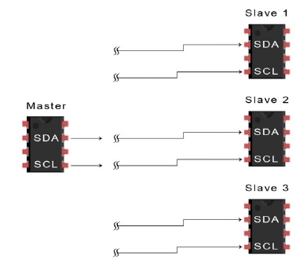
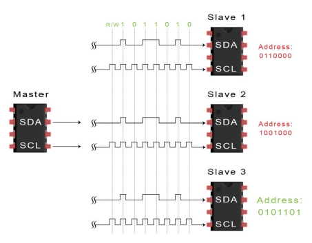
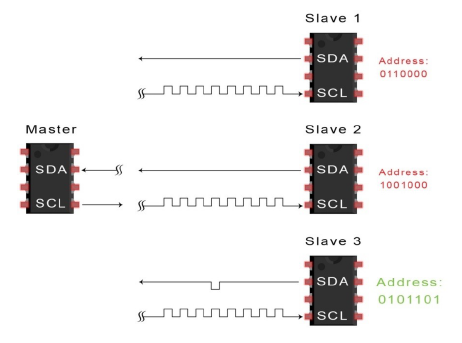
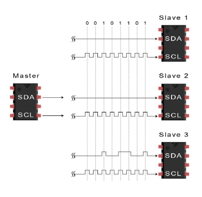
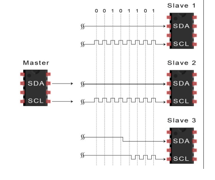
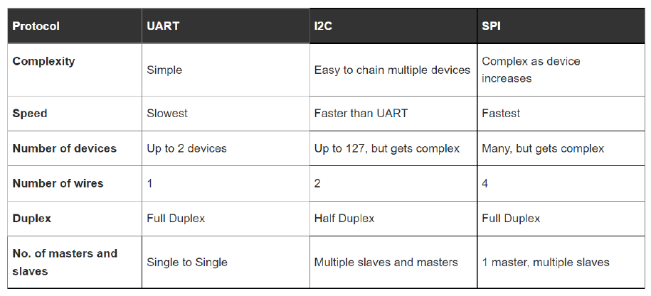
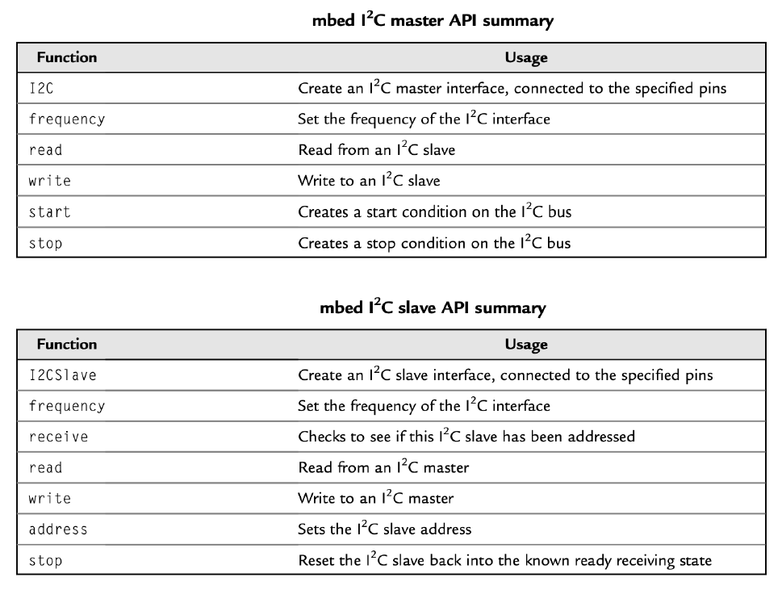
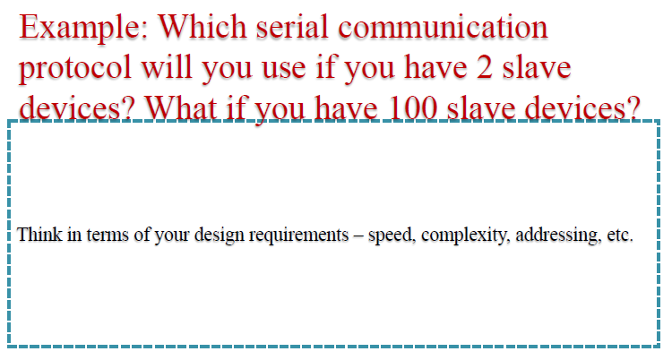

# Lecture 11 : Inter Integrated Circuit (I2C) Communication Protocol

> **_Inter Integrated Circuit_**，译为集成电路总线，简写为 IIC，也常写作 I2C。


## <u>简介</u>

- I2C 是一个串行的数据传输协议，也就是具有 Block 4 Part 1 所提及的所有串行总线的特点
- I2C 和 SPI 不同，在同一条总线上可以挂载一个乃至多个主机控制一个乃至多个从机，而 SPI 只能由最多一个主机
- 和 SPI 相同，I2C 只适用于短距离的数据传输，对长距离的场景的抗干扰能力等并没有良好的表现。
- 对于典型的 I2C 总线，只有两条线，一条为 SDA (Serial Data Line)，一条为 SCL (Serial Clock)，也就是一条数据线，一条时钟线。两条线的具体作用会在后文提及
- 对于挂载在 I2C 总线上的主设备或者从设备，在同一时间内只能读取或者输出数据，但是总线在整体上同时具有读取和输入两个功能。因此，I2C 是一种**半双工**的通讯协议。

## <u>参数</u>

| Type                          | Data                       | Description                                                                                        |
| ----------------------------- | -------------------------- | :------------------------------------------------------------------------------------------------- |
| Wires Used                    | 2                          | 一条 SDA 线，一条 SCL                                                                              |
| Speed                         | Standard Mode : 100 kbps   | 首先注意单位，bps 的 b 是 bit 不是 Byte                                                            |
|                               | Fast Mode : 400 kbps       | 其次，从数据可以发现，最快的模式也比 SPI 要慢                                                      |
|                               | High Speed Mode : 3.4 Mbps |                                                                                                    |
|                               | Ultra Fast Mode : 5 Mbps   |                                                                                                    |
| Synchronous or Asynchronous ? | Synchronous                | 在传输数据时，主机通过 SCL 线向外输出时钟信号，所以是同步的通讯协议                                |
| Serial or Parallel ?          | Serial                     | 如同之前说的，I2C 通讯协议通过 SDA 一条线传输数据，是一种串行的通讯协议                            |
| Max # of Masters              | Unlimited                  | 只要挂载在总线上就，就可以充当主机对从机进行交互                                                   |
| Max # of Slaves               | 1008                       | 这个数量是由消息中的地址数量决定的。所以与主机数量不同，从机通过数据的地址区分，因此具有数量的限制 |

> 对于从机的数量限制，它是基于 10bit 模式来计算的。
> 首先$2^{10}=1024$​，理论上应该有 1024 个可用的地址可以使用，但是广播地址 0x000 和用作扩展地址的一部分是不会给从设备使用的，所以真正的可用的地址区间是 0x010 到 0x3FF，一共是 1008 个可用地址。
>
> 一般绝对挂不了这么多乱七八糟的东西。

## <u>典型的 I2C 连接</u>


典型的 I2C 连接由 SDA 和 SCL 两个线组成。

需要注意的是，总线的数据传输由连接到 VCC 的上拉电阻（阻值为$4.7k\Omega$） 和 IO 口的开漏模式输出组成（用开漏输出是为了规避隐藏的短路风险，不过这个应该不考）。也是因为这个缘故，总线在默认不挂载设备的情况下应该是位于电平状态的。

给从机供电的 VCC，VDD，GND 等线并不算信号传输线，**不纳入 I2C 的连线数量中**。

~~I2C 的总线要求电容不能超过 400pF，可能是比起地址数更加现实的从机的数量限制。~~

### _SDA (Serial Data Line)_

I2C 总线中进行数据传输的线，主机通过 IO 口控制总线上电平的高低来发送信息，高电平被理解为 1，低电平被理解为 0。

### _SCL (Serial Clock)_

SCL，即为 I2C 总线的时钟线，默认为高电平状态。在传输过程中，时钟信号由主机产生，控制整个总线的时序。

因为没有 SS/CS 线，所以 I2C 总线的信息的发起与结束由 SDA 和 SCL 共同定义。这也是主机可以开始和结束数据传输的另一个原因。

---

这是一个多主机连接多从机的 I2C 连接结构，是更常用的用法。


这种连接方式存在一个问题：当多个挂载在同一总线上的设备同时进行数据传输时，数据会相互覆盖干扰，最后不能得到正确的通讯效果。

因此，每个主设备在发送信息前都会对 SDA 线进行数据的读取，判断现在的 SDA 线时高电平状态还是低电平状态。

若 SDA 线存在低电平，则说明一定有别的设备在 SDA 线上进行了数据的输出，该设备会等待，直到这次数据传输结束。

## <u>I2C 消息 (Message)</u>

### 消息的开始与结束


- **开始条件：**在 SCL 处于高电平时，SDA 线发生了从高电平到低电平的转换过程，也就是有下降沿。
- **结束条件：**在 SCL 处于高电平时，SDA 线发生了从低电平到高电平的转换过程，也就是有上升沿。

### 消息的内容


一个典型的 I2C 消息由图上所显示的这些部分组成：开始条件(Start Condition)，地址帧(Address Frame)，读/写位(Read/Write Bit)，数据帧(Data Frame)，结束条件(Stop Condition)，在每个帧(Frame)之间会穿插有确认字符(ACK/NACK Bit) 。

- **确认字符：**在每一个数据帧传输完毕后，从机会在 SDA 线向主机发送一个确认字符来说明自己收到了消息。
  上文提及，I2C 的总线上有一个连接 VCC 的上拉电阻，所以高电平是总线的默认状态。所以，ACK(Acknowledge Bit)代表着 SDA 上的低电平，NACK(No-Acknowledge Bit)代表着 SDA 上的高电平。
  SCL 的时钟信号仍然由主机提供。

- **地址帧：**I2C 的总线并不像 SPI 那样通过 SS/CS 来判断从机是否被选中，I2C 通讯协议给了每个从机一个特有的地址，长度为**7 或者 10 位**，在通讯的时候将信息发送给挂载在这个总线上的所有从机，而从机通过读取地址信息，判断是否是自己的地址，进而判断是否进行响应。
  如果发送的地址由对应的设备，那么会在 SDA 线的对应时刻接收到 ACK

- **读/写位：**这一位紧接着地址帧发出，其中高电平状态含义为要求从从机读取数据，低电平状态的含义为将要给从机发送数据。这一位会影响之后的数据帧的发送方和发送格式。


- **数据帧：**长度为 8 位，也就是以字节为单位进行收发，顺序是 HSB 到 LSB，或者说是大端模式。具体怎么传输数据，传输什么数据，由谁给谁怎么传输，根据从设备的数据手册里的定义来判断。
  不过值得注意的是，I2C 是一个半双工的通讯协议，SDA 线在同一时间只能由一个设备进行信息的发送，而在发送的同时 SCL 线必须由主机提供时钟信号。
  在每一个数据帧结束后，会有一个确认字符，由读取方发出，来表示自己已经收到的信息。因此，I2C 相比 SPI 可以知道数据有无被正确接收。

## <u>I2C 通讯的收发过程</u>

- 首先，主设备向总线（也就是挂载在总线上的所有设备）发送 I2C 消息的开始条件，即 SCL 置高的同时给 SDA 下降沿。

、

- 主设备向总线发送 7 或者 10 位的地址帧，并发送读/写位。



- 从设备比对地址帧内容和自己的地址，如果配对则拉低 SDA 总线，输出确认字符 ACK。如果没有从设备匹配，总线默认置于高电平，获得确认字符 NACK。



- 根据需求主设备向总线（即目标从设备）发送或读取信息。在每个长度为 8 位的数据帧的结束，接受数据的设备都会向 SDA 线输出确认字符 ACK，示意数据读取成功。这个过程可能根据实际情况持续若干次。



- 在传输过程结束时，主机向从机发送结束条件，即在 SCL 置高时给 SDA 上升沿。之后，SDA 和 SCL 线都保持默认的高电平状态，总线空闲。



## <u>简单分析</u>

### 优点

- 总线只使用两根线，节省连线数量和引脚数量
- 支持在总线上挂在多个主机
- 存在确认字符，可以在传输帧时知晓是否传输成功
- 相比 UART（串口），硬件实现更加简单
- 广泛使用

### 缺点

- 因为传输相同的数据需要额外的内容，传输数据的速度小于 SPI
- 数据帧的长度被限制在了 8 位，自由度不够高
- 相比 SPI，硬件实现更加复杂
- 与 SPI 相比，I2C 只支持半双工模式，而 SPI 支持全双工



## <u>在 Mbed OS 上的实现</u>

> 这里提及的是 Mbed OS 上支持的硬件 I2C 的支持
>
> 实际上，作为一个同步的通讯协议，你完全可以通过几个 IO 和中断进行一个 I2C 支持的手搓，实现软件 I2C、



I2C 类给主机使用，I2CSlave 给从机使用，也就是说对于我们现在使用的 NUCLEO-L432KC，可以选择充当主机或者从机。

每个类对应的类方法应该在表格里很清楚了。

作为主机的 I2C 例程，来自[I2C - API references and tutorials | Mbed OS 6 Documentation](https://os.mbed.com/docs/mbed-os/v6.16/apis/i2c.html)

```cpp
/*
 * Copyright (c) 2014-2020 Arm Limited and affiliates.
 * SPDX-License-Identifier: Apache-2.0
 */
#include "mbed.h"
// Read temperature from LM75BD
I2C i2c(I2C_SDA, I2C_SCL);
const int addr7bit = 0x48;      // 7 bit I2C address
const int addr8bit = 0x48 << 1; // 8bit I2C address, 0x90
int main()
{
    char cmd[2];
    while (1) {
        cmd[0] = 0x01;
        cmd[1] = 0x00;
        i2c.write(addr8bit, cmd, 2);
        ThisThread::sleep_for(500);
        cmd[0] = 0x00;
        i2c.write(addr8bit, cmd, 1);
        i2c.read(addr8bit, cmd, 2);
        float tmp = (float((cmd[0] << 8) | cmd[1]) / 256.0);
        printf("Temp = %.2f\n", tmp);
    }
}
```

作为从机的 I2C 例程，来自[I2CSlave - API references and tutorials | Mbed OS 6 Documentation](https://os.mbed.com/docs/mbed-os/v6.16/apis/i2cslave.html)

```cpp
/*
 * Copyright (c) 2006-2020 Arm Limited and affiliates.
 * SPDX-License-Identifier: Apache-2.0
 */
#include <mbed.h>
#if !DEVICE_I2CSLAVE
#error [NOT_SUPPORTED] I2C Slave is not supported
#endif
I2CSlave slave(D14, D15);
int main()
{
    char buf[10];
    char msg[] = "Slave!";

    slave.address(0xA0);
    while (1) {
        int i = slave.receive();
        switch (i) {
            case I2CSlave::ReadAddressed:
                slave.write(msg, strlen(msg) + 1); // Includes null char
                break;
            case I2CSlave::WriteGeneral:
                slave.read(buf, 10);
                printf("Read G: %s\n", buf);
                break;
            case I2CSlave::WriteAddressed:
                slave.read(buf, 10);
                printf("Read A: %s\n", buf);
                break;
        }
        for (int i = 0; i < 10; i++) {
            buf[i] = 0;    // Clear buffer
        }
    }
}
```

## <u>思考题</u>


