# Lecture 9 : Serial Communication and UART

> 明明 Lecture 9 在 Block 3 里面，为什么还要算在 Block 4 里考……
>
> 发布时间撞上 MS 复习讲座了
> 我打复习讲座……真的假的

## <u>设备间的通讯(Communication)</u>

和人与人之间交流需要足够的语言能力类似，设备与设备之间需要相互交流也需要说相同的语言。说得更正式一点，就是他们也需要使用相同的通讯协议(Protocol)。

**(PPT 原话)**很幸运的是，我们只需要知道**很少**一部分的通讯协议就好。

人与人之间交流通过声音作为媒介，设备与设备之间的交流通过电信号作为媒介。通过导线把需要沟通的两个设备连接起来，设备便通过导线传播携带了信息的电信号。信息以位(bit)组成，每一位只包含两种状态，被我们表示为 0 和 1。

> 需要注意的是，0 和 1 和导线上的电平的对应关系需要根据具体的通讯协议来决定，比如 USB2.0 的 D+和 D-信号就是一组差分线，其 1 和 0 对应的电平状态并不简单的是高电平和低电平。

### _为什么我们需要快速的数据交互？_

- 与其他的设备进行通讯，比如其他的 MCU，DSP，甚至是 FPGA（比如 SRIO，PCIe，I2C）
- 从用户读取输入，以及在显示设备上输出
- 与不同板子上的 MCU 进行通讯交互，以实现 MCU 组网的应用场景（比如 CAN 和 LIN）

> 值得注意的是，CAN 总线和 LIN 总线的典型应用场景是汽车

### _数据通讯的类型_

#### 并行和串行

通讯协议我们可以分为两种模式，**串行通信(Serial Form)**和**并行通信(Parallel Form)**。

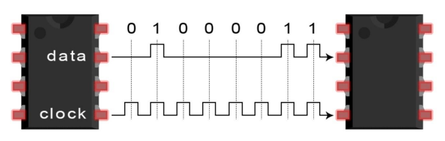

**串行通信**指的是这样的通讯方式：将数据一位一位的发送在同一条线上。

需要注意的是，虽然图上画了时钟线（也就是 clock），但是实际上串行通讯协议并不一定有时钟线。

- 在传输时，发送设备和接受设备之间使用正确的格式
- 线少，所以便宜
- 使用更少的引脚数量，节省 MCU 的引脚
- 不用在意**时钟偏移(Clock skew)**问题（指的是对于**不含时钟信号的异步串行数据传输**）（好长一串定语，做 PPT 的怎么想的）
- 可以有更高的时钟速率，也就是有更高的传输速率
- 适用于长距离信号传输，甚至是网络信号传输

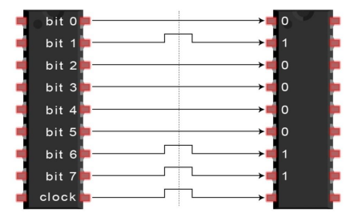

**并行通信**指的是这样的通讯方式：所有的数据位被同时发送在不同的线上，一一对应。

虽然图这么画，但是首先没有规定一定有 clock，也没有规定线的数量。

- 通常具有更高的速率
- 硬件实现更加简单，不需要序列化器(Serializer)和反序列化器(Deserializer)，更易于实现
- 通常用于**_非常_**短距离的通讯
- 但是对于时序需要更高的要求，可能会发生**时钟偏移(Clock skew)**，即时钟信号在不同的时间到达不同的设备
  - 原因是线的长度、电容的耦合或者材料的不理想等
  - 可以理解为信号不同时到达
- 有的时候，一条线上的信号会被临近线上的信号干扰，形成**串扰(Crosstalk)**
- 因为上两条的原因，在长距离时通讯速率相对串行通信较低
- 因为使用线的数量较多，线材成本更高

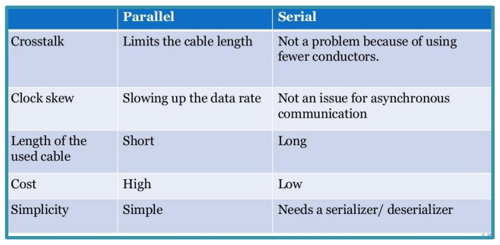

#### 单工，半双工和全双工

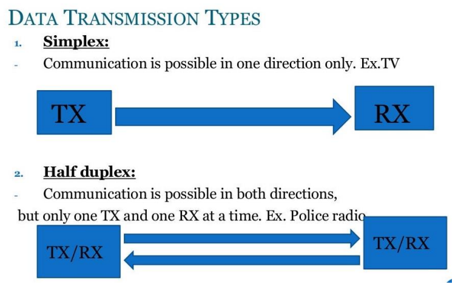

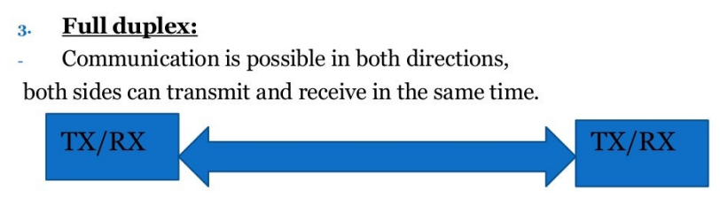

- **单工(Simplex)：** 只允许单向的数据通讯。对于一个设备，能且只能发送或者接受信息的其中一个功能
- **半双工(Half duplex)：** 允许双向的数据通讯，但是在某一个时刻，线上只能进行发送和接受信息的其中一个功能。对于一个设备，在相对长的时间里可以在线上发送和接收信息，但是在某一时刻只能实现一个功能。
- **全双工(Full duplex)：** 允许任何时刻的双向数据传输。总线允许在同一时刻同时进行收发两个操作。

#### 同步和异步

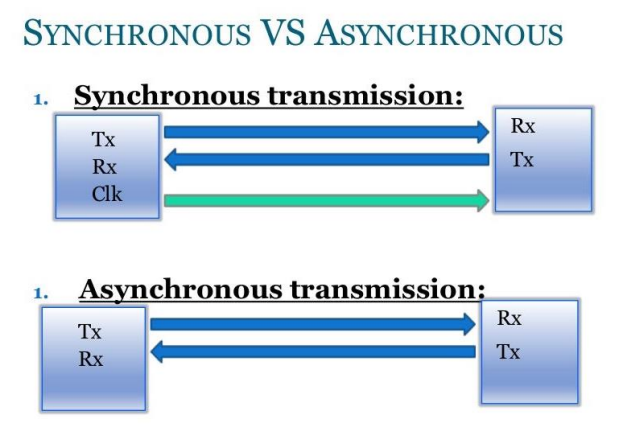

> 实际上图上画的就是 USART 和 UART，一个是同步传输协议，具有 Clk 线，另一个时异步传输协议。

**同步通讯(Synchronous transmission)**和**异步通讯(Asynchronous transmission)**的最大区别在于，同步通讯会发送时钟信号来同步主机和从机的时钟。

对于异步传输协议，通常会使用约定好的固定传输速率以及开始位和结束位来实现

### _总结：串行通信协议的基础_

- 什么时候数据传输开始和结束（开始和结束条件）
- 通讯速率和数据打包格式
  - 通讯速率可以通过事先约定或者提供时钟信号同步实现
  - 数据打包格式根据不同的通讯协议而不同

## <u>UART & USART</u>

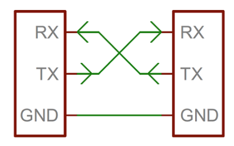

> 这是典型的**UART**连接，注意一下不是 USART。只需要两根线进行连线，RX 和 TX 交叉连接。
>
> RX 接受信号，TX 发送信号，引脚没什么需要说的

### _UART 的简介_

**UART**，全称为**通用异步接收器/发送器(Universal Asynchronous Receiver/Transmitter)**

它并不像 SPI 和 I2C 一样是一个通讯协议（指的是概念上的规则），而是一个在 MCU 中的物理意义上的电路，或者是一个独立的集成电路模块（指的是有物理实体）。

它是一个外设，有多种数据格式和数据传输速率可选。

UART 最主要的设计目的就是传输串行信号，适用于一对一的设备连接。在通过 UART 传输前，并行的信号会被处理成串行的信号以进行数据传输。

UART 是一个典型的全双工通讯协议，一个设备可以同时发送和接收数据。

### _UART 的适用场景_

- 并不需要很高的传输速率
- 较低的使用成本
  - 每一个传输方向只需要一根线
  - 硬件实现非常简单

### UART 的数据包(Packet)\*

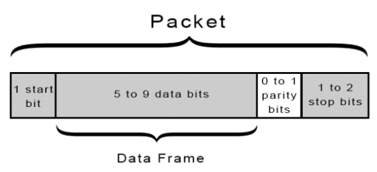

UART 的传输协议中，一个一字节的数据被打包成了数据包进行传输，具体的组成部分是：

- 起始位
  - 在没有进行数据传输的时候，连线默认置于高电平
  - 数据的起始位由一个低电平的 0 开始，长度是一个时钟周期
  - 接收的设备读到起始位后开始读取后面数据
- 数据帧（通常为 7 到 8 位，也有时候是 5 位）
  - 在存在校验位的情况下，一个数据帧的范围是 5 到 8 位；如果不存在校验位，则最多能有 9 位
  - 在大多数情况下，数据先以最小有效位数发送
  - 从 MSB 到 LSB
- 一个可选的数据校验位
  - 数据校验位的作用是让读取方确认数据在传输过程中是否发生错误
  - 如果前面发送的 1 的位数是奇数，则数据校验位为 1，反之为 0。
  - 可以更直接地理解为数据校验位让整个数据包的 1 的个数是偶数。·读取方如果读取了及数个 1，则说明数据传输错误
- 停止位（可以是一位或者多位）
  - 标示着数据包的结束
  - 从低电平上升至高电平，保持至少两个时钟周期
- 特定的每一位的时间（称为波特(baud)）
  - 传输速率我们也叫做波特率，单位是 bps(bit per second)
  - 发送和接收端应该具有相同的波特率，误差最多 10%，不然可能会因为时间的误差导致传输失败

对于 UART 硬件，它们都以一定的时钟频率控制，通常是比特率(bit rate)的八倍

接受的设备会在每个时钟信号的脉冲进行采样，等待起始位的发生。

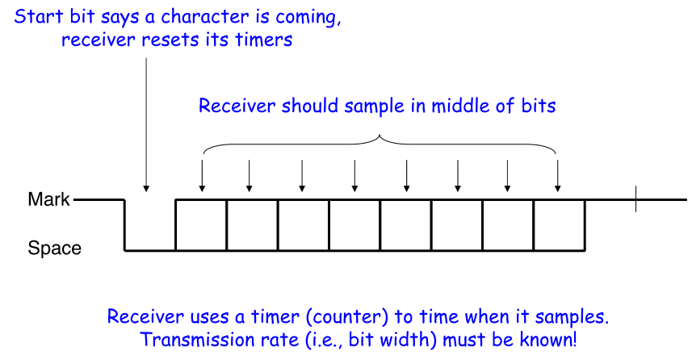

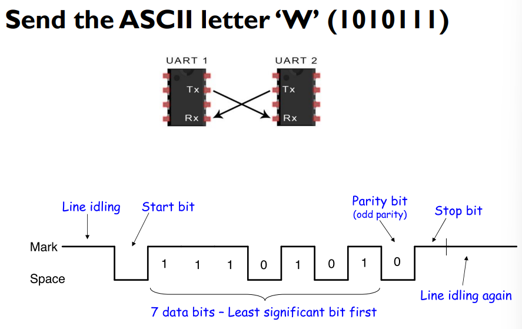

### _UART 传输的过程_

- 接受并行数据

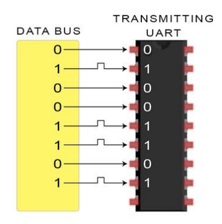

- 将并行数据串行化，并在数据帧上添加起始位、校验位和停止位

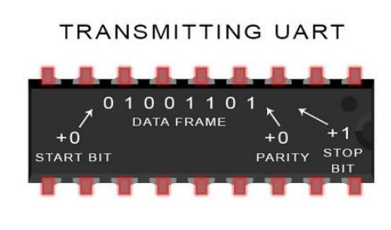

- 通过 Tx 引脚串行的向外输出打包好的数据包，其中数据包的格式和波特率被预先设置好且与接收设备保持一致

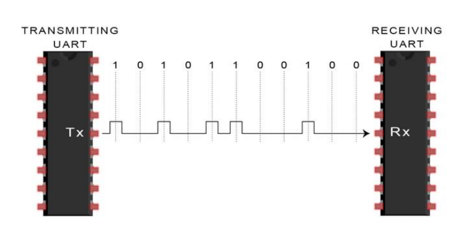

- 接收设备读取到起始位后开始读取数据包，并处理得到数据帧

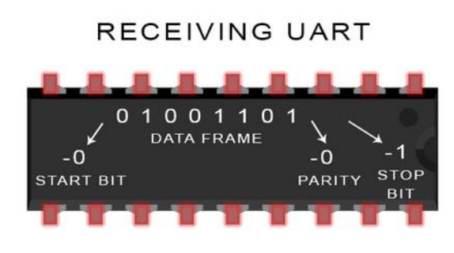

- 将读取到的数据帧并行化并输出给总线（也就是留给 MCU 处理）

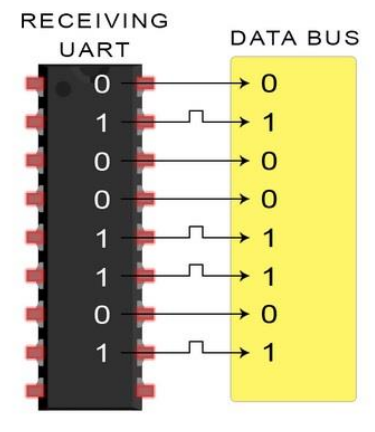

### _数据传输出现错误_

#### 成帧错误(Framing Error)

- 接收方找不到规定的起始位和停止位
- 起始位是一个数据包的开头，也是数据包中其他的位的参考
- 当应当出现停止位时未能出现停止位时，就会发生成帧错误

#### 奇偶校验错误(Parity Error)

- 当数据包中的总的 1 的个数为奇数时，或者说是奇偶校验位和其之前的数据不符时，奇偶校验错误就会发生
- 奇偶校验位时可选项，所以这个错误在不使用奇偶校验位时不会发生

### _USART 的简介_

USART，即为通用同步异步接收器/发送器(Universal Synchronous Asynchronous Receiver/Transmitter)。UART 只支持异步模式进行数据发送，线上不传输时钟信号；USART**同时支持同步模式和异步模式**。

换句话说，USART 可以被认为是 UART 的升级版，你可以用 USART 模块替代 UART 模块。

当你使用 USART 的同步模式时，需要多连接一条时钟信号线，同时不需要使用起始位和停止位了。这提升了数据传输效率，因为压缩了数据包的大小。

以下是 PPT 提供的基于 STM32F103 的 USART 例程：

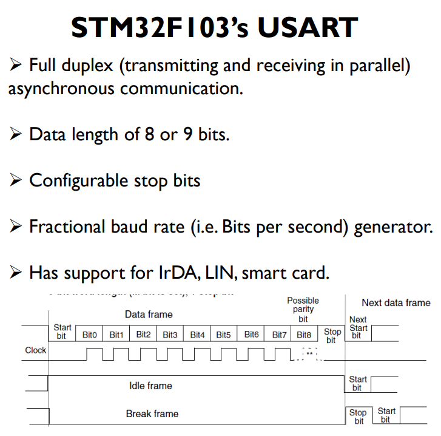

- 全双工工作模式，发送和接受在并行的两条线上
- 数据帧长度可以是 8 位（有奇偶校验位）或者 9 位（没有奇偶校验位）
- 可以配置的终止位
- 可以通过时钟信号自定义波特率
- 支持 IrDA（一种红外线通讯协议），LIN（前文提及），智能卡

图中的空闲帧(Idle frame)和间隔帧(Break frame，中文翻译不确定是否正确)是在 USART 的同步模式中特有的帧格式，用于实现 USART 功能~~，没细讲就是不考~~。
