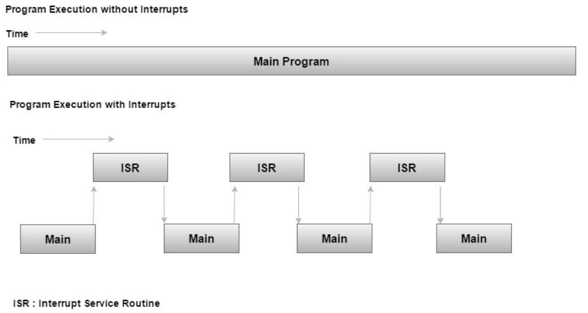
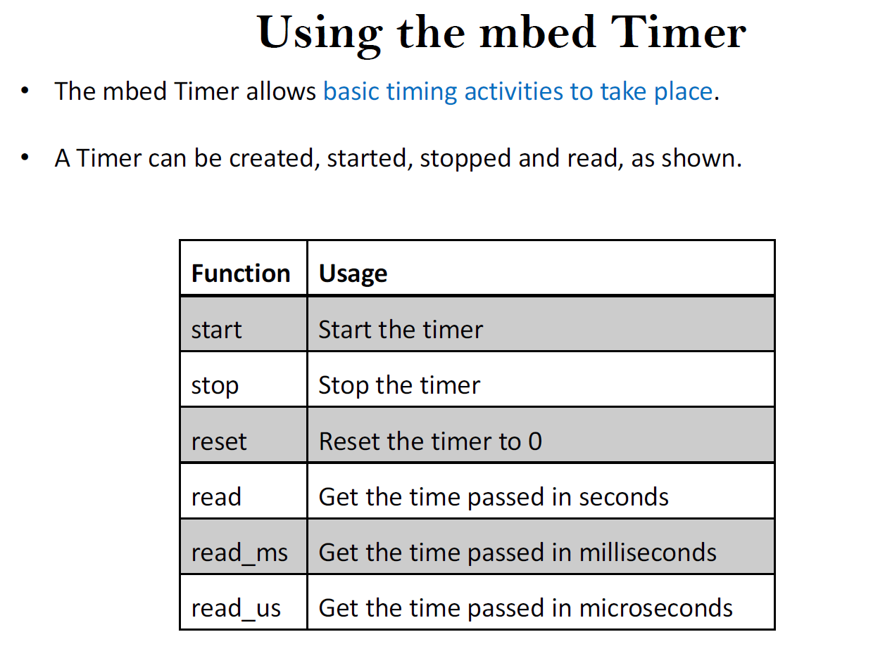
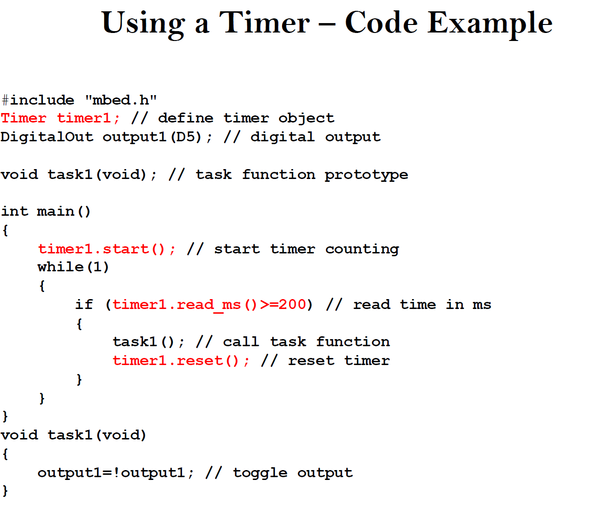

# Lecture 12 : Interrupts, Timers and Tasks in Embedded System

> 怎么感觉 Block 4 是四个 Block 里最简单的……
>
> 这下 MS 要挂科了。
>
> ——写了 Mock Exam 有感

## <u>任务(Task)</u>

### 介绍

在嵌入式程序中，程序经常需要进行不同的活动，我们称这些活动为**任务(Task)**。这些任务往往可以分为两类：

- **通过事件触发的任务(Event-Triggered Task)**
  - 当外部事件发生时，程序对其做出反应
  - 间隔时间并不固定或者有规律
- **通过时间触发的任务(Time-Triggered Task)**
  - 周期性发生的任务，通过 MCU 上的计时器进行控制

当一个程序具有多个任务需要处理时，需要决定哪个任务优先执行。这个顺序由任务的**优先级(Priority)**决定

### 轮询(Polling)和中断(Interrupts)

当响应通过外部事件触发的任务时，有这么几种做法可以选择：

- 对设备进行**轮询**
- 使用**中断**来在触发时响应
- 同时使用两者

#### 轮询(Polling)

**轮询(Polling)**指的是 CPU 持续不断地确认一个设备的状态来判断是否需要响应和处理，也可以选择按顺序不断确认多个设备的状态

两次确认之间的间隔称为**轮询周期(Polling Cycle)**，轮询周期会受到多个因素影响

但是，轮询也存在一些问题：

- 在进行轮询时，CPU 不能进行其他的操作或者响应
- 所有的输入都被一视同仁的对待，不能优先处理更紧迫的任务
- （在大多数情况下，对 CPU 的占用更高）

#### 中断(Interrupt)

**中断(Interrupt)**，指的是一种可以让程序暂停运行的方式，CPU 可以中途打断程序运行并处理别的事件的响应，当事件处理完成后 CPU 继续执行之前暂停执行的程序。

一般来讲，中断是比轮询更好的解决方案。

中断分为**硬件中断(Hardware/External Interrupt)**和**软件中断(Software/Internal Interrupt)**

- **硬件中断**
  - 由于外部事件产生的中断‘
  - 比如，如果你配置了 InterruptIn 类并连接了一个按钮，按钮造成的上升沿或者下降沿就时一个外部触发源
  - 有很多外设都可以产生中断，比如 ADC，UART，TIM 等
- **软件中断**
  - 软件中断是响应软件指令而产生的，如一些**异常情况(Exceptional Condition)**或者指令集中会产生中断的指令而发生的。
  - 比如说进行将数据除以 0 的运算时，程序会产生**除以零异常(divide-by-zero exception)**，程序会根据这个异常进行对应的处理，比如打印报错信息。
  - 不妨想想之前 IP 课里 用 gdb 调试时经常爆出来的数组越界

### 中断服务程序(ISR, Interrupt Service Routine)

当一个中断事件发生时，对应的中断服务程序(ISR, 也可以写作 Interrupt Handler)会被调用，期间普通的程序将被暂停。

多个中断同时发生时，会按照中断优先级来进行处理。

对于每个中断，会用 4 个字节（也就是 32 位，因为 stm32 是 32 位架构）存储中断服务程序的函数地址。程序会通过调用对应地址的函数来调用 ISR 进行处理。

### MCU 处理中断的步骤

- 停止现在进行的操作，在栈里存储下一个指令的地址（即 Program Counter 里的东西）
- 程序会先阻塞低优先级的中断，优先处理高优先级的中断
- 读取中断向量表(Interrupt Vector Table)，获得 ISR 的地址，跳转至 ISR 里进行处理
- ISR 处理完后返回原来的位置继续进行程序

### Mbed OS 6 上 GPIO 中断的 API

## <u>计时器(Timers/TIM)</u>

### 什么是计时器

计时器是一个可以精准计量时间的外设。MCU 的时钟产生周期性的时钟信号，而 MCU 内部的寄存器在每次接收到时钟脉冲时都将计数+1，进而起到计时的效果。

当寄存器的值达到最大值时，再进行+1 操作时会发生数据溢出，数据回到 0

一般认为寄存器存储的是无符号整型数据，长度由寄存器位数决定。比如对一个 8 位的寄存器，最大的值就是 0xFF，数据溢出就会变成 0x00

上图是个使用 TIM 的例子，其中的 TIM 采用上升沿计数的方式，外部时钟是 5kHz，想要获得 5s 的计时则需要计数 25000 次计数。

> 根据往年的题目，有理由怀疑这里删去了 Pre-scalar 的部分，可能也没提通过 TIM 生成 PWM 的与 Lecture 8 联动的内容
>
> 坚信没讲就是不考，亏了回头自学

### Mbed OS 6 的 Timer API

> 这里也没有讲 Ticker API，也就是 TIM 中断相关的内容
>
> 坚信不讲就是不考
